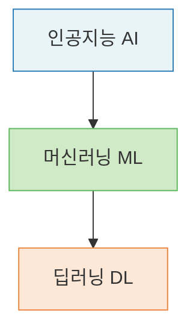
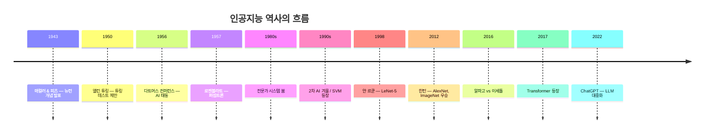
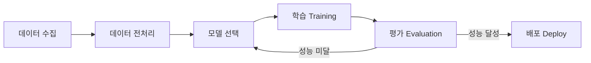

# Lecture 01. 인공지능이란 무엇인가

## 개요

**핵심 질문**

- 인공지능은 무엇이며, 어떻게 정의할 수 있는가?
- 규칙 기반 시스템과 학습 기반 시스템은 어떻게 다른가?
- 인공지능, 머신러닝, 딥러닝은 어떤 관계인가?
- "지능"을 어떻게 정의하고 측정할 수 있는가?

**학습 목표**

- 인공지능의 학문적·실용적 정의를 구분하여 설명할 수 있다.
- AI → ML → DL의 포함 관계를 개념적으로 이해한다.
- 규칙 기반과 학습 기반 접근의 근본적 차이를 설명할 수 있다.
- 인공지능 역사의 흐름과 각 전환점의 의미를 파악한다.

---

## 핵심 개념

### 1. 인공지능의 정의

**학문적 정의**

> 보통 사람이 수행하는 지능적인 작업을 자동화하기 위한 연구 활동.

**실용적 정의**

> 사람처럼 학습하고 추론할 수 있는 지능을 가진 컴퓨터 시스템을 만드는 기술.

두 정의의 교차점은 **"지능적 작업의 자동화"** 다. 여기서 지능(intelligence)은 신비로운 속성이 아니라, **주어진 환경에서 목표를 달성하는 문제 해결 능력**으로 바라보는 관점이 현대 AI의 출발점이다.

**강인공지능과 약인공지능**

| 구분 | 정의 | 현재 상태 |
|---|---|---|
| 강인공지능 (Strong AI) | 사람과 구분하기 어려운 범용 지능 | 미실현 |
| 약인공지능 (Weak AI) | 특정 분야에서 사람을 보조하는 지능 | 현재 모든 AI 시스템 |

---

### 2. AI → ML → DL : 포함 관계

**인공지능 (Artificial Intelligence)**

- 인간의 지적 능력을 컴퓨터로 구현하려는 가장 넓은 범주
- 초기에는 **심볼릭 AI(Symbolic AI)** 가 주류 — 명시적 규칙을 데이터베이스에 저장하는 방식

**머신러닝 (Machine Learning)**

- AI의 한 분야
- 명시적 규칙 없이 **데이터로부터 패턴을 학습**하는 알고리즘
- 대표 알고리즘: 로지스틱 회귀, 나이브 베이즈, 서포트 벡터 머신(SVM)

**딥러닝 (Deep Learning)**

- 머신러닝의 한 분야
- **인공 신경망(Artificial Neural Network)** 구조를 기반으로 학습
- 층(Layer)을 깊게 쌓아 점진적으로 복잡한 표현을 학습 — 이것이 "딥(Deep)"의 의미

---

### 3. 규칙 기반 vs 학습 기반

| 구분 | 규칙 기반 시스템 | 학습 기반 시스템 |
|---|---|---|
| 접근 방식 | 사람이 규칙을 직접 작성 | 데이터에서 규칙을 자동 학습 |
| 입력 | 규칙 + 데이터 | 데이터 + 정답(또는 피드백) |
| 출력 | 규칙 적용 결과 | 학습된 모델 |
| 한계 | 규칙 폭발, 예외 처리 불가 | 데이터 의존성, 해석 어려움 |
| 예시 | 전문가 시스템, if-else 체인 | SVM, 신경망, LLM |

핵심 전환:

> **규칙 기반**: `규칙 + 데이터 → 답`
>
> **학습 기반**: `데이터 + 답 → 규칙(모델)`

---

### 4. Task-oriented AI

현대 AI는 **특정 과제(Task) 중심**으로 설계된다. Mitchell(1997)의 정의가 이를 가장 명확하게 표현한다:

> 어떤 작업 $T$에 대해, 성능 $P$로 측정했을 때, 경험 $E$로 인해 성능이 향상된다면 — 그 프로그램은 $T$에 대해 $E$로 **학습**한 것이다.

즉 AI는 "지능 그 자체"가 아니라 **측정 가능한 성능 향상**으로 정의된다.

---

### 5. 인공지능의 역사

**두 번의 AI 겨울이 남긴 교훈**

- 1차 AI 겨울: 컴퓨터 성능 한계 — 단순 문제 해결이 전부
- 2차 AI 겨울: 전문가 시스템의 실패 — 규칙의 폭발적 복잡도를 감당 못함

두 번의 실패는 모두 **규칙 기반 접근의 한계**에서 비롯됐다. 그 반성이 학습 기반 접근, 즉 머신러닝·딥러닝으로의 전환을 가속시켰다.

---

## 수식

**Mitchell(1997)의 학습 정의**

$$
\text{학습} \equiv P(T, E) \uparrow \quad \text{as} \quad E \uparrow
$$

성능 $P$는 과제 $T$에 대해 경험 $E$가 쌓일수록 향상된다.

**선형 분류기 (규칙 기반 → 학습 기반 전환의 시작점)**

$$
\hat{y} = \text{sign}(\mathbf{w}^\top \mathbf{x} + b)
$$

- $\mathbf{x}$: 입력 특성 벡터
- $\mathbf{w}$: 학습된 가중치
- $b$: 편향
- $\hat{y}$: 예측 클래스

규칙 기반이라면 $\mathbf{w}$를 사람이 직접 설정한다. 학습 기반이라면 데이터로부터 $\mathbf{w}$를 **자동으로 최적화**한다.

---

## 시각화

**머신러닝의 전체 흐름**

---

## 직관적 이해

규칙 기반 시스템은 **요리 레시피**다. 재료(데이터)가 들어오면, 레시피(규칙)대로 조리해 결과를 낸다. 문제는 세상의 모든 요리를 레시피로 커버할 수 없다는 것이다.

머신러닝은 **맛을 보면서 레시피를 스스로 만들어가는 요리사**다. 정답 레시피를 주지 않아도, 충분한 데이터(재료와 완성된 요리 사례)를 보면서 스스로 규칙을 발견한다.

딥러닝은 거기서 한 발 더 나아가, **재료의 본질 자체를 재해석**한다. "이게 단순히 소금이 아니라, 감칠맛의 원천이다"라는 식의 계층적 표현(hierarchical representation)을 스스로 학습한다.

---

## 참고

- Mitchell, T. (1997). *Machine Learning*. McGraw-Hill.
- LeCun, Y., Bottou, L., Bengio, Y., & Haffner, P. (1998). [Gradient-based learning applied to document recognition](http://yann.lecun.com/exdb/publis/pdf/lecun-01a.pdf). *Proceedings of the IEEE*.
- Krizhevsky, A., Sutskever, I., & Hinton, G. (2012). [ImageNet Classification with Deep Convolutional Neural Networks](https://papers.nips.cc/paper/2012/hash/c399862d3b9d6b76c8436e924a68c45b-Abstract.html). *NeurIPS*.
- Géron, A. (2022). *Hands-On Machine Learning with Scikit-Learn, Keras, and TensorFlow* (3rd ed.). O'Reilly.
- Chollet, F. (2021). *Deep Learning with Python* (2nd ed.). Manning.
