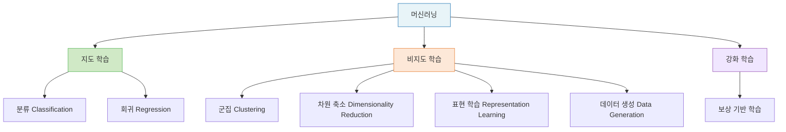
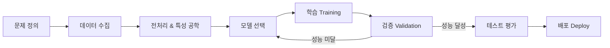
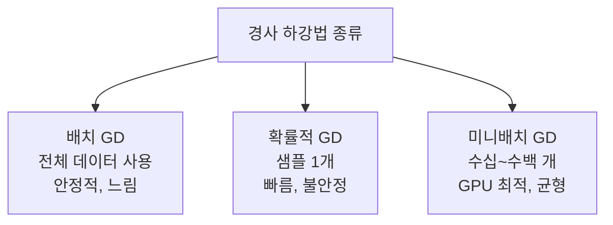

# Lecture 02. 학습의 개념

## 개요

**핵심 질문**

- 학습이란 무엇인가?
- 데이터, 모델, 목적함수는 어떤 관계인가?
- 학습과 추론은 어떻게 다른가?
- 좋은 학습이 만족해야 할 조건은 무엇인가?

**학습 목표**

- 머신러닝에서 "학습"의 정의를 수학적으로 설명할 수 있다.
- 데이터 → 모델 → 목적함수의 삼각 관계를 이해한다.
- 지도 학습, 비지도 학습, 강화 학습의 차이를 학습 신호 관점에서 구분할 수 있다.
- 경사 하강법의 작동 원리와 세 가지 변형을 설명할 수 있다.

---

## 핵심 개념

### 1. 학습이란 무엇인가

머신러닝에서 "학습"은 다음과 같이 정의된다:

> 유용한 데이터 표현을 만드는 데이터 변환을, **피드백 신호를 바탕으로 자동으로 탐색하는 과정**.

즉 학습의 핵심은 세 가지 요소의 상호작용이다:

| 요소 | 역할 |
|---|---|
| **데이터 (Data)** | 학습의 원재료 — 입력과 정답(또는 피드백) |
| **모델 (Model)** | 입력을 출력으로 변환하는 함수, 파라미터로 표현 |
| **목적함수 (Objective Function)** | 모델이 얼마나 좋은지/나쁜지를 수치로 측정 |

학습 = 목적함수를 최소(또는 최대)화하는 **파라미터를 반복적으로 탐색하는 과정**.

---

### 2. 데이터의 구조

**훈련 데이터 (Training Data)**

- 입력(특성, Feature) + 정답(타깃, Target/Label)의 쌍으로 구성
- 샘플(Sample): 하나의 데이터 포인트
- 훈련 세트(Train Set): 모델 학습에 사용
- 테스트 세트(Test Set): 학습 후 성능 평가에 사용 — 학습 중에는 절대 사용하지 않음

**데이터 스누핑 (Data Snooping)**

> 테스트 세트를 이용해 모델을 반복적으로 조정하면, 테스트 세트에 과적합된 낙관적 성능 추정이 발생한다.

**샘플링 편향 (Sampling Bias)**

- 훈련 세트와 테스트 세트에 샘플이 골고루 섞여 있지 않은 것
- 해결: 데이터 섞기(Shuffle) + 계층적 샘플링(Stratified Sampling)

---

### 3. 학습 패러다임 : 학습 신호의 종류

**지도 학습 (Supervised Learning)**

- 레이블(정답)이 있는 데이터로 학습
- 학습 신호: 예측값과 정답의 차이(오차)
- 분류: 이산적 클래스 레이블 예측 (예: 이메일 스팸 분류)
- 회귀: 연속적인 수치 예측 (예: 주택 가격 예측)

**비지도 학습 (Unsupervised Learning)**

- 레이블 없이 데이터 자체의 구조를 탐색
- 학습 신호: 없음 — 데이터 내부 패턴으로부터 자율 학습
- 군집(Clustering): 유사한 샘플끼리 그룹화
- 차원 축소: 고차원 데이터를 저차원으로 압축, 정보 손실 최소화
- 표현 학습: 데이터의 핵심 정보를 잠재 공간(Latent Space)으로 표현

**강화 학습 (Reinforcement Learning)**

- 환경과의 상호작용을 통해 보상을 최대화하는 정책(Policy) 학습
- 학습 신호: 보상 함수(Reward Function)
- 순차적 의사결정 문제(Sequential Decision Problem)에 적합

---

### 4. 모델의 구조

**모델 (Model)**

> 다양한 변수 간 수학적·확률적 관계를 표현하는 자료구조, 알고리즘, 프로그램.

- **파라미터 (Parameter)**: 데이터로부터 학습되는 값 (예: 가중치 $\mathbf{w}$, 편향 $b$)
- **하이퍼파라미터 (Hyperparameter)**: 사용자가 직접 설정하는 값 (예: 학습률 $\eta$, 층의 수)

모델 학습 = **파라미터를 최적화**하는 과정.
하이퍼파라미터는 학습 전에 설정되며, 그리드 서치·랜덤 서치로 탐색.

---

### 5. 목적함수와 최적화

**손실 함수 (Loss Function)**

- 하나의 샘플에 대해 모델의 예측이 정답에서 얼마나 벗어났는지 측정

**비용 함수 (Cost Function)**

- 전체 훈련 세트에 대한 손실의 평균

**경사 하강법 (Gradient Descent)**

- 비용 함수를 최소화하기 위해 **그레이디언트의 반대 방향**으로 파라미터를 반복 업데이트하는 최적화 알고리즘

| 종류 | 샘플 수 | 특징 |
|---|---|---|
| 배치 경사 하강법 | 전체 훈련 세트 | 안정적, 느림 |
| 확률적 경사 하강법 (SGD) | 1개 | 빠름, 불안정 (온라인 학습 가능) |
| 미니배치 경사 하강법 | 수십~수백 개 | 균형, GPU 활용 최적 |

---

### 6. 학습과 추론의 차이

| 구분 | 학습 (Training) | 추론 (Inference) |
|---|---|---|
| 목적 | 파라미터 최적화 | 새로운 입력에 대한 예측 |
| 데이터 | 훈련 세트 | 본 적 없는 데이터 |
| 파라미터 | 업데이트됨 | 고정됨 |
| 연산 | 순전파 + 역전파 | 순전파만 |

---

### 7. 좋은 학습의 조건

**일반화 (Generalization)**

> 훈련 데이터에서 학습한 패턴이 **본 적 없는 새로운 데이터**에서도 잘 작동하는 것.

일반화 오차(Generalization Error): 새로운 샘플에 대한 오차 비율. 이를 최소화하는 것이 학습의 궁극적 목표.

**과적합 vs 과소적합**

| 구분 | 정의 | 원인 |
|---|---|---|
| 과적합 (Overfitting) | 훈련 데이터를 암기 → 새 데이터에 일반화 실패 | 모델 복잡도 과다, 데이터 부족 |
| 과소적합 (Underfitting) | 훈련 데이터도 제대로 학습 못함 | 모델 복잡도 부족 |

**머신러닝 전체 흐름**

---

## 수식

**선형 모델의 예측**

$$
\hat{y} = \mathbf{w}^\top \mathbf{x} + b
$$

- $\mathbf{x} \in \mathbb{R}^n$: 입력 특성 벡터
- $\mathbf{w} \in \mathbb{R}^n$: 가중치 벡터 (학습되는 파라미터)
- $b \in \mathbb{R}$: 편향 (bias)
- $\hat{y}$: 모델의 예측값

**평균 제곱 오차 (MSE, Mean Squared Error)**

$$
\mathcal{L}(\mathbf{w}, b) = \frac{1}{m} \sum_{i=1}^{m} \left( \hat{y}^{(i)} - y^{(i)} \right)^2
$$

- $m$: 훈련 샘플 수
- $y^{(i)}$: $i$번째 샘플의 정답
- $\hat{y}^{(i)}$: $i$번째 샘플의 예측값

**경사 하강법 파라미터 업데이트**

$$
\mathbf{w} \leftarrow \mathbf{w} - \eta \nabla_{\mathbf{w}} \mathcal{L}
$$

$$
b \leftarrow b - \eta \frac{\partial \mathcal{L}}{\partial b}
$$

- $\eta$: 학습률 (Learning Rate) — 하이퍼파라미터
- $\nabla_{\mathbf{w}} \mathcal{L}$: 비용 함수의 가중치에 대한 그레이디언트

**표준화 (Standardization)**

$$
x_j' = \frac{x_j - \mu_j}{\sigma_j}
$$

- $\mu_j$: $j$번째 특성의 평균
- $\sigma_j$: $j$번째 특성의 표준편차
- 표준화 후 모든 특성이 평균 0, 분산 1을 가짐 → 경사 하강법 수렴 안정화

---

## 시각화

**경사 하강법의 수렴 과정**

**세 가지 경사 하강법 비교**

---

## 직관적 이해

학습을 **산에서 내려오는 과정**으로 이해할 수 있다. 파라미터 공간은 하나의 울퉁불퉁한 지형이고, 비용 함수의 값은 고도다. 목표는 **가장 낮은 계곡(전역 최솟값)** 을 찾는 것이다.

경사 하강법은 현재 위치에서 가장 가파르게 내려가는 방향으로 한 걸음씩 내딛는 전략이다. 학습률 $\eta$는 한 걸음의 크기다:

- $\eta$가 너무 크면 → 계곡을 지나쳐 발산
- $\eta$가 너무 작으면 → 너무 느리게 수렴

배치 경사 하강법은 **전체 지형을 보고** 가장 가파른 방향을 정확히 계산하지만 느리다. 확률적 경사 하강법은 **지금 서 있는 발 아래만 보고** 방향을 결정하니 빠르지만 불안정하다. 미니배치는 그 중간 — 작은 구역을 보고 결정하는 균형 잡힌 전략이다.

그리고 추론(Inference)은 산을 다 내려온 뒤, 그 위치에서 **새로운 질문에 답하는 것**이다. 더 이상 걸음을 내딛지 않는다. 파라미터는 고정되어 있고, 오직 입력에서 출력으로의 계산만 남는다.

---

## 참고

- Mitchell, T. (1997). *Machine Learning*. McGraw-Hill.
- Géron, A. (2022). *Hands-On Machine Learning with Scikit-Learn, Keras, and TensorFlow* (3rd ed.). O'Reilly.
- Chollet, F. (2021). *Deep Learning with Python* (2nd ed.). Manning.
- Raschka, S., & Mirjalili, V. (2022). *Python Machine Learning* (3rd ed.). Packt Publishing.
- Goodfellow, I., Bengio, Y., & Courville, A. (2016). [Deep Learning](https://www.deeplearningbook.org/). MIT Press.
