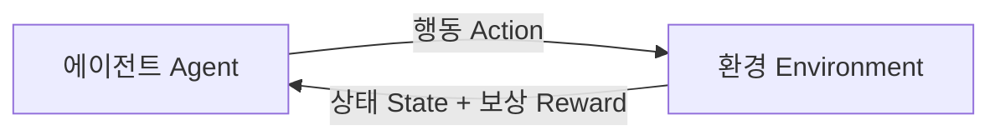
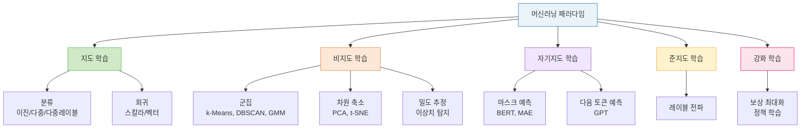
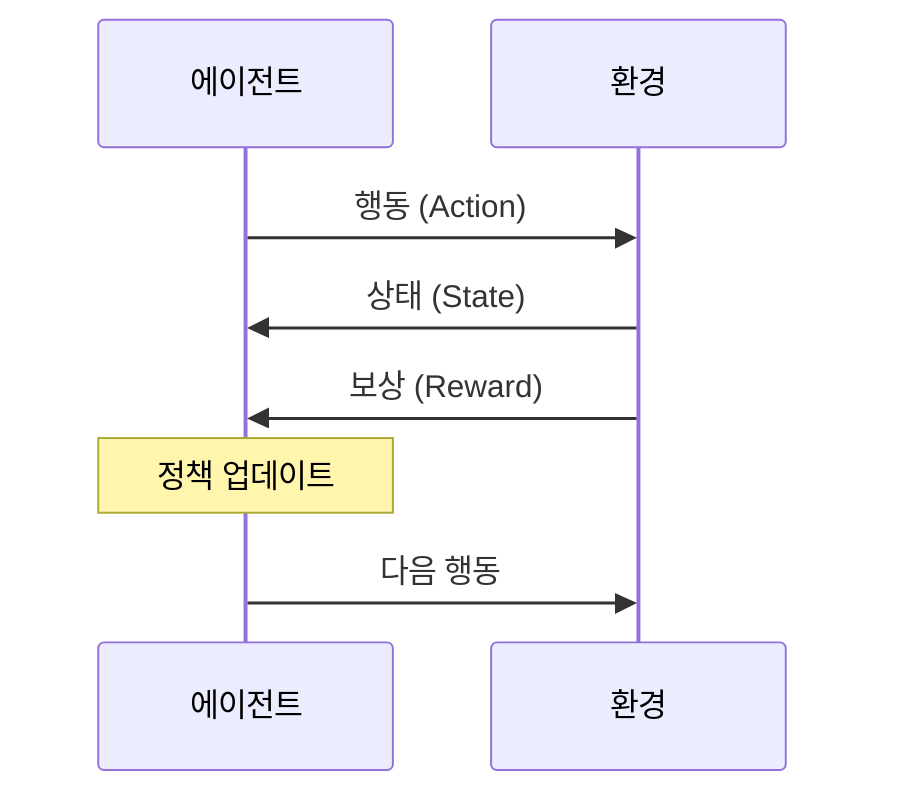

# Lecture 03. 학습 패러다임

## 개요

**핵심 질문**

- 학습 패러다임은 어떻게 구분되는가?
- 지도 학습과 비지도 학습의 근본적인 차이는 무엇인가?
- 자기지도 학습은 왜 등장했고, 어떻게 작동하는가?
- 강화 학습은 다른 패러다임과 어떤 점에서 다른가?
- 각 패러다임은 어떤 문제 유형에 적합한가?

**학습 목표**

- 학습 신호(피드백)의 종류에 따라 패러다임을 분류할 수 있다.
- 지도 학습의 분류·회귀 문제 유형을 구분하고 대표 알고리즘을 나열할 수 있다.
- 비지도 학습의 주요 과제(군집, 차원 축소, 밀도 추정)를 설명할 수 있다.
- 자기지도 학습의 등장 배경과 준지도 학습과의 차이를 이해한다.
- 강화 학습의 에이전트-환경-보상 구조를 설명할 수 있다.
- 배치 학습과 온라인 학습, 사례 기반과 모델 기반의 차이를 이해한다.

---

## 핵심 개념

### 1. 학습 패러다임의 분류 기준

학습 패러다임은 **학습 신호(피드백)의 종류**에 따라 구분된다.

| 패러다임 | 학습 신호 | 핵심 질문 |
|---|---|---|
| 지도 학습 | 정답 레이블 | 이 입력의 정답은 무엇인가? |
| 비지도 학습 | 없음 | 데이터 안에 어떤 구조가 있는가? |
| 자기지도 학습 | 데이터 자체에서 생성 | 데이터의 일부로 나머지를 예측할 수 있는가? |
| 준지도 학습 | 일부 레이블 | 적은 정답으로 더 많이 학습할 수 있는가? |
| 강화 학습 | 보상 신호 | 어떤 행동이 장기적으로 최대 보상을 가져오는가? |

---

### 2. 지도 학습 (Supervised Learning)

**정의**

> 입력 데이터에 대한 정답(레이블)을 사전에 정의하여 학습 데이터로 제공하는 방식. 모델은 예측값과 정답의 차이(오차)를 줄이는 방향으로 학습한다.

**핵심 구성요소**

- 입력(Feature, 피처): 예측에 사용되는 변수
- 타깃(Target, Label): 모델이 예측해야 할 정답
- 모델: 입력 → 출력 변환 함수

**문제 유형**

| 유형 | 타깃 | 예시 | 대표 알고리즘 |
|---|---|---|---|
| 이진 분류 | 2개 클래스 | 스팸 분류, 불량 감지 | 로지스틱 회귀, SVM |
| 다중 분류 | N개 클래스 | 이미지 분류, 뉴스 카테고리 | 결정 트리, 신경망 |
| 다중 레이블 분류 | 복수 레이블 | 태그 분류, 속성 예측 | 다중 출력 신경망 |
| 스칼라 회귀 | 연속 수치 1개 | 주택 가격, 기온 예측 | 선형 회귀, 회귀 트리 |
| 벡터 회귀 | 연속 수치 복수 | 관절 위치 추정 | 다중 출력 회귀 |

**대표 알고리즘**

- 로지스틱 회귀 (Logistic Regression): 시그모이드 함수로 확률 추정 → 이진 분류
- 결정 트리 (Decision Tree): 데이터 균일도(지니 계수, 정보 이득) 기반 규칙 학습
- 랜덤 포레스트 (Random Forest): 배깅 방식으로 다수 결정 트리를 앙상블
- GBM / XGBoost / LightGBM: 부스팅 방식, 잔차를 순차적으로 학습
- 서포트 벡터 머신 (SVM): 클래스 간 최대 마진 결정 경계 탐색
- 신경망 (Neural Network): 층 기반 표현 학습

**성능 평가 지표**

- 분류: 정확도(Accuracy), 정밀도(Precision), 재현율(Recall), F1, ROC-AUC
- 회귀: MAE, MSE, RMSE, $R^2$

---

### 3. 비지도 학습 (Unsupervised Learning)

**정의**

> 레이블 없이 순수하게 데이터만으로 학습하는 방법. 데이터 내부의 숨겨진 구조, 패턴, 분포를 스스로 탐색한다.

**주요 과제**

**군집 (Clustering)**

- 비슷한 샘플끼리 묶어 클러스터로 그룹화
- k-평균(k-Means): 센트로이드 기반, 이너셔 최소화
- DBSCAN: 밀도 기반, 노이즈 샘플 자동 처리
- GMM (Gaussian Mixture Model): 확률적 군집, 소프트 할당

**차원 축소 (Dimensionality Reduction)**

- 고차원 데이터를 저차원으로 압축, 정보 손실 최소화
- 시각화(2D/3D 투영), 노이즈 제거, 특성 공학에 활용
- 대표 기법: PCA, t-SNE, UMAP

**밀도 추정 (Density Estimation)**

- 데이터 생성 확률 과정의 확률 밀도 함수 추정
- 이상치 탐지(Outlier Detection): 밀도가 낮은 지역의 샘플을 이상치로 판별

**이상치 탐지 알고리즘**

- Isolation Forest: 랜덤 분할로 이상치 조기 격리
- LOF (Local Outlier Factor): 주변 밀도 비교 기반
- One-Class SVM: 정상 데이터 분포 경계 학습

---

### 4. 자기지도 학습 (Self-Supervised Learning)

**등장 배경**

지도 학습은 레이블 데이터 생성 비용이 막대하다. 대용량 비레이블 데이터는 풍부한데, 레이블 작업이 병목이 된다. 자기지도 학습은 **데이터 자체에서 레이블을 자동 생성**하여 이 문제를 해결한다.

**핵심 아이디어**

> 레이블이 전혀 없는 데이터셋에서, 입력의 일부를 가리거나 변형한 뒤 나머지로 예측하는 프리텍스트 태스크(Pretext Task)를 설계한다.

**대표 사례**

- 언어 모델 (GPT): 이전 토큰으로 다음 토큰 예측
- 마스크 언어 모델 (BERT): 가려진 단어를 문맥으로 복원
- 이미지 자기지도 학습 (MAE): 마스킹된 이미지 패치를 복원

**준지도 학습 (Semi-Supervised Learning)과의 차이**

| 구분 | 레이블 | 방식 |
|---|---|---|
| 준지도 학습 | 일부 있음 | 레이블 데이터 + 비레이블 데이터 혼합 학습 |
| 자기지도 학습 | 없음 | 데이터 자체에서 감독 신호 생성 |

준지도 학습의 핵심 기법: **레이블 전파(Label Propagation)** — 동일 클러스터 내 샘플에 레이블을 전파하여 효율적 학습.

---

### 5. 강화 학습 (Reinforcement Learning)

**정의**

> 에이전트가 환경과 상호작용하며, 보상 신호를 최대화하는 정책(Policy)을 학습하는 패러다임. 순차적 의사결정 문제(Sequential Decision Problem)에 적합하다.

**구성 요소**

| 요소 | 설명 |
|---|---|
| 에이전트 (Agent) | 학습하는 주체 |
| 환경 (Environment) | 에이전트가 상호작용하는 대상 |
| 상태 (State) | 현재 환경의 관측값 |
| 행동 (Action) | 에이전트가 선택하는 행동 |
| 보상 (Reward) | 행동 결과로 받는 피드백 신호 |
| 정책 (Policy) | 상태 → 행동 매핑 함수 |

**다른 패러다임과의 핵심 차이**

- 지도 학습: 정답이 주어짐
- 강화 학습: 정답 없음. 행동의 결과(보상)만 주어지며, **지연된 피드백** 속에서 학습

---

### 6. 학습 방식에 따른 추가 분류

**배치 학습 vs 온라인 학습**

| 구분 | 배치 학습 (Batch) | 온라인 학습 (Online) |
|---|---|---|
| 별칭 | 오프라인 학습 | 점진적 학습 (Incremental) |
| 방식 | 전체 데이터로 한 번에 훈련 | 데이터를 순차적으로 미니배치 단위로 학습 |
| 장점 | 안정적, 재현 가능 | 대용량 데이터, 실시간 적응 가능 |
| 단점 | 모델 부패(Data Drift) 발생 | 잘못된 데이터에 민감 |

- **모델 부패 (Model Rot / Data Drift)**: 배치 학습 모델이 시간 흐름에 따라 성능이 점진적으로 저하되는 현상.
- **외부 메모리 학습 (Out-of-Core Learning)**: 메인 메모리에 들어갈 수 없는 대규모 데이터셋을 온라인 학습 방식으로 처리.

**사례 기반 학습 vs 모델 기반 학습**

| 구분 | 사례 기반 (Instance-based) | 모델 기반 (Model-based) |
|---|---|---|
| 방식 | 훈련 샘플 기억 → 유사도 비교 | 데이터로 모델 학습 → 예측에 사용 |
| 일반화 | 유사도 측정 기반 | 학습된 함수 기반 |
| 예시 | k-NN | 선형 회귀, 신경망 |

---

## 수식

**로지스틱 회귀 (이진 분류)**

$$
\hat{p} = \sigma(\mathbf{w}^\top \mathbf{x} + b) = \frac{1}{1 + e^{-(\mathbf{w}^\top \mathbf{x} + b)}}
$$

$$
\hat{y} = \begin{cases} 1 & \text{if} \quad \hat{p} \geq 0.5 \\ 0 & \text{otherwise} \end{cases}
$$

**소프트맥스 (다중 분류)**

$$
\hat{p}_k = \frac{e^{s_k(\mathbf{x})}}{\sum_{j=1}^{K} e^{s_j(\mathbf{x})}}
$$

- $K$: 클래스 수
- $s_k(\mathbf{x})$: 클래스 $k$에 대한 점수

**크로스 엔트로피 손실 (분류)**

$$
\mathcal{L} = -\frac{1}{m} \sum_{i=1}^{m} \sum_{k=1}^{K} y_k^{(i)} \log \hat{p}_k^{(i)}
$$

**k-평균 목적 함수 (이너셔)**

$$
J = \sum_{i=1}^{m} \left\| \mathbf{x}^{(i)} - \boldsymbol{\mu}_{c^{(i)}} \right\|^2
$$

- $\boldsymbol{\mu}_{c^{(i)}}$: 샘플 $\mathbf{x}^{(i)}$가 할당된 클러스터의 센트로이드
- 목표: $J$ 최소화

**F1 점수**

$$
F_1 = 2 \cdot \frac{\text{Precision} \times \text{Recall}}{\text{Precision} + \text{Recall}}
$$

---

## 시각화

**학습 패러다임 전체 지도**

**강화 학습의 상호작용 루프**

---

## 직관적 이해

학습 패러다임을 **교육 방식**에 비유하면 이해하기 쉽다.

**지도 학습**은 정답지가 있는 시험 공부다. 문제(입력)와 정답(레이블)이 함께 주어지고, 틀린 문제를 반복해서 교정하면서 실력을 쌓는다.

**비지도 학습**은 정답지 없이 책을 읽는 것과 같다. 아무도 "이게 뭐다"라고 알려주지 않지만, 반복해서 읽다 보면 패턴이 보이고, 비슷한 것끼리 자연스럽게 묶인다.

**자기지도 학습**은 빈칸 채우기 문제를 스스로 만들어 푸는 것이다. 텍스트에서 단어 하나를 가리고 "이 단어가 뭘까?"를 맞추는 연습을 통해, 아무도 레이블을 붙여주지 않아도 언어의 구조를 깊이 이해하게 된다. GPT와 BERT가 바로 이 방식으로 학습된다.

**강화 학습**은 게임을 처음 하는 것과 같다. 규칙서를 받지 않았지만, 점수(보상)가 올라가고 내려가는 것을 보면서 어떤 행동이 좋은지 스스로 터득한다.

**준지도 학습**은 소수의 모범 답안만 받고 나머지를 스스로 채우는 방식이다. 레이블 전파는 "모범생 옆에 앉은 학생은 비슷한 성향일 것이다"라는 가정으로 레이블을 추론한다.

---

## 참고

- Géron, A. (2022). *Hands-On Machine Learning with Scikit-Learn, Keras, and TensorFlow* (3rd ed.). O'Reilly.
- Chollet, F. (2021). *Deep Learning with Python* (2nd ed.). Manning.
- He, K., et al. (2022). [Masked Autoencoders Are Scalable Vision Learners](https://arxiv.org/abs/2111.06377). *CVPR*.
- Devlin, J., et al. (2019). [BERT: Pre-training of Deep Bidirectional Transformers for Language Understanding](https://arxiv.org/abs/1810.04805). *NAACL*.
- Sutton, R., & Barto, A. (2018). [Reinforcement Learning: An Introduction](http://incompleteideas.net/book/the-book-2nd.html) (2nd ed.). MIT Press.
- Ester, M., et al. (1996). [A Density-Based Algorithm for Discovering Clusters (DBSCAN)](https://www.aaai.org/Papers/KDD/1996/KDD96-037.pdf). *KDD*.
