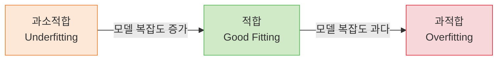
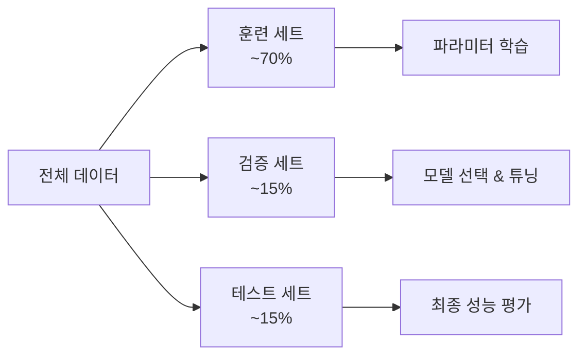
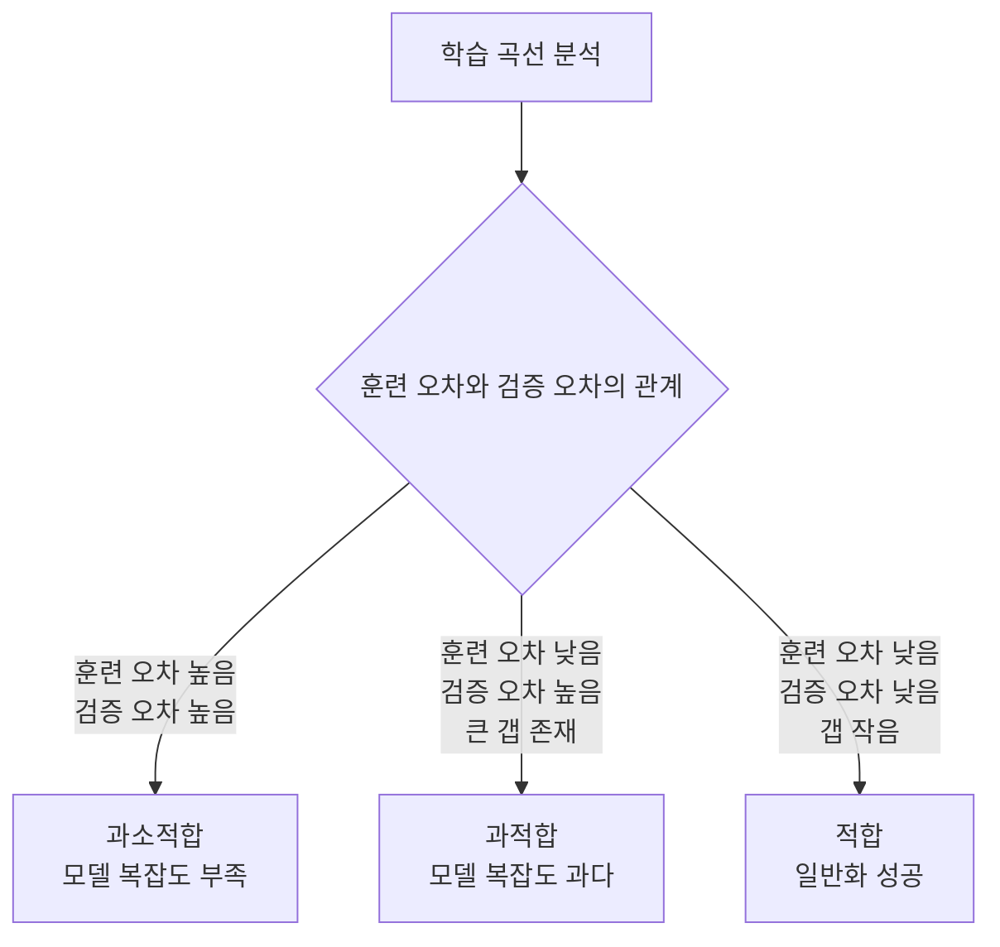
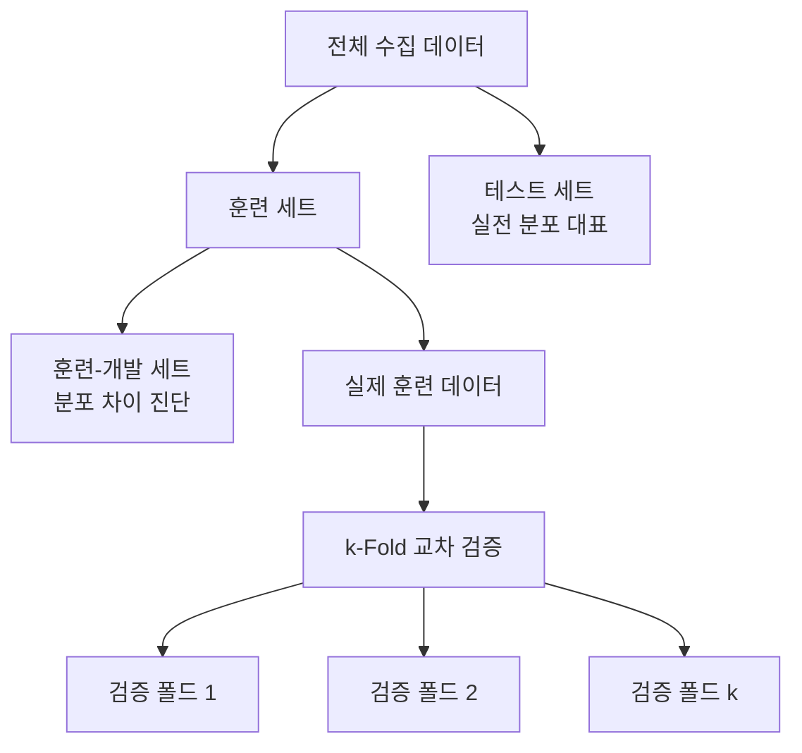

# Lecture 04. 일반화 문제

## 개요

**핵심 질문**

- 일반화란 무엇이며, 왜 머신러닝의 궁극적 목표인가?
- 과적합과 과소적합은 어떻게 발생하고, 어떻게 진단하는가?
- 훈련 / 검증 / 테스트 세트를 왜 분리해야 하는가?
- 학습 데이터와 현실 데이터의 차이는 어떤 문제를 일으키는가?

**학습 목표**

- 일반화 오차의 정의와 중요성을 설명할 수 있다.
- 과적합·과소적합의 원인과 징후를 구분할 수 있다.
- Train / Validation / Test 분리의 목적과 각 세트의 역할을 이해한다.
- 데이터 스누핑, 샘플링 편향, 데이터 불일치 문제를 인식하고 대처법을 설명할 수 있다.

---

## 핵심 개념

### 1. 일반화 (Generalization)

**정의**

> 훈련 데이터에서 학습한 패턴이 **본 적 없는 새로운 데이터**에서도 올바르게 작동하는 능력.

머신러닝의 목표는 훈련 데이터를 잘 맞추는 것이 아니라, **현실 세계의 새로운 데이터에 대해 정확한 예측**을 하는 것이다. 훈련 오차가 낮더라도 일반화 오차가 높다면 모델은 실패한 것이다.

**일반화 오차 (Generalization Error)**

> 본 적 없는 새로운 샘플에 대한 오차 비율. 외부 샘플 오차(Out-of-Sample Error)라고도 한다.

- 훈련 오차(Training Error): 훈련 세트에서의 오차
- 일반화 오차: 실전 데이터에서의 오차
- 좋은 모델 = 훈련 오차와 일반화 오차의 **차이가 작은** 모델

---

### 2. 과적합 (Overfitting)

**정의**

> 모델이 훈련 데이터를 과도하게 학습하여 데이터를 **암기**한 상태. 훈련 오차는 낮지만 일반화 오차는 높다.

**발생 원인**

- 모델 복잡도가 데이터에 비해 과도하게 높음
- 훈련 데이터가 너무 적음
- 훈련 데이터에 노이즈가 많음
- 정규화(Regularization) 부재

**징후**

- 훈련 세트 성능 ↑, 검증/테스트 세트 성능 ↓
- 훈련 오차와 검증 오차 사이의 큰 간격 (Gap)

**해결 방법**

- 더 많은 훈련 데이터 수집
- 모델 복잡도 감소 (층 수, 파라미터 수 줄이기)
- 정규화 적용 (L1, L2, Dropout)
- 조기 종료 (Early Stopping)
- 데이터 증식 (Data Augmentation)

---

### 3. 과소적합 (Underfitting)

**정의**

> 모델이 너무 단순하여 훈련 데이터의 내재된 구조조차 제대로 학습하지 못한 상태. 훈련 오차와 일반화 오차 모두 높다.

**발생 원인**

- 모델 복잡도가 문제에 비해 너무 낮음
- 훈련이 충분히 이루어지지 않음 (에포크 부족)
- 관련 특성이 누락됨

**해결 방법**

- 더 복잡한 모델 사용
- 더 많은 에포크로 훈련
- 더 유용한 특성 추가 (특성 공학)
- 정규화 강도 완화

---

### 4. 적합 상태 비교

| 구분 | 훈련 오차 | 일반화 오차 | 원인 |
|---|---|---|---|
| 과소적합 | 높음 | 높음 | 모델 너무 단순 |
| 적합 | 낮음 | 낮음 | 균형 |
| 과적합 | 매우 낮음 | 높음 | 모델 너무 복잡 |

---

### 5. Train / Validation / Test 분리

**왜 분리하는가**

모델을 훈련 데이터로만 평가하면 일반화 오차를 추정할 수 없다. 세 세트를 분리하는 이유는 각자 다른 역할을 수행하기 때문이다.

| 세트 | 역할 | 사용 시점 |
|---|---|---|
| 훈련 세트 (Train Set) | 파라미터 학습 | 훈련 중 |
| 검증 세트 (Validation Set) | 하이퍼파라미터 튜닝, 모델 선택 | 훈련 중 (반복적으로) |
| 테스트 세트 (Test Set) | 최종 일반화 성능 평가 | 훈련 완료 후 단 1회 |

**홀드아웃 검증 (Holdout Validation)**

- 훈련 세트의 일부를 검증 세트로 분리
- 여러 후보 모델을 검증 세트로 평가 → 최고 모델 선택

**교차 검증 (Cross-Validation)**

- 훈련 세트를 k개 폴드로 분할
- k번 반복: 매번 다른 폴드를 검증, 나머지로 훈련
- 검증 세트가 작을 때 발생하는 평가 불안정성 해소
- 대표 방식: k-Fold CV, Stratified k-Fold (클래스 불균형 시)

---

### 6. 데이터 스누핑 (Data Snooping)

**정의**

> 테스트 세트를 반복적으로 참조하여 모델을 조정할 경우, 테스트 세트에 과적합된 낙관적 성능 추정이 발생하는 것.

- 규칙: **테스트 세트는 훈련 완료 후 단 한 번만 사용**
- 위반 시: 보고된 성능이 실제 일반화 성능보다 부풀려짐
- 실전: 테스트 세트를 아예 잠가두고, 개발 중에는 검증 세트만 사용

---

### 7. 학습 데이터와 현실 데이터의 차이

머신러닝 모델은 훈련 데이터의 분포를 학습한다. 현실 데이터가 훈련 데이터와 다른 분포를 갖는다면, 아무리 훈련을 잘해도 실전에서 실패한다.

**샘플링 잡음 (Sampling Noise)**

- 훈련 데이터가 너무 작을 때 발생
- 우연한 패턴(노이즈)을 실제 패턴으로 잘못 학습

**샘플링 편향 (Sampling Bias)**

- 표본 추출 방식이 잘못되어 특정 집단이 과대 또는 과소 대표됨
- 예: 인터넷 사용자 설문으로 전체 인구 추론 → 고령층 과소 대표

**데이터 불일치 (Data Mismatch)**

- 검증·테스트 세트와 실전 데이터의 분포가 다를 때 발생
- 해결: 검증·테스트 세트는 **실전에서 기대되는 데이터**를 대표해야 함
- 훈련-개발 세트: 훈련 세트에서 일부를 떼어 분포 차이를 진단하는 용도

**데이터 드리프트 (Data Drift) / 모델 부패 (Model Rot)**

- 시간이 지나면서 현실 데이터의 분포가 변화
- 배치 학습 모델은 재학습 없이는 성능이 점진적으로 저하됨
- 해결: 주기적 재학습, 온라인 학습 적용

---

## 수식

**일반화 오차 분해**

$$
\text{Expected Error} = \text{Bias}^2 + \text{Variance} + \text{Irreducible Noise}
$$

- $\text{Bias}^2$: 모델의 가정이 실제 함수와 얼마나 다른가 (과소적합 원인)
- $\text{Variance}$: 훈련 데이터 변화에 모델이 얼마나 민감한가 (과적합 원인)
- $\text{Irreducible Noise}$: 데이터 자체의 노이즈, 줄일 수 없음

**훈련 오차와 일반화 오차**

$$
\mathcal{L}_{\text{train}} = \frac{1}{m} \sum_{i=1}^{m} \ell\left(\hat{y}^{(i)}, y^{(i)}\right)
$$

$$
\mathcal{L}_{\text{gen}} = \mathbb{E}_{(\mathbf{x}, y) \sim p_{\text{data}}} \left[ \ell\left(f(\mathbf{x}), y\right) \right]
$$

- $p_{\text{data}}$: 현실 데이터의 실제 분포
- 과적합: $\mathcal{L}_{\text{train}} \ll \mathcal{L}_{\text{gen}}$
- 과소적합: $\mathcal{L}_{\text{train}} \approx \mathcal{L}_{\text{gen}}$, 둘 다 높음

**L2 정규화 (Ridge) — 과적합 억제**

$$
\mathcal{L}_{\text{reg}} = \mathcal{L} + \alpha \sum_{j=1}^{n} w_j^2
$$

**L1 정규화 (Lasso)**

$$
\mathcal{L}_{\text{reg}} = \mathcal{L} + \alpha \sum_{j=1}^{n} |w_j|
$$

- $\alpha$: 정규화 강도 하이퍼파라미터
- L1: 희소 가중치 유도 (불필요한 특성 자동 제거)
- L2: 가중치 전반적 감소

**k-Fold 교차 검증 오차**

$$
\mathcal{L}_{\text{CV}} = \frac{1}{k} \sum_{i=1}^{k} \mathcal{L}^{(i)}_{\text{val}}
$$

---

## 시각화

**학습 곡선 — 과적합 vs 과소적합 진단**

**데이터 분리 전략**

---

## 직관적 이해

일반화 문제는 **시험 준비 방식**으로 이해하면 명확하다.

과적합은 **기출문제만 달달 외운 학생**이다. 같은 문제가 나오면 100점이지만, 조금만 변형된 문제가 나오면 속수무책이다. 훈련 데이터를 "암기"했을 뿐, 개념을 이해하지 못한 것이다.

과소적합은 **공부를 너무 안 한 학생**이다. 기출문제도 틀리고, 새로운 문제도 당연히 틀린다. 모델 자체의 표현력이 부족한 상태다.

Train / Validation / Test 분리는 **모의고사 → 중간점검 → 실전 시험**의 구조와 같다. 모의고사(훈련)로 공부하고, 중간점검(검증)으로 전략을 수정하고, 실전 시험(테스트)은 최종 평가로만 쓴다. 중간점검 결과를 보고 "이 유형이 나오는구나" 하고 특별히 준비하는 순간, 그 중간점검은 신뢰할 수 없게 된다 — 이것이 데이터 스누핑이다.

현실 데이터와 학습 데이터의 차이 문제는, 한국 교과서로만 공부했는데 미국 시험을 보는 상황과 같다. 내용을 잘 알아도 문제 유형이 달라서 결과가 나쁘게 나올 수 있다. 검증·테스트 세트가 실전 데이터를 대표해야 하는 이유가 바로 여기에 있다.

---

## 참고

- Géron, A. (2022). *Hands-On Machine Learning with Scikit-Learn, Keras, and TensorFlow* (3rd ed.). O'Reilly.
- Goodfellow, I., Bengio, Y., & Courville, A. (2016). [Deep Learning](https://www.deeplearningbook.org/). MIT Press. — Ch. 5 (Machine Learning Basics).
- Hastie, T., Tibshirani, R., & Friedman, J. (2009). [The Elements of Statistical Learning](https://hastie.su.domains/ElemStatLearn/) (2nd ed.). Springer.
- Mitchell, T. (1997). *Machine Learning*. McGraw-Hill.
