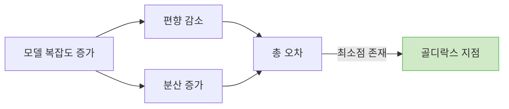
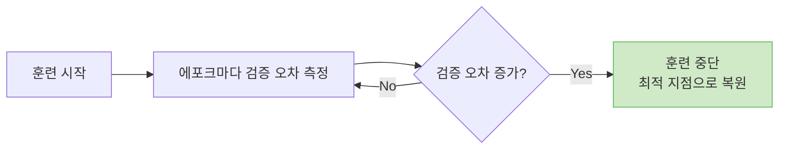
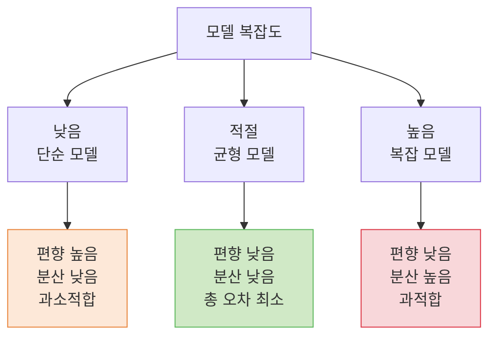
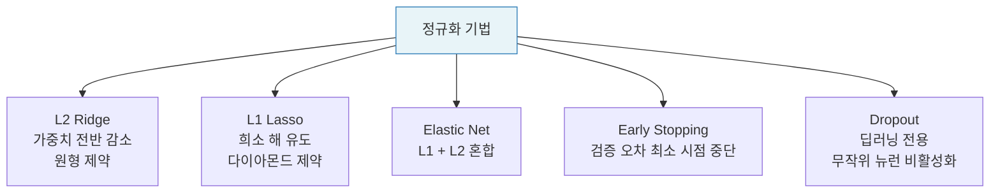

# Lecture 05. 편향과 분산

## 개요

**핵심 질문**

- 편향과 분산은 무엇이며, 왜 동시에 낮추기 어려운가?
- 모델 복잡도는 편향-분산 트레이드오프에 어떤 영향을 주는가?
- 데이터 양이 늘어나면 모델 성능은 어떻게 변하는가?
- 더 큰 모델이 항상 좋은 것은 아닌 이유는 무엇인가?
- 과적합을 억제하는 정규화 기법에는 어떤 것이 있는가?

**학습 목표**

- 편향과 분산의 정의를 수식으로 표현하고 직관적으로 설명할 수 있다.
- 편향-분산 트레이드오프를 모델 복잡도 관점에서 분석할 수 있다.
- 학습 곡선을 해석하여 과적합·과소적합을 진단할 수 있다.
- L1·L2 정규화, 조기 종료의 원리와 차이를 설명할 수 있다.
- 데이터 양과 모델 성능의 관계를 이해한다.

---

## 핵심 개념

### 1. 편향 (Bias)

**정의**

> 모델의 예측값과 실제 정답 사이의 **체계적인 차이(오차의 평균)**. 모델이 데이터의 실제 패턴을 얼마나 단순하게 가정하는지를 나타낸다.

- 높은 편향 → 모델이 너무 단순 → **과소적합**
- 예: 비선형 데이터에 선형 모델을 적용

### 2. 분산 (Variance)

**정의**

> 훈련 데이터가 바뀔 때 모델의 예측이 **얼마나 민감하게 변하는가**. 모델이 훈련 데이터의 노이즈까지 학습하는 정도를 나타낸다.

- 높은 분산 → 모델이 너무 복잡 → **과적합**
- 예: 훈련 세트마다 완전히 다른 예측을 내놓는 고차 다항 모델

### 3. 편향-분산 트레이드오프 (Bias-Variance Tradeoff)

편향과 분산은 **동시에 낮추기 어렵다**. 하나를 낮추면 다른 하나가 올라가는 구조적 긴장 관계가 존재한다.

| 모델 복잡도 | 편향 | 분산 | 상태 |
|---|---|---|---|
| 낮음 (단순) | 높음 | 낮음 | 과소적합 |
| 적절 | 낮음 | 낮음 | 균형 (목표) |
| 높음 (복잡) | 낮음 | 높음 | 과적합 |

**골디락스 지점 (Goldilocks Point)**

> 편향과 분산의 합이 최소화되는 지점. 전체 오차가 가장 낮은 모델 복잡도.

---

### 4. 모델 복잡도의 의미

모델 복잡도는 **학습할 수 있는 함수의 표현력**을 의미한다. 주요 결정 요소는 다음과 같다:

- 파라미터 수 (가중치 개수)
- 층의 깊이 (딥러닝)
- 다항식의 차수 (다항 회귀)
- 결정 트리의 깊이

**다항 회귀에서의 복잡도**

- 1차: 직선 → 높은 편향, 낮은 분산
- 3차: 곡선 → 균형
- 고차: 모든 점 통과 → 낮은 편향, 높은 분산

---

### 5. 데이터 양과 모델 성능의 관계

**훈련 데이터가 증가할수록:**

- 훈련 오차: 초기에는 낮다가 **점차 증가** (완벽히 암기하기 어려워짐)
- 검증 오차: 초기에는 높다가 **점차 감소** (더 많은 패턴 학습)
- 두 곡선이 수렴하는 지점이 모델의 일반화 한계

**학습 곡선으로 문제 진단**

| 학습 곡선 패턴 | 진단 | 해결책 |
|---|---|---|
| 훈련·검증 오차 모두 높음, 수렴 | 과소적합 (높은 편향) | 모델 복잡도 증가, 특성 추가 |
| 훈련 오차 낮음, 검증 오차 높음, 큰 갭 | 과적합 (높은 분산) | 데이터 추가, 정규화, 모델 단순화 |
| 훈련·검증 오차 낮음, 수렴 | 적합 | 유지 |

**데이터 증가의 한계**

- 과소적합 모델: 데이터를 아무리 늘려도 성능이 크게 개선되지 않음 → 모델 자체를 바꿔야 함
- 과적합 모델: 데이터 증가가 효과적 → 분산 감소

---

### 6. 왜 더 큰 모델이 항상 좋은 것은 아닌가

더 큰 모델(더 많은 파라미터)은 더 복잡한 패턴을 학습할 수 있지만, 다음 문제를 동반한다:

- **분산 증가**: 훈련 데이터의 노이즈까지 학습 → 새로운 데이터에 민감
- **계산 비용 증가**: 학습 시간, 메모리, 추론 비용 모두 증가
- **레이블 데이터 의존성**: 파라미터가 많을수록 더 많은 학습 데이터 필요
- **그레이디언트 소실**: 깊은 신경망에서 역전파 시 미분값이 사라지는 현상

> 적절한 복잡도의 모델 + 충분한 데이터 + 올바른 정규화 = 좋은 일반화

---

### 7. 정규화 (Regularization)

과적합을 억제하기 위해 비용 함수에 **페널티 항**을 추가하여 가중치가 지나치게 커지지 않도록 제한하는 기법.

**L2 정규화 (Ridge)**

- 가중치 제곱합을 페널티로 추가
- 모든 가중치를 전반적으로 작게 만듦
- 기하학적 의미: 가중치 공간에서 원형 경계 내에서 최적점 탐색

**L1 정규화 (Lasso)**

- 가중치 절댓값 합을 페널티로 추가
- 일부 가중치를 **정확히 0으로** 만드는 희소 해(Sparse Solution) 유도
- 자동 특성 선택 효과

**엘라스틱넷 (Elastic Net)**

- L1 + L2 정규화를 결합
- 희소성 + 가중치 안정성 동시 확보

**조기 종료 (Early Stopping)**

- 검증 오차가 최솟값에 도달한 시점에서 훈련 중단
- 파라미터 변경 없이 과적합 방지
- 명시적 페널티 없이도 정규화 효과 달성

**드롭아웃 (Dropout)** — 딥러닝 전용

- 훈련 중 무작위로 뉴런을 비활성화
- 특정 뉴런에 대한 과의존 방지
- 앙상블 효과: 매 미니배치마다 다른 부분 신경망을 학습하는 효과

---

### 8. 특성 선택과 차원 축소

불필요한 특성을 제거하면 모델 복잡도가 낮아지고 분산이 감소한다.

**특성 선택 (Feature Selection)**

- 원본 특성 중 유용한 것만 선택
- 방법: 순차 후진 선택(SBS), 랜덤 포레스트 특성 중요도, L1 정규화

**특성 추출 (Feature Extraction)**

- 기존 특성의 조합으로 새로운 저차원 특성 생성
- 방법: PCA, t-SNE, 오토인코더

---

## 수식

**기대 오차의 편향-분산 분해**

$$
\mathbb{E}\left[(y - \hat{f}(\mathbf{x}))^2\right] = \underbrace{\left(\mathbb{E}[\hat{f}(\mathbf{x})] - f(\mathbf{x})\right)^2}_{\text{Bias}^2} + \underbrace{\mathbb{E}\left[\left(\hat{f}(\mathbf{x}) - \mathbb{E}[\hat{f}(\mathbf{x})]\right)^2\right]}_{\text{Variance}} + \underbrace{\sigma^2_\epsilon}_{\text{Irreducible Noise}}
$$

- $f(\mathbf{x})$: 실제 정답 함수
- $\hat{f}(\mathbf{x})$: 모델의 예측 함수
- $\sigma^2_\epsilon$: 데이터 자체의 노이즈, 줄일 수 없음

**L2 정규화 비용 함수 (Ridge)**

$$
\mathcal{L}_{\text{ridge}}(\theta) = \frac{1}{m} \sum_{i=1}^{m} \ell(\hat{y}^{(i)}, y^{(i)}) + \alpha \sum_{j=1}^{n} w_j^2
$$

**L1 정규화 비용 함수 (Lasso)**

$$
\mathcal{L}_{\text{lasso}}(\theta) = \frac{1}{m} \sum_{i=1}^{m} \ell(\hat{y}^{(i)}, y^{(i)}) + \alpha \sum_{j=1}^{n} |w_j|
$$

**엘라스틱넷 비용 함수**

$$
\mathcal{L}_{\text{elastic}}(\theta) = \frac{1}{m} \sum_{i=1}^{m} \ell(\hat{y}^{(i)}, y^{(i)}) + r\alpha \sum_{j=1}^{n} |w_j| + \frac{(1-r)}{2} \alpha \sum_{j=1}^{n} w_j^2
$$

- $\alpha$: 정규화 강도 (하이퍼파라미터)
- $r$: L1과 L2의 혼합 비율

**총 오차 = 편향² + 분산 + 노이즈**

$$
\text{Total Error} = \text{Bias}^2 + \text{Variance} + \sigma^2_\epsilon
$$

$$
\frac{\partial \text{Total Error}}{\partial \text{complexity}} = 0 \quad \Rightarrow \quad \text{골디락스 지점}
$$

---

## 시각화

**편향-분산 트레이드오프와 모델 복잡도**

**정규화 기법 비교**

---

## 직관적 이해

편향과 분산을 **양궁 과녁**으로 이해하면 명확하다.

- **저편향·저분산**: 화살이 과녁 중심에 촘촘히 모여 있다. 이상적인 상태다.
- **고편향·저분산**: 화살이 한 곳에 모여 있지만 중심에서 벗어나 있다. 체계적인 오류다. 모델이 현실을 잘못 가정하고 있다.
- **저편향·고분산**: 화살이 중심 근처에 퍼져 있다. 때로는 맞히지만 일관성이 없다. 훈련 데이터가 조금만 바뀌어도 예측이 달라진다.
- **고편향·고분산**: 화살이 중심에서도 벗어나고 퍼져 있다. 최악의 상태다.

더 큰 모델이 항상 좋지 않은 이유는 **자유도가 너무 높은 모델은 훈련 데이터의 우연한 노이즈까지 외워버리기 때문**이다. 1000명의 학생 데이터로 학습한 모델이 그 1000명의 답안지를 모두 외웠다면, 1001번째 학생의 점수를 예측하는 데는 오히려 방해가 된다.

정규화는 이 자유도를 제한하는 장치다. L2는 "가중치를 너무 크게 키우지 마라", L1은 "중요하지 않은 특성은 아예 무시해라"라는 제약을 건다. 조기 종료는 "더 외우기 전에 멈춰라"라는 타이밍 제어다.

데이터를 더 모으는 것은 **분산을 낮추는 데** 효과적이다. 하지만 편향이 문제라면 — 즉 모델이 근본적으로 너무 단순하다면 — 데이터를 아무리 늘려도 한계가 있다. 이때는 모델 자체의 표현력을 키워야 한다.

---

## 참고

- Géron, A. (2022). *Hands-On Machine Learning with Scikit-Learn, Keras, and TensorFlow* (3rd ed.). O'Reilly.
- Hastie, T., Tibshirani, R., & Friedman, J. (2009). [The Elements of Statistical Learning](https://hastie.su.domains/ElemStatLearn/) (2nd ed.). Springer. — Ch. 2 (Bias-Variance Tradeoff).
- Goodfellow, I., Bengio, Y., & Courville, A. (2016). [Deep Learning](https://www.deeplearningbook.org/). MIT Press. — Ch. 5.4 (Capacity, Overfitting and Underfitting).
- Geman, S., Bienenstock, E., & Doursat, R. (1992). Neural Networks and the Bias/Variance Dilemma. *Neural Computation*, 4(1), 1–58.
- Tibshirani, R. (1996). [Regression Shrinkage and Selection via the Lasso](https://www.jstor.org/stable/2346178). *Journal of the Royal Statistical Society*.
