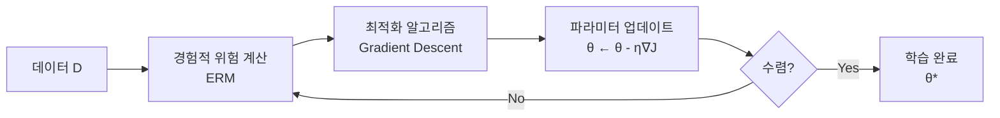
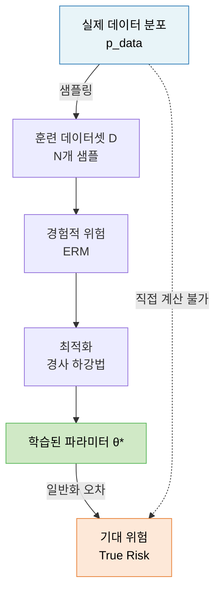
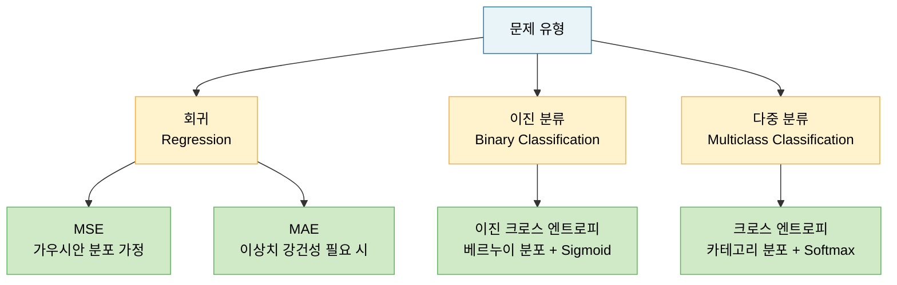

# Lecture 06. 경험적 위험 최소화

## 개요

**핵심 질문**

- 손실 함수는 어떤 역할을 하는가?
- 기대 위험과 경험적 위험은 어떻게 다른가?
- 학습을 최적화 문제로 어떻게 정형화할 수 있는가?
- 좋은 목적함수가 만족해야 할 조건은 무엇인가?

**학습 목표**

- 손실 함수와 비용 함수의 차이를 설명할 수 있다.
- 기대 위험과 경험적 위험의 관계를 수식으로 표현할 수 있다.
- ERM 프레임워크를 통해 학습을 최적화 문제로 정형화할 수 있다.
- 회귀·분류 문제에 적합한 손실 함수를 선택하는 기준을 이해한다.
- 정규화항이 ERM에 추가될 때 어떤 효과가 있는지 설명할 수 있다.

---

## 핵심 개념

### 1. 손실 함수의 역할

**손실 함수 (Loss Function)**

> 단일 샘플에 대해 모델의 예측이 정답에서 얼마나 벗어났는지를 수치로 측정하는 함수.

학습의 방향을 결정하는 나침반이다. 손실 함수 없이는 모델이 "얼마나 틀렸는지"를 알 수 없으므로, 파라미터를 어느 방향으로 업데이트해야 할지도 알 수 없다.

**비용 함수 (Cost Function)**

> 전체 훈련 세트에 대한 손실의 평균 또는 합. 학습의 실제 최적화 대상.

$$
J(\theta) = \frac{1}{N} \sum_{i=1}^{N} \ell\left(\hat{y}^{(i)}, y^{(i)}\right)
$$

**목적 함수 (Objective Function)**

> 최소화하거나 최대화하려는 함수의 총칭.

- 최소화 대상: 비용 함수, 손실 함수
- 최대화 대상: 유틸리티 함수, 우도 함수

---

### 2. 기대 위험과 경험적 위험

**기대 위험 (Expected Risk / True Risk)**

> 모델이 실제 데이터 분포 $p_{\text{data}}(\mathbf{x}, y)$에서 범하는 평균 손실.

$$
R(\theta) = \mathbb{E}_{(\mathbf{x}, y) \sim p_{\text{data}}} \left[ \ell\left(f(\mathbf{x};\theta), y\right) \right]
$$

문제: $p_{\text{data}}$는 미지의 분포이므로 직접 계산 불가.

**경험적 위험 (Empirical Risk)**

> 훈련 데이터셋에서 측정한 평균 손실. 기대 위험의 대리 지표(Proxy).

$$
\hat{R}(\theta) = \frac{1}{N} \sum_{i=1}^{N} \ell\left(f(\mathbf{x}^{(i)};\theta), y^{(i)}\right)
$$

**경험적 위험 최소화 (ERM, Empirical Risk Minimization)**

> 훈련 데이터에서 경험적 위험을 최소화하는 파라미터를 찾는 학습 원리.

$$
\theta^* = \argmin_{\theta} \hat{R}(\theta) = \argmin_{\theta} \frac{1}{N} \sum_{i=1}^{N} \ell\left(f(\mathbf{x}^{(i)};\theta), y^{(i)}\right)
$$

**기대 위험과 경험적 위험의 관계**

$$
R(\theta) \approx \hat{R}(\theta) \quad \text{(훈련 데이터가 충분히 많을 때)}
$$

- 훈련 데이터가 많을수록 경험적 위험 → 기대 위험에 수렴 (대수의 법칙)
- 훈련 데이터가 적으면 경험적 위험이 기대 위험을 과소 추정 → **과적합**

---

### 3. 학습을 최적화 문제로 보는 관점

학습은 결국 **파라미터 공간에서 비용 함수를 최소화하는 점을 찾는 최적화 문제**다.

**표준 최적화 문제 형태**

$$
\min_{\theta \in \Theta} \quad J(\theta) = \frac{1}{N} \sum_{i=1}^{N} \ell\left(f(\mathbf{x}^{(i)};\theta), y^{(i)}\right)
$$

$$
\text{subject to} \quad g_j(\theta) \leq 0, \quad j = 1, \ldots, m
$$

- 제약 조건이 없는 경우: 순수 경험적 위험 최소화
- 제약 조건이 있는 경우: 정규화항 추가 = 구조적 위험 최소화(SRM)

**구조적 위험 최소화 (SRM, Structural Risk Minimization)**

$$
\theta^* = \argmin_{\theta} \left[ \underbrace{\frac{1}{N} \sum_{i=1}^{N} \ell\left(f(\mathbf{x}^{(i)};\theta), y^{(i)}\right)}_{\text{경험적 위험}} + \underbrace{\lambda R(\theta)}_{\text{정규화항}} \right]
$$

- $\lambda$: 정규화 강도 (하이퍼파라미터)
- $R(\theta)$: 모델 복잡도 패널티 ($L_1$ 또는 $L_2$ 노름)

---

### 4. 손실 함수의 종류와 선택 기준

#### 회귀 문제

**평균제곱오차 (MSE, Mean Squared Error)**

- 오차를 제곱해 평균 → 이상치에 민감
- 모델이 타깃의 **평균값** 방향으로 학습
- 가우시안 노이즈 가정 하에서 최대우도추정과 동치

**평균절대오차 (MAE, Mean Absolute Error)**

- 오차의 절댓값 평균 → 이상치에 덜 민감
- 모델이 타깃의 **중앙값** 방향으로 학습
- 미분 불가능 지점 존재 (원점) → 구간별 처리 필요

| 지표 | 수식 | 이상치 | 미분 |
|---|---|---|---|
| MSE | $\frac{1}{N}\sum\|t_i - \hat{y}_i\|^2$ | 민감 | 가능 |
| MAE | $\frac{1}{N}\sum\|t_i - \hat{y}_i\|$ | 덜 민감 | 불연속 |
| RMSE | $\sqrt{\text{MSE}}$ | 민감 | 가능 |

#### 분류 문제

**이진 크로스 엔트로피 (Binary Cross Entropy)**

- 베르누이 분포 기반 최대우도추정의 결과
- 이진 분류 모델의 표준 손실 함수

**크로스 엔트로피 (Categorical Cross Entropy)**

- 카테고리 분포 기반 최대우도추정의 결과
- 다중 분류 모델의 표준 손실 함수

**최대우도추정 관점에서의 손실 함수**

손실 함수는 단순히 오차 측정 도구가 아니다. **관측 데이터를 가장 잘 설명하는 확률분포의 파라미터를 찾는 문제**로 해석할 수 있다.

$$
\theta^* = \argmax_{\theta} \prod_{i=1}^{N} p(y^{(i)} | \mathbf{x}^{(i)}; \theta) = \argmin_{\theta} \left[ -\sum_{i=1}^{N} \log p(y^{(i)} | \mathbf{x}^{(i)}; \theta) \right]
$$

- 회귀 + 가우시안 분포 가정 → MSE
- 이진 분류 + 베르누이 분포 가정 → 이진 크로스 엔트로피
- 다중 분류 + 카테고리 분포 가정 → 크로스 엔트로피

---

### 5. 좋은 목적함수의 조건

| 조건 | 설명 |
|---|---|
| **미분 가능** | 경사 하강법 적용을 위해 거의 모든 점에서 미분 가능해야 함 |
| **볼록성 (Convexity)** | 볼록 함수이면 지역 최솟값 = 전역 최솟값 보장 |
| **데이터와의 정합성** | 모델이 데이터의 실제 분포를 잘 표현하도록 설계 |
| **계산 효율성** | 미니배치 단위로 빠르게 계산 가능해야 함 |
| **최적해의 의미** | 최솟값이 실제로 좋은 모델 파라미터를 가리켜야 함 |

**신경망에서의 비볼록성 문제**

신경망의 손실 함수는 비볼록(Non-convex)이라 지역 최솟값과 안장점이 많다.

- **안장점 (Saddle Point)**: 일부 방향으로는 극소, 다른 방향으로는 극대인 임계점
- 고차원에서 안장점 발생 확률: $1 - \frac{1}{2^{n-1}}$ (매우 높음)
- 해결: SGD 모멘텀, Adam 같은 고급 옵티마이저로 안장점 탈출

---

### 6. 정보 이론과 손실 함수의 연결

**정보량 (Self-Information)**

$$
I(x) = -\log p(x)
$$

- 자주 발생하는 사건 → 낮은 정보량
- 드문 사건 → 높은 정보량

**엔트로피 (Entropy)**

$$
\mathcal{H}(p) = -\sum_x p(x) \log p(x)
$$

- 확률 분포의 불확실성(무질서도)

**크로스 엔트로피 (Cross Entropy)**

$$
\mathcal{H}(p, q) = -\sum_x p(x) \log q(x)
$$

- 실제 분포 $p$와 예측 분포 $q$의 차이
- $p = q$이면 크로스 엔트로피 = 엔트로피 (최솟값)
- 크로스 엔트로피 최소화 = 예측 분포를 실제 분포에 최대한 가깝게

---

## 수식

**경험적 위험 최소화 (ERM)**

$$
\theta^* = \argmin_{\theta} \frac{1}{N} \sum_{i=1}^{N} \ell\left(f(\mathbf{x}^{(i)};\theta), y^{(i)}\right)
$$

**구조적 위험 최소화 (SRM)**

$$
\theta^* = \argmin_{\theta} \left[ \frac{1}{N} \sum_{i=1}^{N} \ell\left(f(\mathbf{x}^{(i)};\theta), y^{(i)}\right) + \lambda R(\theta) \right]
$$

**회귀: MSE 손실**

$$
J(\theta) = \frac{1}{N} \sum_{i=1}^{N} \left\| y^{(i)} - f(\mathbf{x}^{(i)};\theta) \right\|_2^2
$$

**이진 분류: 이진 크로스 엔트로피**

$$
J(\theta) = -\frac{1}{N} \sum_{i=1}^{N} \left[ y^{(i)} \log \hat{p}^{(i)} + (1 - y^{(i)}) \log (1 - \hat{p}^{(i)}) \right]
$$

**다중 분류: 크로스 엔트로피**

$$
J(\theta) = -\frac{1}{N} \sum_{i=1}^{N} \sum_{k=1}^{K} y_k^{(i)} \log \hat{p}_k^{(i)}
$$

**음의 로그 우도 (NLL)**

$$
\text{NLL}(\theta) = -\sum_{i=1}^{N} \log p(y^{(i)} | \mathbf{x}^{(i)}; \theta)
$$

**$L_p$ 노름**

$$
\|\mathbf{x}\|_p = \left( \sum_{i=1}^{n} |x_i|^p \right)^{1/p}, \quad p \geq 1
$$

---

## 시각화

**ERM 프레임워크 전체 구조**

**문제 유형별 손실 함수 선택**

---

## 직관적 이해

경험적 위험 최소화를 **성적표 최적화**로 이해해보자.

기대 위험은 "이 학생이 세상의 모든 문제를 얼마나 잘 풀 수 있는가"다. 이건 측정이 불가능하다. 세상의 모든 문제를 다 줄 수 없으니까.

경험적 위험은 "이 학생이 1000개의 연습 문제에서 얼마나 틀렸는가"다. 이건 측정 가능하다. 그래서 우리는 연습 문제의 오답률을 최소화하는 방향으로 학습시킨다. 연습 문제가 실제 시험을 잘 대표한다면, 연습 오답률 최소화 = 실전 성능 최대화가 된다.

손실 함수는 **채점 방식**이다. 얼마나 틀렸는지를 어떻게 측정하느냐에 따라 학습 방향이 달라진다. MSE는 "큰 실수는 작은 실수보다 훨씬 나쁘다"는 방식이다(제곱 때문에). MAE는 "틀린 건 다 똑같이 나쁘다"는 방식이다. 크로스 엔트로피는 "정답 클래스에 얼마나 확신했는가"를 보는 방식이다.

구조적 위험 최소화는 **감점 규칙이 있는 채점**과 같다. 단순히 오답률만 보지 않고 "모델이 너무 복잡하면 감점"이라는 규칙을 추가한다. 이 감점이 정규화항이다. 훈련 성적(경험적 위험)만 쫓다 보면 실전(기대 위험)에서 무너지는 과적합이 생기기 때문이다.

---

## 참고

- Vapnik, V. (1998). *Statistical Learning Theory*. Wiley-Interscience.
- Goodfellow, I., Bengio, Y., & Courville, A. (2016). [Deep Learning](https://www.deeplearningbook.org/). MIT Press. — Ch. 5.5, Ch. 8.
- Géron, A. (2022). *Hands-On Machine Learning with Scikit-Learn, Keras, and TensorFlow* (3rd ed.). O'Reilly.
- Hastie, T., Tibshirani, R., & Friedman, J. (2009). [The Elements of Statistical Learning](https://hastie.su.domains/ElemStatLearn/) (2nd ed.). Springer. — Ch. 7.
- Shannon, C. E. (1948). [A Mathematical Theory of Communication](https://people.math.harvard.edu/~ctm/home/text/others/shannon/entropy/entropy.pdf). *Bell System Technical Journal*.
