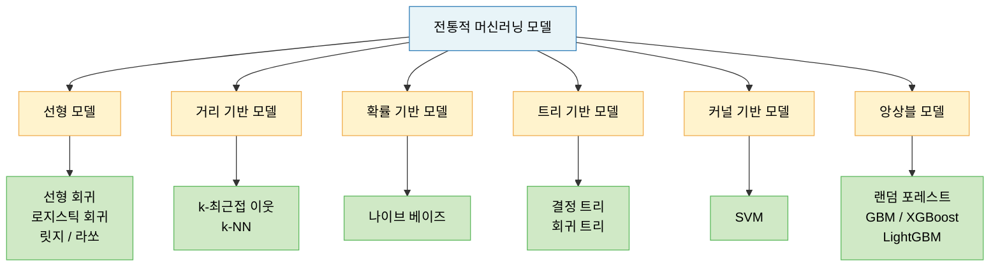
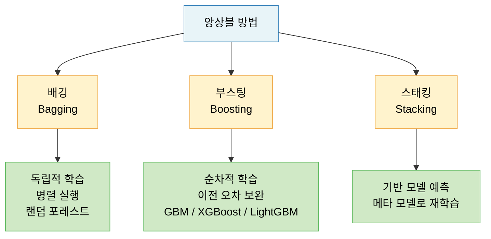
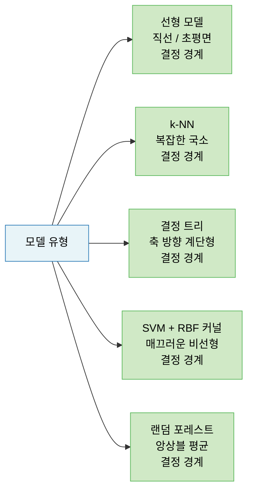
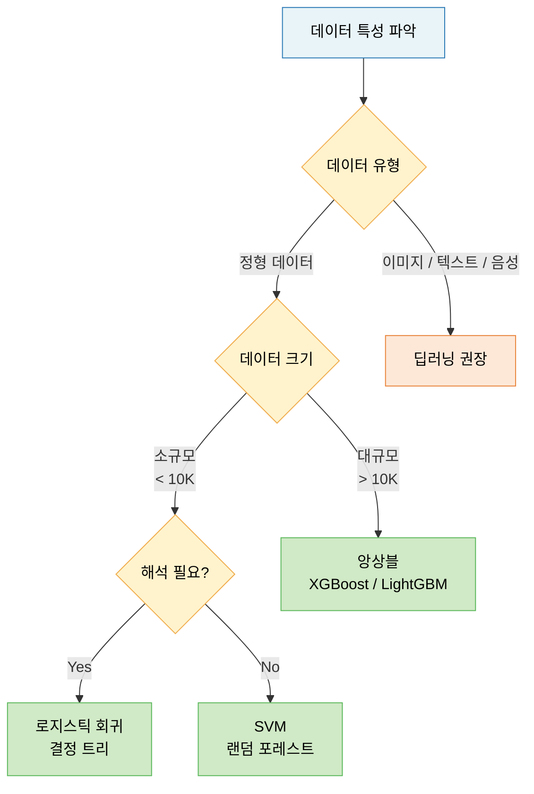

# Lecture 07. 전통적 머신러닝 모델

## 개요

**핵심 질문**

- 선형 모델은 어떤 가정 위에 서 있으며, 그 한계는 어디인가?
- 거리 기반 모델은 어떤 직관으로 예측하는가?
- 확률 기반 모델은 어떻게 불확실성을 다루는가?
- 트리 기반 모델은 왜 정형 데이터에 강한가?
- 딥러닝 이전 모델들의 공통적인 한계는 무엇인가?

**학습 목표**

- 선형 회귀·로지스틱 회귀의 수식과 가정을 설명할 수 있다.
- k-NN, SVM, 나이브 베이즈, 결정 트리 각 모델의 핵심 원리를 구분할 수 있다.
- 앙상블 방법(배깅·부스팅·스태킹)의 차이와 대표 알고리즘을 이해한다.
- 각 모델의 장단점과 적합한 문제 유형을 판단할 수 있다.
- 전통적 머신러닝 모델들이 딥러닝으로 대체된 이유를 설명할 수 있다.

---

## 핵심 개념

### 1. 전통적 머신러닝 모델의 분류

---

### 2. 선형 모델 (Linear Models)

**핵심 가정**: 입력 특성과 출력 사이에 **선형 관계**가 존재한다.

#### 선형 회귀 (Linear Regression)

- 하나 이상의 독립변수(피처)와 연속형 종속변수(타깃) 사이의 선형 관계를 모델링
- 목표: 잔차(실제값 - 예측값)의 제곱합(RSS)을 최소화하는 회귀 계수 탐색
- 정규 방정식(Normal Equation): 닫힌 형태의 해, 특성 수가 많을수록 계산 비용 증가

**다항 회귀 (Polynomial Regression)**

- 특성의 거듭제곱을 새로운 특성으로 추가 → 비선형 데이터에 선형 모델 적용
- 차수 증가 → 표현력 증가, 과적합 위험 증가

**규제 선형 모델**

| 모델 | 규제 | 특징 |
|---|---|---|
| 릿지 (Ridge) | L2: $\alpha\sum w_j^2$ | 가중치 전반 감소, 희소성 없음 |
| 라쏘 (Lasso) | L1: $\alpha\sum\|w_j\|$ | 일부 가중치 정확히 0 → 자동 특성 선택 |
| 엘라스틱넷 | L1 + L2 혼합 | 두 규제의 균형, 그룹 특성 선택 |

#### 로지스틱 회귀 (Logistic Regression)

- 이름은 "회귀"지만 분류 모델
- 선형 방정식의 출력을 시그모이드 함수로 변환 → $[0, 1]$ 범위의 확률로 해석
- 소프트맥스 회귀: 로지스틱 회귀를 다중 분류로 일반화, Softmax + 크로스 엔트로피

**선형 모델의 한계**

- 비선형 관계 직접 표현 불가 (다항 특성 수동 추가 필요)
- 특성 스케일 정규화 필요
- 특성 간 상호작용 자동 학습 불가

---

### 3. 거리 기반 모델 — k-최근접 이웃 (k-NN)

**핵심 직관**: 새로운 샘플은 가장 가까운 $k$개의 훈련 샘플과 같은 클래스(또는 평균값)를 가질 것이다.

- 분류: 이웃 $k$개의 다수결 투표
- 회귀: 이웃 $k$개의 타깃값 평균
- 모델 파라미터 없음 → **게으른 학습(Lazy Learning)**, 훈련 시간 없음, 예측 시간 $O(n)$

**결정계수 ($R^2$)**

$$
R^2 = 1 - \frac{\sum(y_i - \hat{y}_i)^2}{\sum(y_i - \bar{y})^2}
$$

- 1에 가까울수록 좋은 예측, 0에 가까우면 평균 예측 수준

**k-NN의 한계**

- 훈련 세트 범위를 벗어난 새 샘플 → 엉뚱한 예측 (외삽 불가)
- 특성 수 증가 → 차원의 저주(Curse of Dimensionality)
- 전체 훈련 데이터 메모리 상주 필요

---

### 4. 확률 기반 모델 — 나이브 베이즈 (Naive Bayes)

**핵심 사고방식**: 베이즈 정리를 기반으로, 각 특성이 **조건부 독립**이라 가정하여 사후 확률을 계산한다.

$$
P(C | \mathbf{x}) \propto P(C) \prod_{i=1}^{n} P(x_i | C)
$$

- $P(C)$: 클래스 사전 확률
- $P(x_i | C)$: 클래스 $C$에서 특성 $x_i$의 조건부 확률

**특징**

- "나이브(Naive)": 특성 간 독립 가정 → 현실에서 틀리지만 실용적으로 잘 작동
- 텍스트 분류, 스팸 필터링에 강점
- 훈련·예측 모두 빠름, 소규모 데이터에도 효과적

**한계**: 특성 간 상관관계가 강한 경우 성능 저하

---

### 5. 트리 기반 모델 (Tree-Based Models)

#### 결정 트리 (Decision Tree)

**핵심 원리**: 데이터를 재귀적으로 분할하여 트리 구조의 분류/회귀 규칙을 학습한다.

- 루트 노드 → 리프 노드까지 질문(규칙)을 따라 내려가며 예측
- 분할 기준: 정보 균일도 최대화
  - **지니 불순도**: $G = 1 - \sum_k p_k^2$
  - **엔트로피**: $H = -\sum_k p_k \log p_k$
  - **정보 이득(Information Gain)**: 부모-자식 불순도 차이

**특징**

- 스케일링·정규화 전처리 불필요
- 화이트박스 모델 → 해석 가능
- 깊이 제한 없으면 과적합 발생
- 데이터 방향(축 방향)에 민감, 분산이 큼

**CART 알고리즘**

- 이진 분할만 수행 → 분류 + 회귀 모두 적용 가능
- 회귀 트리: 리프 노드에 속한 샘플 타깃값의 **평균**으로 예측

---

### 6. 커널 기반 모델 — SVM (Support Vector Machine)

**핵심 원리**: 클래스 사이에 **마진(Margin)이 가장 넓은 결정 경계**를 찾는다.

- 서포트 벡터: 결정 경계에 가장 가까운 샘플들 → 모델을 전적으로 결정
- 소프트 마진: 일부 마진 오류를 허용하여 일반화 성능 향상

**커널 트릭 (Kernel Trick)**

- 실제로 고차원 공간으로 변환하지 않고, 내적만 계산하여 비선형 분류 가능
- 다항식 커널, RBF(가우시안) 커널, 시그모이드 커널

**SVM의 강점**

- 고차원 공간에서도 효과적
- 훈련 샘플 수 < 특성 수인 경우 강점
- 소규모 데이터셋에서 높은 정확도

**한계**: 대규모 데이터셋에서 느림, 출력이 확률값이 아닌 결정 경계 거리

---

### 7. 앙상블 모델 (Ensemble Models)

**핵심 원리**: 여러 약한 학습기를 결합하여 단일 강한 학습기보다 나은 성능을 달성한다.

#### 배깅 (Bagging) — 랜덤 포레스트

- 부트스트랩 샘플(중복 허용 랜덤 샘플링)로 각 결정 트리를 독립 학습
- 최종 예측: 분류 → 다수결, 회귀 → 평균
- OOB(Out-of-Bag) 샘플: 부트스트랩에 미포함 샘플 → 별도 검증 세트 없이 성능 추정 가능

#### 부스팅 (Boosting)

**GBM (Gradient Boosting Machine)**

- 깊이가 얕은 결정 트리를 순차 학습
- 각 트리는 이전 트리의 **잔차(의사 잔차)**를 학습
- 경사 하강법으로 가중치 업데이트

**XGBoost**

- GBM의 느린 수행 시간·과적합 규제 부재 문제 해결
- 병렬 학습, Tree Pruning, 내장 교차 검증, 결손값 자체 처리
- L1·L2 정규화 내장

**LightGBM**

- 리프 중심(Leaf-wise) 트리 분할 → 최대 손실값 리프 우선 분할
- XGBoost보다 빠른 학습 속도, 낮은 메모리 사용량
- 소규모 데이터셋에서는 과적합 주의

| 모델 | 분할 방식 | 속도 | 메모리 | 특징 |
|---|---|---|---|---|
| GBM | 깊이 우선 | 느림 | 보통 | 기본 구현 |
| XGBoost | 깊이 우선 | 빠름 | 보통 | 병렬, 규제 |
| LightGBM | 리프 우선 | 매우 빠름 | 적음 | 대규모 데이터 |

#### 스태킹 (Stacking)

- 기반 모델(Base Models)의 예측값을 새로운 특성으로 사용
- 메타 모델(Meta Model)이 최종 예측 수행
- 다양한 알고리즘 조합 → 개별 모델의 약점 보완

---

### 8. 딥러닝 이전 모델들의 공통 한계

| 한계 | 설명 |
|---|---|
| **특성 공학 의존** | 유용한 특성을 사람이 직접 설계해야 함 |
| **비정형 데이터 취약** | 이미지·텍스트·음성의 원시 데이터 처리 어려움 |
| **표현력 한계** | 매우 복잡한 패턴(계층적 표현) 학습 불가 |
| **스케일 한계** | 대규모 데이터에서 성능 포화 |
| **엔드투엔드 학습 불가** | 전처리·특성 추출·모델 학습이 분리됨 |

> 딥러닝의 핵심 기여: **특성 공학의 자동화** — 데이터에서 계층적 표현을 스스로 학습.

---

## 수식

**선형 회귀 예측**

$$
\hat{y} = \mathbf{w}^\top \mathbf{x} + b = w_1x_1 + w_2x_2 + \cdots + w_nx_n + b
$$

**정규 방정식 (Normal Equation)**

$$
\hat{\mathbf{w}} = (\mathbf{X}^\top \mathbf{X})^{-1} \mathbf{X}^\top \mathbf{y}
$$

**로지스틱 회귀 (시그모이드)**

$$
\hat{p} = \sigma(\mathbf{w}^\top \mathbf{x} + b) = \frac{1}{1 + e^{-(\mathbf{w}^\top \mathbf{x} + b)}}
$$

**소프트맥스**

$$
\hat{p}_k = \frac{e^{s_k(\mathbf{x})}}{\sum_{j=1}^{K} e^{s_j(\mathbf{x})}}
$$

**지니 불순도**

$$
G = 1 - \sum_{k=1}^{K} p_k^2
$$

**정보 이득**

$$
IG = H(\text{parent}) - \frac{N_{\text{left}}}{N} H(\text{left}) - \frac{N_{\text{right}}}{N} H(\text{right})
$$

**SVM 마진 최대화**

$$
\min_{\mathbf{w}, b} \frac{1}{2} \|\mathbf{w}\|^2 \quad \text{subject to} \quad y^{(i)}(\mathbf{w}^\top \mathbf{x}^{(i)} + b) \geq 1
$$

**나이브 베이즈**

$$
\hat{y} = \argmax_k P(C_k) \prod_{i=1}^{n} P(x_i | C_k)
$$

---

## 시각화

**각 모델의 결정 경계 특성**

**모델 선택 가이드**

---

## 직관적 이해

전통적 머신러닝 모델들은 각자 다른 **철학**으로 세상을 바라본다.

선형 모델은 **직선으로 세상을 나눌 수 있다**고 믿는다. 가장 단순하고 해석하기 쉽지만, 세상이 직선처럼 단순하지 않을 때 한계에 부딪힌다.

k-NN은 **비슷한 것끼리 모인다**는 직관을 따른다. 새로운 학생이 전학 왔을 때, 그 학생이 앉은 자리 주변 친구들의 성격을 보고 그 학생의 성격을 추론하는 것과 같다.

나이브 베이즈는 **각 단서를 독립적으로 종합한다**. 스팸 메일 분류에서 "무료"라는 단어와 "당첨"이라는 단어가 각각 독립적으로 스팸 확률을 높인다고 가정한다. 두 단어의 조합이 더 강한 증거라는 것을 무시하지만, 놀랍도록 잘 작동한다.

결정 트리는 **스무고개 게임**이다. "키가 170cm 이상인가? → 몸무게가 70kg 이상인가? → ..." 식으로 질문을 나눠가며 최종 답에 도달한다.

SVM은 **가장 여유 있는 경계**를 찾는다. 두 팀을 나누는 선을 그을 때, 양쪽에서 최대한 멀리 떨어진 선을 선택한다. 커널 트릭은 마치 꼬인 실뭉치를 3차원으로 들어 올려 평면으로 나눌 수 있게 만드는 것과 같다.

앙상블은 **집단 지성**이다. 한 명의 천재보다 평범한 전문가 100명의 다수결이 더 나을 수 있다는 원리다. 랜덤 포레스트는 서로 다른 데이터로 훈련된 트리들이 투표하고, XGBoost는 앞 전문가가 틀린 문제만 다음 전문가가 집중해서 공부하는 방식이다.

이 모든 모델의 공통 한계는 **특성 공학의 의존성**이다. 어떤 특성을 입력으로 줄지는 사람이 직접 설계해야 한다. 딥러닝의 혁명은 이 과정을 자동화한 데 있다.

---

## 참고

- Géron, A. (2022). *Hands-On Machine Learning with Scikit-Learn, Keras, and TensorFlow* (3rd ed.). O'Reilly.
- Raschka, S., & Mirjalili, V. (2022). *Python Machine Learning* (3rd ed.). Packt Publishing.
- Hastie, T., Tibshirani, R., & Friedman, J. (2009). [The Elements of Statistical Learning](https://hastie.su.domains/ElemStatLearn/) (2nd ed.). Springer.
- Breiman, L. (2001). [Random Forests](https://link.springer.com/article/10.1023/A:1010933404324). *Machine Learning*, 45, 5–32.
- Chen, T., & Guestrin, C. (2016). [XGBoost: A Scalable Tree Boosting System](https://arxiv.org/abs/1603.02754). *KDD*.
- Ke, G., et al. (2017). [LightGBM: A Highly Efficient Gradient Boosting Decision Tree](https://papers.nips.cc/paper/2017/hash/6449f44a102fde848669bdd9eb6b76fa-Abstract.html). *NeurIPS*.
- Cortes, C., & Vapnik, V. (1995). [Support-Vector Networks](https://link.springer.com/article/10.1007/BF00994018). *Machine Learning*, 20, 273–297.
