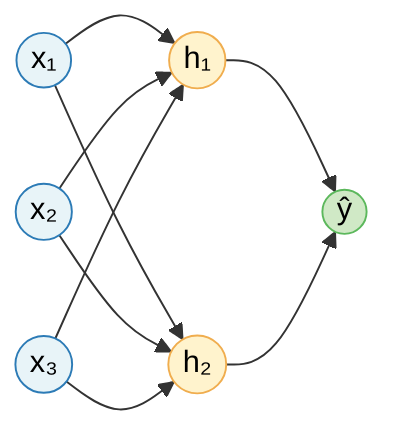
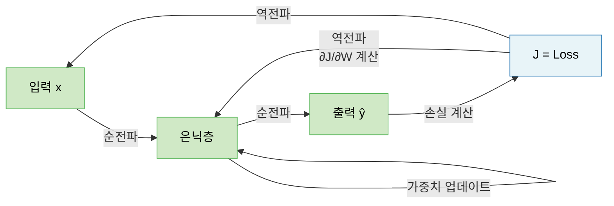
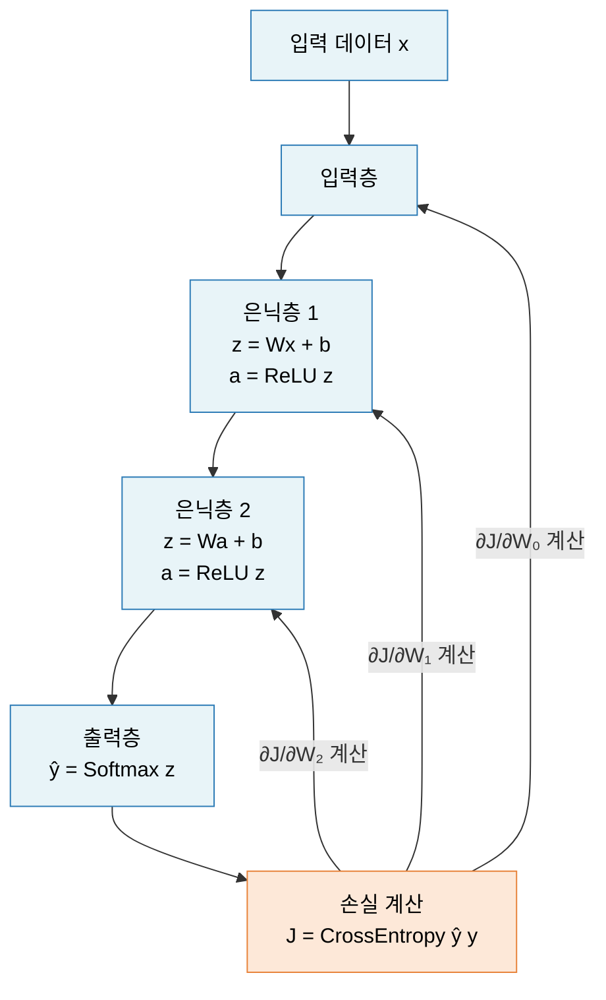
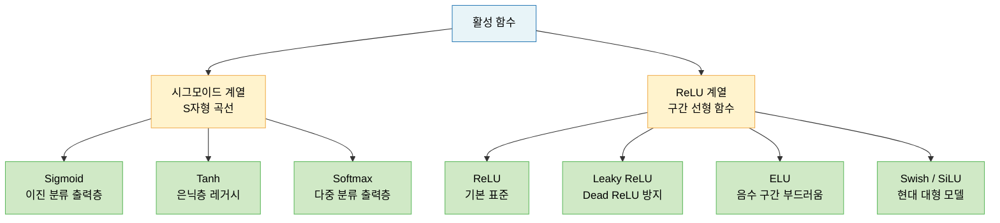

# Lecture 08. 신경망의 원리

## 개요

**핵심 질문**

- 퍼셉트론은 어떻게 학습하는가?
- 다층 신경망은 단층 신경망과 무엇이 다른가?
- 역전파 알고리즘의 핵심 아이디어는 무엇인가?
- 깊이(Depth)는 신경망 성능에 어떤 영향을 미치는가?

**학습 목표**

- 퍼셉트론의 구조와 학습 규칙을 수식으로 설명할 수 있다.
- 다층 신경망의 순전파 과정을 층 단위로 추적할 수 있다.
- 역전파 알고리즘을 연쇄 법칙과 계산 그래프로 이해할 수 있다.
- 주요 활성 함수의 특성과 미분을 비교할 수 있다.
- 가중치 초기화·배치 정규화·드롭아웃의 역할을 설명할 수 있다.

---

## 핵심 개념

### 1. 퍼셉트론 (Perceptron)

퍼셉트론은 신경망의 가장 기본 단위이자 최초의 학습 가능한 인공 신경망 모델이다.

**생체 뉴런 → 퍼셉트론 대응**

| 생체 뉴런 | 퍼셉트론 |
|---|---|
| 수상 돌기 (신호 수신) | 입력 $x_1, x_2, \ldots, x_n$ |
| 시냅스 연결 강도 | 가중치 $w_1, w_2, \ldots, w_n$ |
| 세포체 (신호 합산) | 가중 합산 $z = \mathbf{w}^\top\mathbf{x} + b$ |
| 축삭 발화 임계값 | 활성 함수 $f(z)$ |
| 다음 뉴런으로 신호 전달 | 출력 $\hat{y} = f(z)$ |

**퍼셉트론의 한계**

- 선형 분류기 → XOR처럼 선형 분리 불가능한 문제를 풀지 못함
- 해결: 층을 쌓아 다층 퍼셉트론(MLP) 구성

---

### 2. 다층 신경망의 구조

**계층 구조**

- **입력 계층 (Input Layer)**: 외부 데이터를 벡터 형태로 수신 → 다음 계층에 전달
- **은닉 계층 (Hidden Layer)**: 데이터의 특징 추출, 비선형 변환 수행
- **출력 계층 (Output Layer)**: 추론 결과 출력, 문제 유형에 맞는 활성 함수 사용

**완전 연결 계층 (Fully Connected Layer)**

- 현재 층의 모든 뉴런이 이전 층의 모든 뉴런과 연결
- 각 뉴런은 같은 입력에서 서로 다른 특징을 추출 → **뉴런마다 고유한 가중치 벡터**

**모델 크기**

- **너비 (Width)**: 계층별 뉴런 수
- **깊이 (Depth)**: 계층 수 (은닉층 기준)
- 너비·깊이·해상도를 함께 스케일링하면 성능이 효율적으로 향상됨 (EfficientNet)

---

### 3. 순전파 (Forward Pass)

입력 데이터가 입력층 → 은닉층 → 출력층 순으로 흐르며 예측값을 계산하는 과정.

**단일 뉴런의 계산**

$$
z = \mathbf{w}^\top \mathbf{x} + b = w_1x_1 + w_2x_2 + \cdots + w_nx_n + b
$$

$$
a = f(z) \quad \text{(활성 함수 적용)}
$$

**계층 단위 계산 (행렬 형식)**

$$
\mathbf{z}^{(l)} = W^{(l)\top} \mathbf{a}^{(l-1)} + \mathbf{b}^{(l)}
$$

$$
\mathbf{a}^{(l)} = f\left(\mathbf{z}^{(l)}\right)
$$

**전체 신경망 = 함수들의 합성**

$$
\hat{y} = f^{(L)}\left(\cdots f^{(2)}\left(f^{(1)}(\mathbf{x})\right)\right)
$$

**범용 근사 정리 (Universal Approximation Theorem)**

> 2계층 순방향 신경망에서 은닉 뉴런이 충분히 많고, 검증된 활성 함수를 사용하면 $n$차원 공간의 임의의 연속 함수를 원하는 정확도로 근사할 수 있다.

즉 신경망은 이론적으로 **어떤 함수도 표현할 수 있는 범용 함수 근사기**다.

---

### 4. 활성 함수 (Activation Function)

활성 함수는 신경망에 **비선형성**을 부여한다. 활성 함수 없이 층을 아무리 쌓아도 단순한 선형 변환에 불과하다.

**문제 유형별 출력층 활성 함수**

| 문제 유형 | 활성 함수 | 출력 범위 |
|---|---|---|
| 이진 분류 | Sigmoid | $[0, 1]$ |
| 다중 분류 | Softmax | $[0, 1]$, 합 = 1 |
| 회귀 | Identity (항등 함수) | $(-\infty, \infty)$ |

**은닉층 주요 활성 함수**

| 함수 | 수식 | 범위 | 특징 |
|---|---|---|---|
| 계단 함수 | $f(z) = \mathbb{1}[z \geq 0]$ | $\{0, 1\}$ | 미분값 0, 학습 불가 |
| Sigmoid | $\frac{1}{1+e^{-x}}$ | $(0, 1)$ | 그레이디언트 소실, 연산 느림 |
| Tanh | $\frac{e^x - e^{-x}}{e^x + e^{-x}}$ | $(-1, 1)$ | Sigmoid 개선, 그레이디언트 소실 |
| ReLU | $\max(0, x)$ | $[0, \infty)$ | 빠름, Dead ReLU 문제 |
| Leaky ReLU | $\max(0.01x, x)$ | $(-\infty, \infty)$ | Dead ReLU 방지 |
| ELU | $x$ if $x > 0$, else $\alpha(e^x - 1)$ | $(-\alpha, \infty)$ | 음수 구간 부드러움 |
| Swish (SiLU) | $x \cdot \sigma(x)$ | $(-\infty, \infty)$ | 자기 정규화, 현대 모델 애용 |

**Dead ReLU 문제**

- 가중치 초기화 실패 또는 학습률이 너무 클 때 발생
- 가중 합산이 음수 → ReLU 출력 0 → 그레이디언트 0 → 영구적으로 학습 중단

---

### 5. 역전파 알고리즘 (Backpropagation)

**핵심 아이디어**

> 최종 손실에서 시작하여, 연쇄 법칙(Chain Rule)을 사용해 각 파라미터가 손실에 기여한 정도(그레이디언트)를 출력층 → 입력층 방향으로 효율적으로 계산한다.

**연쇄 법칙 (Chain Rule)**

합성 함수의 미분: $\frac{\partial J}{\partial w} = \frac{\partial J}{\partial z} \cdot \frac{\partial z}{\partial w}$

2계층 신경망 예시:

$$
\frac{\partial J}{\partial w^1_{nm}} = \frac{\partial J}{\partial y} \cdot \frac{\partial y}{\partial z^2} \cdot \frac{\partial z^2}{\partial a^1_m} \cdot \frac{\partial a^1_m}{\partial z^1_m} \cdot \frac{\partial z^1_m}{\partial w^1_{nm}}
$$

**역전파 실행 순서**

1. **손실 함수 미분**: $\frac{\partial J}{\partial y}$ 계산 → 출력층에 전달
2. **출력 뉴런 미분**: 활성 함수 미분 → 가중치 전역 미분 → 가중치 업데이트 → 은닉층에 전달
3. **은닉 뉴런 미분**: 전달받은 전역 미분 × 지역 미분 → 가중치 업데이트

**핵심**: 공통 부분(각 층의 오차)을 한 번만 계산하고 재사용 → 계산 효율성 극대화

---

### 6. 경사 하강법 및 옵티마이저

| 옵티마이저 | 핵심 아이디어 | 특징 |
|---|---|---|
| SGD | 랜덤 미니배치로 그레이디언트 추정 | 빠르지만 진동 |
| SGD + Momentum | 이전 속도에 관성 추가 | 안장점 탈출, 오버슈팅 주의 |
| Nesterov | 미리 한 걸음 가본 뒤 그레이디언트 계산 | 오버슈팅 억제 |
| AdaGrad | 전체 경로 곡면 변화량으로 학습률 조정 | 학습 초반 중단 위험 |
| RMSProp | 최근 경로 곡면 변화량 (지수 이동 평균) | AdaGrad 개선 |
| Adam | SGD Momentum + RMSProp | 현재 가장 많이 사용 |

---

### 7. 가중치 초기화

가중치 초기화는 손실 함수에서의 **출발 위치**를 결정한다.

- **0 초기화**: 모든 뉴런이 동일한 출력 → 대칭성 문제 → 학습 불가
- **상수 초기화**: 대칭성 → 하나의 뉴런과 동일한 효과
- **너무 작은 난수**: 층이 깊어질수록 출력이 0으로 수렴 → **그레이디언트 소실**
- **너무 큰 난수**: 출력이 포화 → **그레이디언트 폭발**

**Xavier 초기화** (Sigmoid/Tanh 계열)

$$
\text{Var}(w_i) = \frac{1}{n}
$$

**He 초기화** (ReLU 계열)

$$
\text{Var}(w_i) = \frac{2}{n}
$$

---

### 8. 배치 정규화 (Batch Normalization)

**내부 공변량 변화 (Internal Covariate Shift)**

층을 지날수록 데이터 분포가 왜곡되어 학습이 불안정해지는 현상.

**해결책**: 각 층의 출력을 미니배치 단위로 정규화 → 다시 원래 분포로 복구

$$
\hat{x}^{(k)} = \frac{x^{(k)} - \mu_\mathcal{B}}{\sqrt{\sigma^2_\mathcal{B} + \epsilon}}, \quad y^{(k)} = \gamma^{(k)} \hat{x}^{(k)} + \beta^{(k)}
$$

**효과**: 그레이디언트 흐름 안정, 초기화 의존도 감소, 높은 학습률 허용

---

### 9. 드롭아웃 (Dropout)

훈련 중 뉴런을 랜덤하게 비활성화하여 과적합을 방지하는 정규화 기법.

- 매 미니배치마다 다른 부분 신경망을 학습 → **무한 앙상블 효과**
- 추론 시: 드롭아웃 없이, 가중치에 유지 확률 $p$를 곱해 보정

$$
\tilde{\mathbf{a}}^{(l)} = (\mathbf{a}^{(l)} \odot \mathbf{r}^{(l)}) / p, \quad \mathbf{r}^{(l)} \sim \text{Bernoulli}(p)
$$

---

### 10. 깊이가 성능에 미치는 영향

**왜 깊이가 중요한가?**

- 얕은 신경망: 폭을 넓혀야만 복잡한 함수 표현 가능 → 파라미터 비효율
- 깊은 신경망: **계층적 표현(Hierarchical Representation)** 학습
  - 1층: 에지(Edge), 질감
  - 2층: 모양, 부분 패턴
  - 3층+: 객체, 개념

**깊이 증가의 문제**

- 그레이디언트 소실: 역전파 중 미분값이 0에 수렴
- 그레이디언트 폭발: 미분값이 기하급수적으로 커짐
- 해결: 배치 정규화, He 초기화, 잔차 연결(ResNet)

---

## 수식

**뉴런의 계산**

$$
z = \mathbf{w}^\top \mathbf{x} + b, \quad a = f(z)
$$

**계층 단위 순전파**

$$
\mathbf{z}^{(l)} = W^{(l)\top} \mathbf{a}^{(l-1)} + \mathbf{b}^{(l)}, \quad \mathbf{a}^{(l)} = f\left(\mathbf{z}^{(l)}\right)
$$

**주요 활성 함수와 미분**

$$
\sigma(x) = \frac{1}{1 + e^{-x}}, \quad \sigma'(x) = \sigma(x)(1 - \sigma(x))
$$

$$
\tanh(x) = \frac{e^x - e^{-x}}{e^x + e^{-x}}, \quad \tanh'(x) = 1 - \tanh^2(x)
$$

$$
\text{ReLU}(x) = \max(0, x), \quad \text{ReLU}'(x) = \begin{cases} 1 & x > 0 \\ 0 & x \leq 0 \end{cases}
$$

$$
\text{Swish}(x) = x \cdot \sigma(x)
$$

**파라미터 업데이트 (경사 하강법)**

$$
\theta \leftarrow \theta - \alpha \nabla_\theta J(\theta)
$$

**역전파 연쇄 법칙**

$$
\frac{\partial J}{\partial w^{(l)}} = \frac{\partial J}{\partial z^{(l)}} \cdot \frac{\partial z^{(l)}}{\partial w^{(l)}} = \delta^{(l)} \cdot \mathbf{a}^{(l-1)\top}
$$

**Adam 옵티마이저**

$$
v_{t+1} = \beta_1 v_t + (1 - \beta_1) \nabla f(x_t)
$$

$$
r_{t+1} = \beta_2 r_t + (1 - \beta_2) \nabla f(x_t)^2
$$

$$
x_{t+1} = x_t - \frac{\alpha}{\sqrt{r_{t+1}} + \epsilon} \odot v_{t+1}
$$

**배치 정규화**

$$
\hat{x}_i = \frac{x_i - \mu_\mathcal{B}}{\sqrt{\sigma^2_\mathcal{B} + \epsilon}}, \quad y_i = \gamma \hat{x}_i + \beta
$$

---

## 시각화

**순전파 → 역전파 전체 흐름**

**활성 함수 계보**

---

## 직관적 이해

신경망은 **데이터를 점진적으로 변환하는 공장**이다. 원자재(입력)가 컨베이어 벨트(층)를 따라 이동하면서 각 공정(뉴런의 가중 합산 + 활성 함수)을 거쳐 최종 제품(예측)이 나온다.

퍼셉트론은 이 공장의 가장 기본 단위 — **단 하나의 공정**이다. 입력의 가중 합산을 구하고, 임계값을 넘으면 발화한다. 문제는 이 단순한 공정 하나로는 "XOR"처럼 비선형적인 문제를 풀 수 없다는 것이다.

층을 쌓는다는 것은 공정을 직렬로 연결하는 것이다. 각 층은 이전 층의 출력을 입력으로 받아 더 추상적인 특징을 추출한다. 이미지 분류에서 첫 번째 층은 에지를 보고, 두 번째 층은 모양을 보고, 세 번째 층은 객체를 인식한다.

역전파는 **공장 품질 관리 시스템**이다. 최종 제품에 불량이 생겼을 때(손실이 클 때), 컨베이어 벨트를 거꾸로 따라가며 어떤 공정이 얼마나 불량에 기여했는지를 추적한다. 그리고 각 공정의 설정값(가중치)을 조금씩 조정한다. 이 과정을 수만 번 반복하면 공장 전체가 최적화된다.

활성 함수는 **비선형 왜곡기**다. 이것 없이 층을 아무리 쌓아도 결국 하나의 선형 변환에 불과하다. ReLU가 "음수는 버리고 양수는 통과"라는 단순한 규칙으로 놀라운 성능을 내는 이유는, 이 단순함이 계산 효율성과 비선형성을 동시에 만족시키기 때문이다.

---

## 참고

- Goodfellow, I., Bengio, Y., & Courville, A. (2016). [Deep Learning](https://www.deeplearningbook.org/). MIT Press. — Ch. 6 (Deep Feedforward Networks).
- Chollet, F. (2021). *Deep Learning with Python* (2nd ed.). Manning.
- Rumelhart, D. E., Hinton, G. E., & Williams, R. J. (1986). [Learning representations by back-propagating errors](https://www.nature.com/articles/323533a0). *Nature*, 323, 533–536.
- Ioffe, S., & Szegedy, C. (2015). [Batch Normalization: Accelerating Deep Network Training by Reducing Internal Covariate Shift](https://arxiv.org/abs/1502.03167). *ICML*.
- Srivastava, N., et al. (2014). [Dropout: A Simple Way to Prevent Neural Networks from Overfitting](https://jmlr.org/papers/v15/srivastava14a.html). *JMLR*, 15, 1929–1958.
- He, K., et al. (2015). [Delving Deep into Rectifiers: Surpassing Human-Level Performance on ImageNet Classification](https://arxiv.org/abs/1502.01852). *ICCV*.
- Kingma, D. P., & Ba, J. (2015). [Adam: A Method for Stochastic Optimization](https://arxiv.org/abs/1412.6980). *ICLR*.
