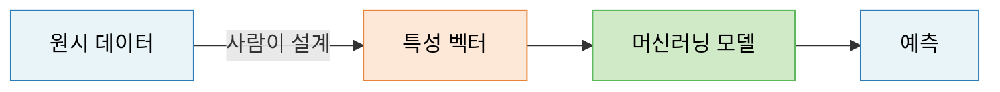
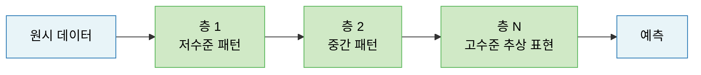
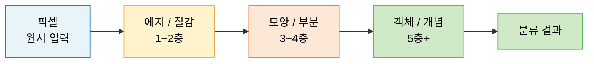
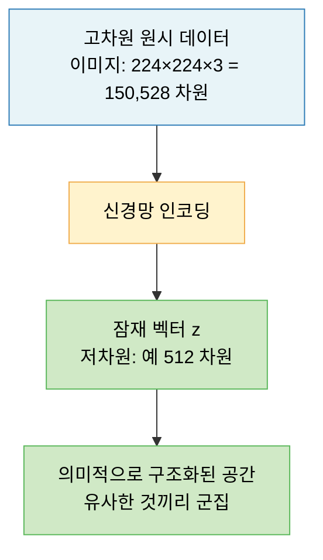
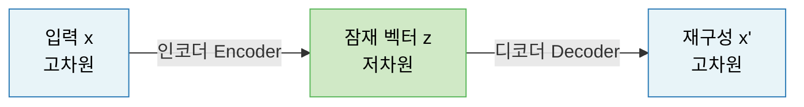
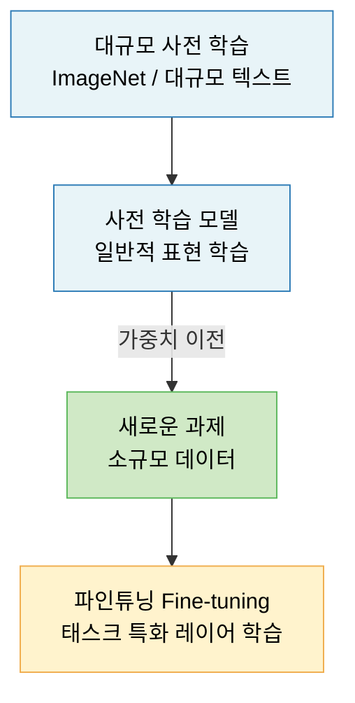
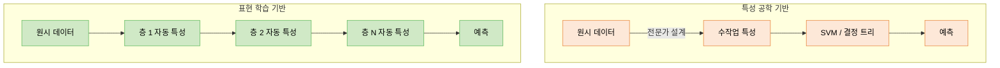
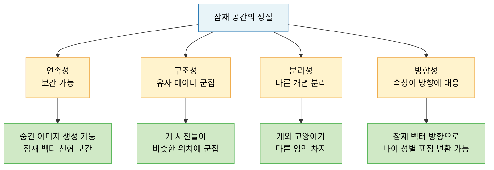

# Lecture 09. 표현 학습

## 개요

**핵심 질문**

- 표현 학습은 전통적인 특성 공학과 무엇이 다른가?
- 신경망은 데이터에서 어떻게 표현을 스스로 학습하는가?
- 임베딩이란 무엇이며, 왜 유용한가?
- 잠재 공간(Latent Space)은 어떻게 해석할 수 있는가?

**학습 목표**

- 특성 공학과 표현 학습의 근본적 차이를 설명할 수 있다.
- 신경망의 각 층이 점진적으로 더 추상적인 표현을 학습하는 과정을 이해한다.
- 임베딩의 정의와 활용 맥락을 설명할 수 있다.
- 잠재 공간의 기하학적 의미를 해석할 수 있다.
- 전이 학습이 표현 학습의 연장선임을 이해한다.

---

## 핵심 개념

### 1. 특성 공학 vs 표현 학습

**특성 공학 (Feature Engineering)**

> 사람이 도메인 지식을 바탕으로 원시 데이터에서 유용한 특성을 수동으로 설계하고 추출하는 과정.

전통적 머신러닝의 병목은 대부분 여기서 발생한다. 좋은 특성을 찾으면 단순한 모델도 잘 작동하지만, 특성 설계에 전문가의 시간과 노력이 집중된다.

**표현 학습 (Representation Learning)**

> 데이터에서 유용한 표현을 만드는 데이터 변환을, **피드백 신호를 바탕으로 자동으로 탐색하는 과정**.

사람이 특성을 설계하지 않는다. 모델이 손실 함수를 최소화하는 방향으로 **스스로 유용한 표현을 발견**한다.

**핵심 차이 요약**

| 구분 | 특성 공학 | 표현 학습 |
|---|---|---|
| 특성 설계 주체 | 사람 (도메인 전문가) | 모델 (자동) |
| 도메인 지식 의존 | 높음 | 낮음 |
| 비정형 데이터 처리 | 어려움 | 자연스러움 |
| 재사용성 | 낮음 (도메인 특화) | 높음 (전이 학습 가능) |
| 대표 기술 | 수작업 피처, PCA, SIFT | 딥러닝, 오토인코더, Word2Vec |

---

### 2. 표현 학습의 의미

신경망은 입력 데이터를 층마다 **점진적으로 변환**한다. 각 층은 이전 층의 표현을 입력으로 받아 더 추상적인 표현을 출력한다.

**이미지 분류에서의 계층적 표현**

**자연어 처리에서의 계층적 표현**

- 1층: 문자, 음절 패턴
- 2층: 단어, 형태소
- 3층: 구(Phrase), 문법 구조
- 4층+: 의미, 문맥, 의도

**핵심**: 깊이가 깊어질수록 더 **추상적이고 불변적인(invariant) 표현**이 형성된다. 이미지가 조금 회전해도 상위 층의 "고양이" 표현은 크게 변하지 않는다.

**딥러닝에서 딥(Deep)의 진짜 의미**

> 단순히 층이 많다는 것이 아니라, **층 기반의 계층적 표현 학습**이 핵심이다.

---

### 3. 임베딩 (Embedding)

**정의**

> 고차원의 이산적(discrete) 또는 복잡한 데이터를 저차원의 연속 벡터 공간으로 변환하는 것.

임베딩은 표현 학습의 가장 직접적인 산물이다. 신경망이 학습한 표현이 고정된 크기의 밀집 벡터로 압축된 형태다.

**왜 필요한가?**

원-핫 인코딩(One-Hot Encoding)의 문제:
- 어휘가 10만 개면 10만 차원의 희소 벡터 → 계산 비효율
- "왕"과 "여왕"이 벡터 공간에서 아무 관계 없음 → 의미 정보 없음

임베딩의 해결:
- 밀집 저차원 벡터 (예: 300차원)
- 의미적으로 유사한 단어는 **가까운 위치**에 → 의미 정보 포함

**Word2Vec 임베딩의 유명한 예시**

$$
\text{vec}(\text{왕}) - \text{vec}(\text{남자}) + \text{vec}(\text{여자}) \approx \text{vec}(\text{여왕})
$$

벡터 공간에서 **의미 관계가 방향으로 인코딩**된다.

**임베딩의 종류**

| 종류 | 대상 | 대표 방법 |
|---|---|---|
| 단어 임베딩 | 자연어 단어 | Word2Vec, GloVe, FastText |
| 문장/문서 임베딩 | 텍스트 시퀀스 | BERT, Sentence-BERT |
| 이미지 임베딩 | 이미지 | CNN 마지막 층 이전 벡터 |
| 그래프 임베딩 | 노드/엣지 | Node2Vec, GraphSAGE |
| 사용자/아이템 임베딩 | 추천 시스템 | Matrix Factorization, DeepFM |

**단어 임베딩의 학습 방식 (Word2Vec)**

- CBOW: 주변 단어들로 중심 단어 예측
- Skip-gram: 중심 단어로 주변 단어들 예측
- 레이블이 필요 없는 자기지도 학습 → 대규모 텍스트에서 자동 학습

---

### 4. 잠재 공간 (Latent Space)

**정의**

> 신경망이 데이터를 인코딩하여 만들어낸 저차원의 내부 표현 공간. 원시 데이터의 핵심 정보가 압축되어 있는 공간.

"잠재(Latent)"는 **겉으로 드러나지 않은 숨겨진**이라는 의미다. 신경망은 데이터에 내재한 구조를 발견하여 이 잠재 공간에 표현한다.

**잠재 공간의 기하학적 해석**

**잠재 공간의 핵심 성질**

1. **연속성**: 잠재 공간에서 두 점 사이를 보간(Interpolation)하면 의미 있는 중간 표현이 생성됨
2. **구조성**: 유사한 데이터는 잠재 공간에서 가까이 위치함
3. **분리성**: 서로 다른 개념은 잠재 공간에서 분리된 영역을 차지함
4. **방향성**: 특정 속성(예: 나이, 감정)이 잠재 공간의 특정 방향에 대응됨

**오토인코더(Autoencoder)에서의 잠재 공간**

- 인코더: $\mathbf{x} \rightarrow \mathbf{z}$ (압축)
- 디코더: $\mathbf{z} \rightarrow \hat{\mathbf{x}}$ (복원)
- 학습 목표: 재구성 오차 최소화 → 잠재 공간이 데이터의 본질 포착

**VAE (Variational Autoencoder)의 확률적 잠재 공간**

일반 오토인코더와 달리, 잠재 벡터를 **확률 분포**로 표현:

$$
\mathbf{z} \sim \mathcal{N}(\boldsymbol{\mu}(\mathbf{x}), \boldsymbol{\sigma}^2(\mathbf{x}))
$$

→ 잠재 공간이 연속적이고 부드러워져 새로운 샘플 생성 가능

---

### 5. 딥러닝의 기하학적 해석

딥러닝은 **고차원 데이터 매니폴드(Manifold)를 펼치는 과정**으로 해석할 수 있다.

- 실제 데이터는 고차원 공간에서 저차원 매니폴드 위에 분포
- 신경망의 각 층은 이 매니폴드를 점진적으로 펼쳐(unfold) 선형 분리 가능한 형태로 변환
- 최종 층에서 클래스 간 선형 분리 가능한 표현 달성

**텐서 연산의 기하학적 의미**

| 연산 | 기하학적 의미 |
|---|---|
| 행렬 곱 ($W\mathbf{x}$) | 회전, 크기 변경 (선형 변환) |
| 편향 추가 ($+\mathbf{b}$) | 이동 (Translation) |
| 활성 함수 ($f(\cdot)$) | 비선형 왜곡 |
| 전체 층 | 아핀 변환 + 비선형 변환 = 복잡한 공간 변형 |

딥러닝 = **복잡하게 꼬인 데이터 매니폴드를 단계적으로 펼쳐** 깔끔한 표현을 찾는 것.

---

### 6. 전이 학습 (Transfer Learning)

표현 학습의 가장 강력한 응용이다. 대규모 데이터로 학습된 표현을 새로운 과제에 재사용한다.

**핵심 아이디어**

> 대규모 데이터에서 학습한 일반적인 표현(하위 층)은 다른 도메인에서도 유용하다.

**전이 학습이 가능한 이유**

- 하위 층은 **도메인 비종속적** 표현 학습 (에지, 질감, 기본 문법 등)
- 상위 층은 **도메인 종속적** 표현 학습 (특정 객체, 특정 언어 패턴)
- 새로운 과제에는 하위 층을 재사용하고 상위 층만 새로 학습

**대표 사례**

- 이미지: ImageNet 사전 학습 CNN → 의료 이미지 분류
- 텍스트: BERT/GPT 사전 학습 → 감성 분석, 질의응답
- 루이의 B-BOT: RAG + 프롬프트 최적화로 LLM의 표현을 부산 정보 도메인에 특화

---

## 수식

**임베딩 레이어 (Lookup Table)**

$$
\mathbf{e} = E[i], \quad E \in \mathbb{R}^{V \times d}
$$

- $V$: 어휘 크기, $d$: 임베딩 차원
- 원-핫 벡터와의 행렬 곱을 효율적 룩업으로 대체

**코사인 유사도 (임베딩 유사성 측정)**

$$
\text{sim}(\mathbf{a}, \mathbf{b}) = \frac{\mathbf{a}^\top \mathbf{b}}{\|\mathbf{a}\| \|\mathbf{b}\|}
$$

**오토인코더 재구성 손실**

$$
\mathcal{L}_{\text{AE}} = \|\mathbf{x} - \hat{\mathbf{x}}\|^2 = \|\mathbf{x} - D(E(\mathbf{x}))\|^2
$$

**VAE 손실 (ELBO)**

$$
\mathcal{L}_{\text{VAE}} = \underbrace{\|\mathbf{x} - \hat{\mathbf{x}}\|^2}_{\text{재구성 손실}} + \underbrace{D_{\text{KL}}\left(\mathcal{N}(\boldsymbol{\mu}, \boldsymbol{\sigma}^2) \| \mathcal{N}(0, I)\right)}_{\text{KL 발산 정규화항}}
$$

**KL 발산 (두 분포의 차이)**

$$
D_{\text{KL}}(q \| p) = \sum_x q(x) \log \frac{q(x)}{p(x)}
$$

**Word2Vec Skip-gram 목적 함수**

$$
\mathcal{L} = -\frac{1}{T} \sum_{t=1}^{T} \sum_{-c \leq j \leq c, j \neq 0} \log p(w_{t+j} | w_t)
$$

- $T$: 총 단어 수, $c$: 문맥 창 크기

**계층적 표현: 뉴런 $l$층의 표현**

$$
\mathbf{h}^{(l)} = f^{(l)}\left(W^{(l)} \mathbf{h}^{(l-1)} + \mathbf{b}^{(l)}\right)
$$

표현은 층이 깊어질수록 더 추상화된다:
$\mathbf{x} = \mathbf{h}^{(0)} \rightarrow \mathbf{h}^{(1)} \rightarrow \cdots \rightarrow \mathbf{h}^{(L)} = \hat{y}$

---

## 시각화

**특성 공학 vs 표현 학습 파이프라인 비교**

**잠재 공간의 구조**

---

## 직관적 이해

특성 공학은 **요리사가 재료를 직접 손질하는 것**이다. 전문가가 "이 데이터에서는 이 특성이 중요하다"를 직접 판단하여 손으로 뽑아낸다. 잘하면 매우 효과적이지만, 요리사마다 다르고, 새로운 재료(도메인)가 나오면 처음부터 다시 손질해야 한다.

표현 학습은 **재료의 맛을 보면서 스스로 손질 방법을 터득하는 로봇**이다. 처음에는 서툴지만, 충분한 데이터와 피드백(손실 함수)을 주면 인간이 생각하지 못했던 패턴까지 발견한다.

임베딩은 **지도**다. 거대한 어휘 사전(도시들)을 2D 지도(임베딩 공간)에 펼쳐놓았을 때, 의미적으로 가까운 단어들(서울과 부산)이 지도에서도 가까이 위치한다. 더 놀라운 것은 이 지도에서 방향이 의미를 가진다는 것이다 — "서울에서 북쪽으로 이동"이 "도시에서 수도로"라는 관계를 나타내듯, "왕 - 남자 + 여자 = 여왕"이 성별 방향으로 인코딩된다.

잠재 공간은 **데이터의 본질만 남긴 압축 파일**이다. 150만 픽셀의 고양이 이미지를 512차원 벡터로 압축했을 때, 그 512개 숫자 안에 "고양이다움"의 본질이 들어있다. 더 나아가 잠재 공간에서 두 점을 선형 보간하면 — "페르시안 고양이"와 "스핑크스 고양이" 사이를 보간하면 — 그 중간에 해당하는 고양이가 생성된다. 이것이 잠재 공간이 연속적이고 구조적임을 보여준다.

전이 학습은 **다른 분야의 경험을 새 분야에 적용하는 것**이다. 수백만 장의 이미지로 학습한 신경망의 하위 층은 "에지를 인식하는 법", "질감을 구분하는 법"을 이미 알고 있다. 의료 이미지 분류에 이것을 그대로 가져오면 — 적은 데이터로도 — 훨씬 빠르게 좋은 성능을 달성할 수 있다.

---

## 참고

- Bengio, Y., Courville, A., & Vincent, P. (2013). [Representation Learning: A Review and New Perspectives](https://arxiv.org/abs/1206.5538). *IEEE TPAMI*, 35(8), 1798–1828.
- Mikolov, T., et al. (2013). [Distributed Representations of Words and Phrases and their Compositionality](https://arxiv.org/abs/1310.4546). *NeurIPS*.
- Goodfellow, I., Bengio, Y., & Courville, A. (2016). [Deep Learning](https://www.deeplearningbook.org/). MIT Press. — Ch. 15 (Representation Learning).
- Kingma, D. P., & Welling, M. (2014). [Auto-Encoding Variational Bayes](https://arxiv.org/abs/1312.6114). *ICLR*.
- Chollet, F. (2021). *Deep Learning with Python* (2nd ed.). Manning. — Ch. 5 (Fundamentals of Machine Learning).
- Hinton, G. E., & Salakhutdinov, R. R. (2006). [Reducing the Dimensionality of Data with Neural Networks](https://www.science.org/doi/10.1126/science.1127647). *Science*, 313, 504–507.
