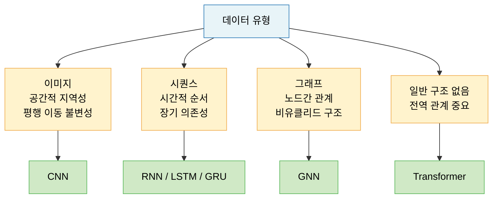
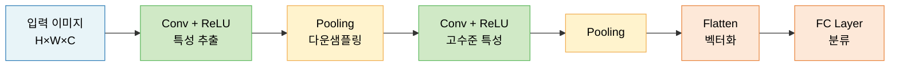
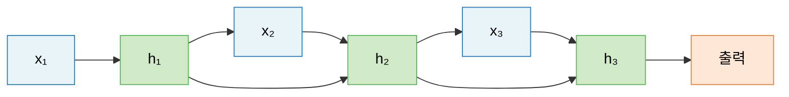
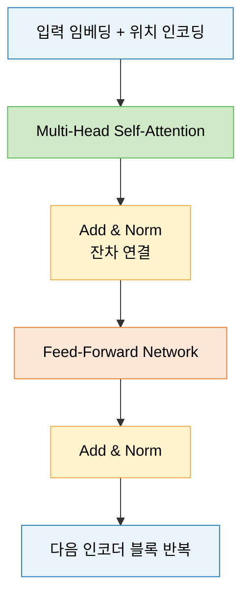
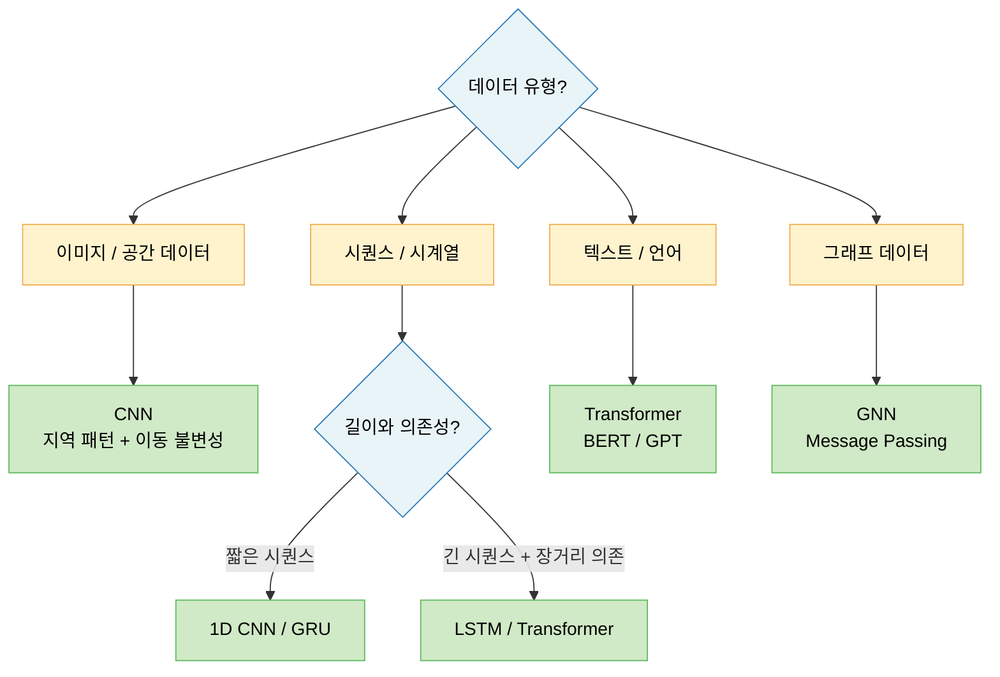
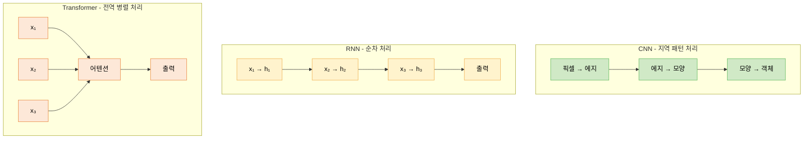

# Lecture 10. 주요 신경망 구조

## 개요

**핵심 질문**

- CNN은 이미지 데이터에 대해 어떤 구조적 가정을 가지는가?
- RNN 계열은 시퀀스 데이터를 어떻게 처리하는가?
- Transformer의 Attention 메커니즘은 무엇이 다른가?
- 문제의 성격에 따라 어떤 구조를 선택해야 하는가?

**학습 목표**

- CNN의 핵심 연산(합성곱, 풀링)과 구조적 가정을 설명할 수 있다.
- RNN·LSTM·GRU의 작동 원리와 장단기 의존성 처리 방식을 이해한다.
- Transformer의 Self-Attention 메커니즘을 수식으로 설명할 수 있다.
- 데이터 유형(이미지·시퀀스·그래프)에 따른 적절한 구조를 선택할 수 있다.
- 주요 구조들의 공통 한계와 개선 방향을 파악한다.

---

## 핵심 개념

### 1. 신경망 구조의 역할

신경망 구조는 데이터에 대한 **귀납적 편향(Inductive Bias)** 을 인코딩한다. 즉, 데이터가 어떤 구조를 가질 것이라는 사전 가정을 모델 설계에 반영하는 것이다.

---

### 2. CNN — 합성곱 신경망 (Convolutional Neural Network)

**구조적 가정**

1. **지역 연결성 (Local Connectivity)**: 유의미한 패턴은 지역적으로 나타난다. 멀리 떨어진 픽셀끼리는 직접 연결하지 않는다.
2. **파라미터 공유 (Parameter Sharing)**: 같은 패턴(에지, 질감)은 이미지 어디에나 나타날 수 있다. 하나의 필터를 전체 이미지에 공유 적용한다.
3. **이동등변성 (Translation Equivariance)**: 객체가 이미지의 어느 위치에 있어도 동일하게 탐지된다.

**핵심 연산**

**합성곱 (Convolution)**

- 입력 특성 맵 위를 필터(커널)가 슬라이딩하며 지역 패치와 내적 → 특성 맵(Feature Map) 생성
- 필터 개수 = 출력 채널 수
- 깊어질수록 특성 맵 크기 감소, 채널 수 증가

**풀링 (Pooling)**

- 특성 맵을 다운샘플링 → 공간 크기 축소, 위치불변성 부여
- 최대 풀링: 가장 두드러진 특성 선택
- 평균 풀링: 평균적인 특성 선택

**패딩과 스트라이드**

- 패딩: 입력 경계에 0을 추가 → 출력 크기 유지
- 스트라이드: 필터 이동 간격 → 서브샘플링 효과

**출력 크기 공식**

$$
O = \frac{(N + 2P) - F}{S} + 1
$$

**CNN의 계층 구조**

**주요 CNN 아키텍처 계보**

| 모델 | 연도 | 핵심 기여 |
|---|---|---|
| LeNet-5 | 1998 | 최초 CNN, 필기체 인식 |
| AlexNet | 2012 | 딥러닝 르네상스, ReLU·Dropout |
| VGGNet | 2014 | 3×3 필터 전용, 깊이의 중요성 |
| GoogLeNet | 2014 | Inception 모듈, 네트워크 속 네트워크 |
| ResNet | 2015 | 잔차 연결, 152층 훈련 가능 |
| EfficientNet | 2019 | 너비·깊이·해상도 동시 스케일링 |

**잔차 연결 (Residual Connection)**

$$
\mathbf{y} = F(\mathbf{x}) + \mathbf{x}
$$

- 그레이디언트가 항등 경로를 통해 직접 흐름 → 그레이디언트 소실 해결
- 매우 깊은 네트워크(100층+) 훈련 가능

---

### 3. RNN 계열 — 순환 신경망

**구조적 가정**: 데이터는 시간(또는 공간)적 순서를 가지며, 이전 정보가 현재 처리에 영향을 준다.

**기본 RNN**

$$
h_t = \tanh(W_{hh} h_{t-1} + W_{xh} x_t + b)
$$

**기본 RNN의 문제: 장기 의존성 (Long-Term Dependency)**

- 멀리 떨어진 타임스텝의 정보가 역전파 중 소실 → 그레이디언트 소실
- 예: "나는 프랑스에서 태어났다. ... 따라서 나는 __를 잘 한다." → "프랑스어"를 예측하려면 멀리 떨어진 정보 필요

**LSTM (Long Short-Term Memory)**

- 별도의 **셀 상태(Cell State)** $C_t$를 도입 → 장기 기억을 보존하는 "고속도로"
- 게이트 메커니즘으로 정보 흐름 제어

$$
\begin{pmatrix} i_t \\ f_t \\ o_t \\ g_t \end{pmatrix} = \begin{pmatrix} \sigma \\ \sigma \\ \sigma \\ \tanh \end{pmatrix} W \begin{pmatrix} h_{t-1} \\ x_t \end{pmatrix}
$$

$$
C_t = f_t \odot C_{t-1} + i_t \odot g_t
$$

$$
h_t = o_t \odot \tanh(C_t)
$$

| 게이트 | 역할 |
|---|---|
| 망각 게이트 $f_t$ | 장기 기억에서 잊을 것 결정 |
| 입력 게이트 $i_t$ | 새 정보 중 장기 기억에 저장할 것 결정 |
| 출력 게이트 $o_t$ | 장기 기억 중 출력할 것 결정 |
| 셀 후보 $g_t$ | 새로운 기억 후보 생성 |

**GRU (Gated Recurrent Unit)**

- LSTM의 경량화 버전, 셀 상태와 은닉 상태를 하나로 통합

$$
r_t = \sigma(W_r [h_{t-1}, x_t]), \quad z_t = \sigma(W_z [h_{t-1}, x_t])
$$

$$
\tilde{h}_t = \tanh(W [r_t \odot h_{t-1}, x_t])
$$

$$
h_t = (1 - z_t) \odot h_{t-1} + z_t \odot \tilde{h}_t
$$

**RNN 계열 비교**

| 구조 | 파라미터 수 | 장기 의존성 | 속도 |
|---|---|---|---|
| 기본 RNN | 적음 | 취약 | 빠름 |
| LSTM | 많음 | 강함 | 느림 |
| GRU | 중간 | 강함 | LSTM보다 빠름 |

**양방향 RNN (Bidirectional RNN)**

- 순방향 + 역방향 두 RNN을 결합 → 문맥 전체를 고려
- 텍스트 분류, 개체명 인식 등에 효과적

---

### 4. Transformer — 어텐션 기반 구조

**핵심 아이디어**: RNN 없이 **어텐션 메커니즘만으로** 시퀀스 전체를 병렬 처리한다.

**Self-Attention (셀프 어텐션)**

입력 시퀀스의 각 토큰이 다른 모든 토큰과의 관련성을 계산하여 표현을 업데이트한다.

$$
\text{Attention}(Q, K, V) = \text{softmax}\left(\frac{QK^\top}{\sqrt{d_k}}\right) V
$$

- $Q$ (Query): "내가 찾는 것"
- $K$ (Key): "각 토큰이 가진 키"
- $V$ (Value): "실제 정보"
- $\sqrt{d_k}$: 스케일링 — 내적값이 너무 커지는 것 방지

**Multi-Head Attention**

- 어텐션을 여러 개의 헤드로 병렬 수행 → 다양한 관점의 관계 학습

$$
\text{MultiHead}(Q, K, V) = \text{Concat}(\text{head}_1, \ldots, \text{head}_h) W^O
$$

$$
\text{head}_i = \text{Attention}(Q W_i^Q, K W_i^K, V W_i^V)
$$

**위치 인코딩 (Positional Encoding)**

Transformer는 순서 정보가 없으므로 위치 정보를 임베딩에 추가:

$$
PE_{(pos, 2i)} = \sin\left(\frac{pos}{10000^{2i/d}}\right), \quad PE_{(pos, 2i+1)} = \cos\left(\frac{pos}{10000^{2i/d}}\right)
$$

**Transformer 아키텍처**

**RNN vs Transformer 비교**

| 특성 | RNN | Transformer |
|---|---|---|
| 처리 방식 | 순차적 | 병렬 |
| 장거리 의존성 | 취약 (그레이디언트 소실) | 강함 (직접 어텐션) |
| 훈련 속도 | 느림 | 빠름 (GPU 병렬화) |
| 메모리 | 적음 | 많음 ($O(n^2)$) |
| 대표 모델 | LSTM, GRU | BERT, GPT, T5 |

---

### 5. 구조 선택이 문제 해결에 미치는 영향

**잘못된 구조 선택의 결과**

- CNN을 시퀀스에 적용: 전역 문맥 무시 → 장거리 의존성 포착 실패
- RNN을 이미지에 적용: 공간 구조 무시 → 비효율적
- Transformer를 소규모 데이터에: 과적합 위험 높음, 사전 학습 필요

---

## 수식

**합성곱 연산**

$$
(I * K)(i, j) = \sum_m \sum_n I(i+m, j+n) \cdot K(m, n)
$$

**CNN 출력 크기**

$$
O = \frac{(N + 2P) - F}{S} + 1
$$

**기본 RNN 은닉 상태**

$$
h_t = \tanh(W_{hh} h_{t-1} + W_{xh} x_t + b_h)
$$

**LSTM 셀 상태 업데이트**

$$
C_t = \underbrace{f_t}_{\text{망각}} \odot C_{t-1} + \underbrace{i_t \odot g_t}_{\text{새 기억}}
$$

**Scaled Dot-Product Attention**

$$
\text{Attention}(Q, K, V) = \text{softmax}\left(\frac{QK^\top}{\sqrt{d_k}}\right) V
$$

**잔차 연결**

$$
\text{output} = \text{LayerNorm}(\mathbf{x} + \text{Sublayer}(\mathbf{x}))
$$

---

## 시각화

**세 가지 구조의 정보 흐름 비교**

---

## 직관적 이해

세 가지 구조를 **독서 방식**으로 비유해보자.

**CNN**은 돋보기로 책을 읽는 것과 같다. 작은 영역을 집중적으로 들여다보며 패턴을 찾는다. "여기에 세로 선이 있다", "저기에 곡선이 있다"를 발견하고, 이것들을 조합해 "이건 글자 'A'다"라고 인식한다. 책의 어느 페이지에서도 같은 돋보기 패턴(필터)을 사용한다 — 이것이 파라미터 공유다.

**RNN**은 책을 처음부터 끝까지 순서대로 읽으며 줄거리를 머릿속에 쌓아가는 것이다. 앞에서 읽은 내용(은닉 상태)을 기억하면서 현재 문장을 이해한다. 문제는 책이 매우 길 때 — 첫 챕터의 내용이 마지막 챕터에서 기억에서 희미해질 수 있다는 것이다. LSTM은 이를 위해 별도의 "장기 노트(셀 상태)"를 들고 다니며, 중요한 것은 기록하고 불필요한 것은 지운다.

**Transformer**는 책 전체를 한 번에 펼쳐 놓고 각 문장이 다른 모든 문장과 어떻게 관련되는지 동시에 파악하는 것이다. "5장의 이 단어가 1장의 저 사건과 관련이 있다"를 한 번에 연결한다. 이것이 어텐션이다. 순서대로 읽지 않아도 되기 때문에 GPU로 완전히 병렬화할 수 있다.

**구조 선택의 핵심**: 문제가 "어디에 무엇이 있는가"라면 CNN, "이것 다음에 무엇이 오는가"라면 RNN, "전체에서 무엇이 무엇과 관련 있는가"라면 Transformer를 먼저 고려하라.

---

## 참고

- LeCun, Y., et al. (1998). [Gradient-based learning applied to document recognition](http://yann.lecun.com/exdb/publis/pdf/lecun-01a.pdf). *Proceedings of the IEEE*.
- Krizhevsky, A., Sutskever, I., & Hinton, G. (2012). [ImageNet Classification with Deep Convolutional Neural Networks](https://papers.nips.cc/paper/2012/hash/c399862d3b9d6b76c8436e924a68c45b-Abstract.html). *NeurIPS*.
- He, K., et al. (2016). [Deep Residual Learning for Image Recognition](https://arxiv.org/abs/1512.03385). *CVPR*.
- Hochreiter, S., & Schmidhuber, J. (1997). [Long Short-Term Memory](https://www.bioinf.jku.at/publications/older/2604.pdf). *Neural Computation*, 9(8), 1735–1780.
- Cho, K., et al. (2014). [Learning Phrase Representations using RNN Encoder–Decoder for Statistical Machine Translation](https://arxiv.org/abs/1406.1078). *EMNLP*.
- Vaswani, A., et al. (2017). [Attention Is All You Need](https://arxiv.org/abs/1706.03762). *NeurIPS*.
- Goodfellow, I., Bengio, Y., & Courville, A. (2016). [Deep Learning](https://www.deeplearningbook.org/). MIT Press. — Ch. 9 (CNN), Ch. 10 (RNN).
