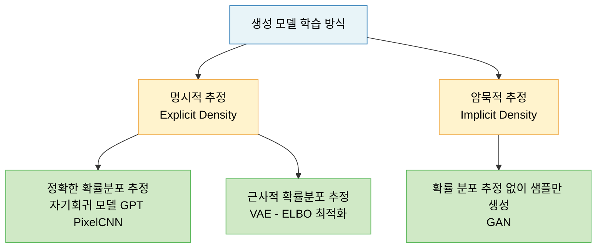
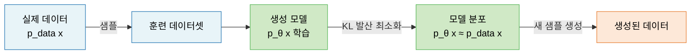

# Lecture 11. 생성이란 무엇인가

## 개요

**핵심 질문**

- 생성 모델과 분류(판별) 모델은 근본적으로 무엇이 다른가?
- 확률 분포를 학습한다는 것은 무슨 의미인가?
- Likelihood 관점에서 학습을 어떻게 정의할 수 있는가?
- 왜 생성 모델이 필요한가?

**학습 목표**

- 판별 모델과 생성 모델의 목표 함수 차이를 수식으로 설명할 수 있다.
- 확률 분포 학습의 의미를 최대우도추정 관점에서 이해한다.
- 명시적 추정과 암묵적 추정의 차이를 구분할 수 있다.
- 생성 모델의 주요 응용 분야와 필요성을 설명할 수 있다.

---

## 핵심 개념

### 1. 생성과 분류의 차이

머신러닝 모델은 근본적으로 두 가지 질문 중 하나를 답하도록 설계된다.

**판별 모델 (Discriminative Model)**

> "이 데이터가 어떤 클래스에 속하는가?"

입력 $\mathbf{x}$가 주어졌을 때 타깃 $y$의 조건부 확률 $p(y | \mathbf{x})$를 모델링한다.

- 결정 경계(Decision Boundary)만 학습 — 데이터 분포 자체는 관심 없음
- 예: 로지스틱 회귀, SVM, CNN 분류기

**생성 모델 (Generative Model)**

> "이 데이터는 어떻게 만들어졌는가? 새로운 데이터를 만들 수 있는가?"

데이터 $\mathbf{x}$ 자체의 확률 분포 $p(\mathbf{x})$, 또는 결합 분포 $p(\mathbf{x}, y)$를 모델링한다.

- 데이터가 생성되는 과정(생성 프로세스)을 학습
- 학습 후 새로운 샘플 생성 가능
- 예: VAE, GAN, 자기회귀 모델, 확산 모델

**핵심 차이 요약**

| 구분 | 판별 모델 | 생성 모델 |
|---|---|---|
| 목표 | $p(y \| \mathbf{x})$ 추정 | $p(\mathbf{x})$ 또는 $p(\mathbf{x}, y)$ 추정 |
| 질문 | "이게 뭐야?" | "이건 어떻게 만들어? 새로 만들어봐." |
| 새 데이터 생성 | 불가 | 가능 |
| 대표 예시 | SVM, CNN, BERT Fine-tuning | VAE, GAN, GPT |

```mermaid
graph LR
    A[입력 데이터 x] --> B[판별 모델\np y|x]
    B --> C[클래스 레이블 y]

    D[잠재 벡터 z] --> E[생성 모델\np x]
    E --> F[새로운 데이터 x']

    classDef disc fill:#fde8d8,stroke:#e8833a,color:#000000
    classDef gen fill:#d0e9c6,stroke:#5cb85c,color:#000000
    classDef io fill:#e8f4f8,stroke:#2c7bb6,color:#000000

    class A,C,D,F io
    class B disc
    class E gen
```

**베이즈 정리로 연결**

$$
p(y | \mathbf{x}) = \frac{p(\mathbf{x} | y) \, p(y)}{p(\mathbf{x})}
$$

생성 모델이 $p(\mathbf{x} | y)$와 $p(\mathbf{x})$를 알면 판별도 할 수 있다. **생성 모델은 판별 모델을 포함하는 더 넓은 문제**다.

---

### 2. 확률 분포를 학습한다는 의미

현실 세계의 데이터는 어떤 미지의 확률 분포 $p_{\text{data}}(\mathbf{x})$에서 샘플링된 것이다.

- 고양이 이미지들: "고양이 이미지 분포"에서 샘플링됨
- 영어 문장들: "영어 문장 분포"에서 샘플링됨

생성 모델의 목표는 이 $p_{\text{data}}(\mathbf{x})$를 **파라미터화된 모델 분포** $p_\theta(\mathbf{x})$로 근사하는 것이다.

$$
p_\theta(\mathbf{x}) \approx p_{\text{data}}(\mathbf{x})
$$

**확률 분포 학습이 달성되면:**

- **밀도 추정**: 새로운 샘플이 그럴듯한지 확률값으로 평가 가능
- **샘플링**: $p_\theta(\mathbf{x})$에서 새로운 샘플 생성 가능
- **조건부 생성**: 원하는 조건의 샘플 생성 가능

**잠재변수 모델 (Latent Variable Model)**

복잡한 데이터 분포를 직접 모델링하기 어려울 때 잠재 변수 $\mathbf{z}$를 도입하여 분해:

$$
p_\theta(\mathbf{x}) = \int p_\theta(\mathbf{x} | \mathbf{z}) \, p(\mathbf{z}) \, d\mathbf{z}
$$

- $p(\mathbf{z})$: 단순한 사전 분포 (예: $\mathcal{N}(0, I)$)
- $p_\theta(\mathbf{x} | \mathbf{z})$: 잠재 벡터에서 데이터를 생성하는 디코더

복잡한 이미지 분포를 직접 배우는 대신, "단순한 잠재 공간에서 샘플링 → 복잡한 이미지로 변환"으로 분해한다.

---

### 3. Likelihood 관점

**최대우도추정 (MLE, Maximum Likelihood Estimation)**

> 관측된 훈련 데이터가 모델에서 나올 확률을 최대화하는 파라미터를 찾아라.

$$
\theta^* = \argmax_\theta \sum_{i=1}^{N} \log p_\theta(\mathbf{x}^{(i)})
$$

**MLE = KL 발산 최소화**

MLE는 데이터 분포 $p_{\text{data}}$와 모델 분포 $p_\theta$ 사이의 KL 발산을 최소화하는 것과 동치다:

$$
\theta^* = \argmin_\theta D_{\text{KL}}\left(p_{\text{data}} \| p_\theta\right)
$$

**명시적 추정 vs 암묵적 추정**



**자기회귀 모델 (Autoregressive Model)**

연쇄 법칙으로 결합 확률을 분해하여 순차 생성:

$$
p(\mathbf{x}) = \prod_{i=1}^{n} p(x_i | x_1, \ldots, x_{i-1})
$$

---

### 4. 생성 모델이 필요한 이유

| 응용 | 설명 |
|---|---|
| 새로운 콘텐츠 생성 | 이미지, 텍스트, 음악 등 새로운 샘플 생성 |
| 데이터 증강 | 희소 데이터 보완, 합성 데이터셋 생성 |
| 이상치 탐지 | 낮은 Likelihood 샘플을 이상치로 판별 |
| 표현 학습 | 잠재 공간의 구조화된 표현 학습 |
| 세계 모델 | RL에서 미래 상태 시뮬레이션, 샘플 효율 향상 |
| 과학적 발견 | 신약 후보 분자 구조 생성, 물리 시뮬레이션 |

**생성 모델 종류 비교**

| 종류 | 학습 방식 | 우도 계산 | 생성 속도 | 대표 모델 |
|---|---|---|---|---|
| 자기회귀 모델 | NLL 최소화 | 정확 | 느림 | GPT, PixelCNN |
| VAE | ELBO 최대화 | 근사 (하한) | 빠름 | VAE, VQ-VAE |
| GAN | 미니맥스 게임 | 불가 | 빠름 | DCGAN, StyleGAN |
| 확산 모델 | 노이즈 제거 학습 | 근사 | 느림 | DDPM, Stable Diffusion |

---

## 수식

**MLE 목적 함수**

$$
\theta^* = \argmax_\theta \sum_{i=1}^{N} \log p_\theta(\mathbf{x}^{(i)})
$$

**MLE = KL 발산 최소화**

$$
\theta^* = \argmin_\theta D_{\text{KL}}\left(p_{\text{data}} \| p_\theta\right) = \argmin_\theta \left[ -\mathbb{E}_{\mathbf{x} \sim p_{\text{data}}} \log p_\theta(\mathbf{x}) \right]
$$

**잠재변수 모델의 주변 우도**

$$
p_\theta(\mathbf{x}) = \int p_\theta(\mathbf{x} | \mathbf{z}) \, p(\mathbf{z}) \, d\mathbf{z}
$$

**베이즈 정리 (판별-생성 연결)**

$$
p(y | \mathbf{x}) = \frac{p(\mathbf{x} | y) \, p(y)}{p(\mathbf{x})}
$$

**자기회귀 모델의 연쇄 법칙 분해**

$$
p(\mathbf{x}) = \prod_{i=1}^{n} p(x_i | x_1, \ldots, x_{i-1})
$$

**KL 발산**

$$
D_{\text{KL}}(p \| q) = \mathbb{E}_{\mathbf{x} \sim p} \left[ \log \frac{p(\mathbf{x})}{q(\mathbf{x})} \right] \geq 0
$$

---

## 시각화

**생성 모델 학습 파이프라인**



---

## 직관적 이해

분류 모델은 **경찰**이다. 진짜와 가짜를 구분하는 경계만 배우면 된다. 지폐가 어떻게 만들어지는지 알 필요가 없다.

생성 모델은 **위조범**이다. 진짜와 구분할 수 없는 지폐를 직접 만들어야 한다. 이를 위해 진짜 지폐의 분포 — 종이 질감, 잉크 패턴, 홀로그램까지 — 를 완전히 이해해야 한다.

Likelihood 학습은 "내 모델이 만든 샘플이 진짜 데이터 분포에서 나올 확률을 높여라"는 원리다. 그 확률이 최대화될 때, 모델은 데이터 분포를 제대로 학습한 것이다.

---

## 참고

- Goodfellow, I., Bengio, Y., & Courville, A. (2016). [Deep Learning](https://www.deeplearningbook.org/). MIT Press. — Ch. 20 (Deep Generative Models).
- Kingma, D. P., & Welling, M. (2014). [Auto-Encoding Variational Bayes](https://arxiv.org/abs/1312.6114). *ICLR*.
- Goodfellow, I., et al. (2014). [Generative Adversarial Networks](https://arxiv.org/abs/1406.2661). *NeurIPS*.
- Oord, A. van den, et al. (2016). [Pixel Recurrent Neural Networks](https://arxiv.org/abs/1601.06759). *ICML*.
- Ho, J., Jain, A., & Abbeel, P. (2020). [Denoising Diffusion Probabilistic Models](https://arxiv.org/abs/2006.11239). *NeurIPS*.
