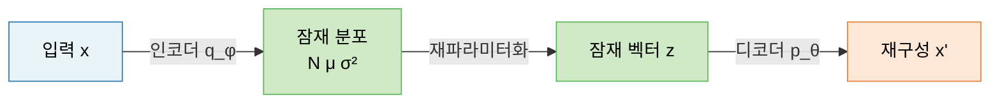
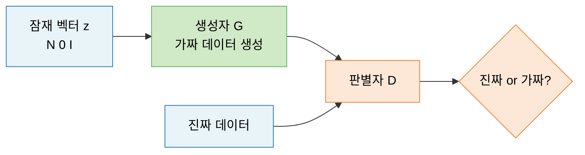
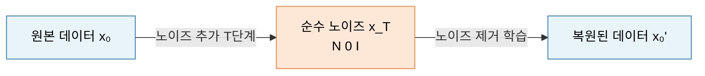
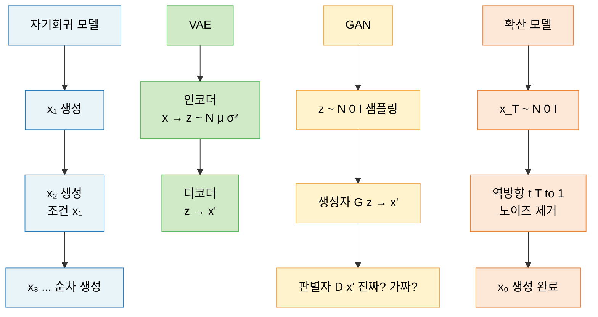

# Lecture 12. 생성 모델의 주요 접근법

## 개요

**핵심 질문**

- 자기회귀 모델은 어떻게 데이터를 순차적으로 생성하는가?
- 잠재변수 모델(VAE, GAN)은 어떻게 잠재 공간을 활용하는가?
- 확산 모델은 기존 접근법과 무엇이 다른가?
- 각 접근법은 어떤 상황에서 유리한가?

**학습 목표**

- 자기회귀 모델의 연쇄 법칙 기반 생성 원리를 설명할 수 있다.
- VAE의 ELBO 목적 함수와 재파라미터화 트릭을 이해한다.
- GAN의 미니맥스 게임 구조와 훈련 불안정성을 설명할 수 있다.
- 확산 모델의 노이즈 추가·제거 과정을 이해한다.
- 네 가지 접근법의 장단점을 비교할 수 있다.

---

## 핵심 개념

### 1. 자기회귀 모델 (Autoregressive Model)

**핵심 아이디어**

데이터의 결합 확률을 연쇄 법칙으로 분해하여, 이전에 생성한 것들을 조건으로 하나씩 순차 생성한다.

$$
p(\mathbf{x}) = \prod_{i=1}^{n} p(x_i | x_1, \ldots, x_{i-1})
$$

텍스트에서는 이전 토큰들로 다음 토큰을 예측하고, 이미지에서는 이전 픽셀들로 다음 픽셀을 예측한다.

**학습 방식**

- 정확한 우도 $p_\theta(\mathbf{x})$ 계산 가능 → 단순히 NLL(Negative Log-Likelihood) 최소화
- 훈련: 실제 데이터의 각 위치에서 다음 값을 맞추는 지도 학습 형태
- 생성: 초기값 → 하나씩 샘플링 → 자기 자신의 출력을 다음 입력으로 재사용

**대표 모델**

- GPT 계열: 텍스트를 왼쪽에서 오른쪽으로 순차 생성
- PixelCNN: 이미지 픽셀을 래스터 스캔 순서로 순차 생성
- WaveNet: 오디오 파형을 샘플 단위로 순차 생성

---

### 2. 잠재변수 모델 — VAE

**핵심 아이디어**

복잡한 데이터 분포를 직접 모델링하는 대신, 단순한 잠재 공간 $\mathbf{z}$를 거쳐 데이터를 생성한다. 인코더가 데이터를 잠재 분포로 압축하고, 디코더가 이를 복원한다.

**목적 함수: ELBO (Evidence Lower BOund)**

주변 우도 $\log p_\theta(\mathbf{x})$를 직접 최대화할 수 없으므로, 하한(Lower Bound)을 최대화한다:

$$
\log p_\theta(\mathbf{x}) \geq \underbrace{\mathbb{E}_{q_\phi(\mathbf{z}|\mathbf{x})} \left[ \log p_\theta(\mathbf{x}|\mathbf{z}) \right]}_{\text{재구성 손실}} - \underbrace{D_{\text{KL}}\left( q_\phi(\mathbf{z}|\mathbf{x}) \| p(\mathbf{z}) \right)}_{\text{정규화 손실}}
$$

- **재구성 손실**: 디코더가 원본을 얼마나 잘 복원하는가
- **KL 정규화항**: 잠재 분포가 사전 분포 $\mathcal{N}(0, I)$에서 얼마나 벗어나는가

**재파라미터화 트릭 (Reparameterization Trick)**

샘플링 연산은 미분 불가능하므로 역전파가 불가능하다. 이를 해결하기 위해 노이즈를 분리한다:

$$
\mathbf{z} = \boldsymbol{\mu}_\phi(\mathbf{x}) + \boldsymbol{\epsilon} \odot \boldsymbol{\sigma}_\phi(\mathbf{x}), \quad \boldsymbol{\epsilon} \sim \mathcal{N}(0, I)
$$

랜덤성을 $\boldsymbol{\epsilon}$으로 분리 → $\boldsymbol{\mu}, \boldsymbol{\sigma}$에 대한 역전파 가능.

---

### 3. 잠재변수 모델 — GAN

**핵심 아이디어**

생성자(Generator)와 판별자(Discriminator)가 경쟁하는 미니맥스 게임을 통해 학습한다.

- **생성자** $G$: 잠재 벡터 $\mathbf{z}$를 입력받아 가짜 데이터 생성
- **판별자** $D$: 입력이 진짜인지 가짜인지 판별

**목적 함수: 미니맥스**

$$
\min_G \max_D \; \mathbb{E}_{\mathbf{x} \sim p_{\text{data}}}[\log D(\mathbf{x})] + \mathbb{E}_{\mathbf{z} \sim p(\mathbf{z})}[\log(1 - D(G(\mathbf{z})))]
$$

- 판별자: $D(\mathbf{x}) \to 1$, $D(G(\mathbf{z})) \to 0$ 이 되도록 최대화
- 생성자: $D(G(\mathbf{z})) \to 1$ 이 되도록 최소화 (판별자를 속이기)

**이론적 최적해**

$$
p_g^*(\mathbf{x}) = p_{\text{data}}(\mathbf{x}), \quad D^*(\mathbf{x}) = \frac{1}{2}
$$

학습이 수렴하면 생성자의 분포가 실제 데이터 분포와 일치하고, 판별자는 진짜·가짜를 구분하지 못한다.

---

### 4. 확산 모델 (Diffusion Model)

**핵심 아이디어**

데이터에 점진적으로 가우시안 노이즈를 추가하는 **순방향 과정**과, 이 노이즈를 단계적으로 제거하여 원본을 복원하는 **역방향 과정**을 학습한다.

**순방향 과정 (Forward Process)** — 고정, 학습 없음

$$
q(\mathbf{x}_t | \mathbf{x}_{t-1}) = \mathcal{N}\left(\mathbf{x}_t; \sqrt{1 - \beta_t} \, \mathbf{x}_{t-1}, \beta_t \mathbf{I}\right)
$$

- $T$번의 단계에 걸쳐 점진적으로 노이즈 추가
- 최종 $\mathbf{x}_T \approx \mathcal{N}(0, I)$

**역방향 과정 (Reverse Process)** — 학습 대상

신경망 $\boldsymbol{\epsilon}_\theta$가 각 단계에서 추가된 노이즈를 예측:

$$
\mathcal{L} = \mathbb{E}_{t, \mathbf{x}_0, \boldsymbol{\epsilon}} \left[ \| \boldsymbol{\epsilon} - \boldsymbol{\epsilon}_\theta(\mathbf{x}_t, t) \|^2 \right]
$$

생성 시: $\mathbf{x}_T \sim \mathcal{N}(0, I)$에서 시작하여 $T$번 노이즈를 제거하면 새로운 샘플 $\mathbf{x}_0$ 생성.

**대표 모델**: DDPM, DDIM, Stable Diffusion, DALL-E 2

---

### 5. 각 접근법의 장단점 비교

| 구분 | 자기회귀 | VAE | GAN | 확산 모델 |
|---|---|---|---|---|
| **우도 계산** | 정확 | 근사 (ELBO) | 불가 | 근사 |
| **생성 품질** | 중간 | 낮음~중간 | 높음 | 매우 높음 |
| **생성 속도** | 느림 (순차) | 빠름 | 빠름 | 느림 (T단계) |
| **훈련 안정성** | 높음 | 높음 | 낮음 (모드 붕괴) | 높음 |
| **잠재 공간** | 없음 | 연속·구조적 | 비구조적 | 없음 |
| **대표 모델** | GPT, PixelCNN | VAE, VQ-VAE | StyleGAN, DCGAN | DDPM, Stable Diffusion |

**GAN의 훈련 불안정성 문제**

- **모드 붕괴 (Mode Collapse)**: 생성자가 다양한 데이터 대신 소수의 패턴만 반복 생성
- **훈련 불균형**: 판별자가 너무 강하면 생성자의 그레이디언트가 소실됨
- 해결 방향: WGAN (Wasserstein 거리 사용), 점진적 학습 (PGGAN)

---

## 수식

**자기회귀 모델의 NLL 손실**

$$
\mathcal{L} = -\sum_{i=1}^{N} \log p_\theta(\mathbf{x}^{(i)}) = -\sum_{i=1}^{N} \sum_{j=1}^{n} \log p_\theta(x_j^{(i)} | x_1^{(i)}, \ldots, x_{j-1}^{(i)})
$$

**VAE ELBO**

$$
\mathcal{L}_{\text{ELBO}} = \mathbb{E}_{q_\phi(\mathbf{z}|\mathbf{x})} \left[ \log p_\theta(\mathbf{x}|\mathbf{z}) \right] - D_{\text{KL}}\left( q_\phi(\mathbf{z}|\mathbf{x}) \| p(\mathbf{z}) \right)
$$

**가우시안 VAE의 KL 발산 (닫힌 형태)**

$$
D_{\text{KL}}\left( \mathcal{N}(\boldsymbol{\mu}, \boldsymbol{\sigma}^2) \| \mathcal{N}(0, I) \right) = \frac{1}{2} \sum_j \left( \mu_j^2 + \sigma_j^2 - \log \sigma_j^2 - 1 \right)
$$

**GAN 목적 함수**

$$
\min_G \max_D \; \mathbb{E}_{\mathbf{x} \sim p_{\text{data}}}[\log D(\mathbf{x})] + \mathbb{E}_{\mathbf{z} \sim p(\mathbf{z})}[\log(1 - D(G(\mathbf{z})))]
$$

**확산 모델의 닫힌 형태 순방향 샘플링**

$$
\mathbf{x}_t = \sqrt{\bar{\alpha}_t} \, \mathbf{x}_0 + \sqrt{1 - \bar{\alpha}_t} \, \boldsymbol{\epsilon}, \quad \boldsymbol{\epsilon} \sim \mathcal{N}(0, I)
$$

- $\bar{\alpha}_t = \prod_{s=1}^{t}(1 - \beta_s)$: 누적 노이즈 스케줄

**확산 모델 학습 목적 함수**

$$
\mathcal{L}_{\text{simple}} = \mathbb{E}_{t, \mathbf{x}_0, \boldsymbol{\epsilon}} \left[ \| \boldsymbol{\epsilon} - \boldsymbol{\epsilon}_\theta(\mathbf{x}_t, t) \|^2 \right]
$$

---

## 시각화

**네 가지 접근법의 생성 흐름 비교**

---

## 직관적 이해

**자기회귀 모델**은 글을 쓰는 작가다. 앞에 쓴 단어를 보며 다음 단어를 고른다. 정확하지만 처음부터 끝까지 순서대로 써야 한다.

**VAE**는 압축·해제 과정이다. 사진을 설명하는 메모(잠재 벡터)를 만들고, 그 메모만 보고 사진을 다시 그린다. 메모가 단순할수록 다양한 사진을 만들 수 있지만 세부 묘사가 흐려진다.

**GAN**은 위조범과 감정사의 경쟁이다. 위조범(생성자)은 점점 정교한 가짜를 만들고, 감정사(판별자)는 더 날카롭게 구분한다. 서로를 키우는 경쟁 끝에 구분 불가능한 수준에 도달한다.

**확산 모델**은 반대 방향의 조각가다. 완성된 작품에 모래를 뿌려 완전히 뭉개고, 그 과정을 역순으로 재현하는 법을 배운다. 느리지만 가장 정교한 복원이 가능하다.

---

## 참고

- Kingma, D. P., & Welling, M. (2014). [Auto-Encoding Variational Bayes](https://arxiv.org/abs/1312.6114). *ICLR*.
- Goodfellow, I., et al. (2014). [Generative Adversarial Networks](https://arxiv.org/abs/1406.2661). *NeurIPS*.
- Ho, J., Jain, A., & Abbeel, P. (2020). [Denoising Diffusion Probabilistic Models](https://arxiv.org/abs/2006.11239). *NeurIPS*.
- Oord, A. van den, et al. (2016). [Pixel Recurrent Neural Networks](https://arxiv.org/abs/1601.06759). *ICML*.
- Arjovsky, M., Chintala, S., & Bottou, L. (2017). [Wasserstein GAN](https://arxiv.org/abs/1701.07875). *ICML*.
- Song, Y., & Ermon, S. (2019). [Generative Modeling by Estimating Gradients of the Data Distribution](https://arxiv.org/abs/1907.05600). *NeurIPS*.
