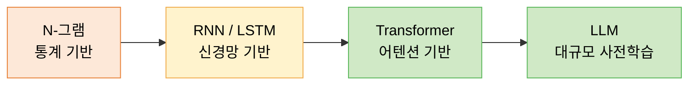
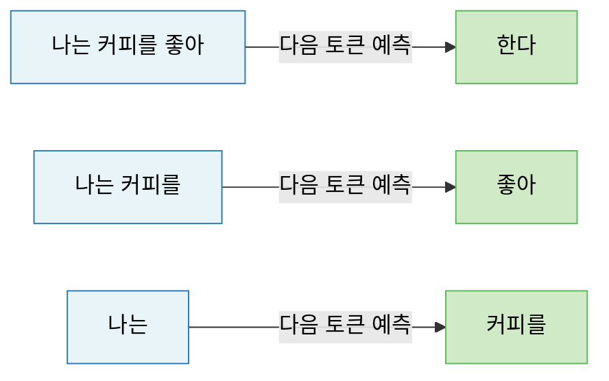
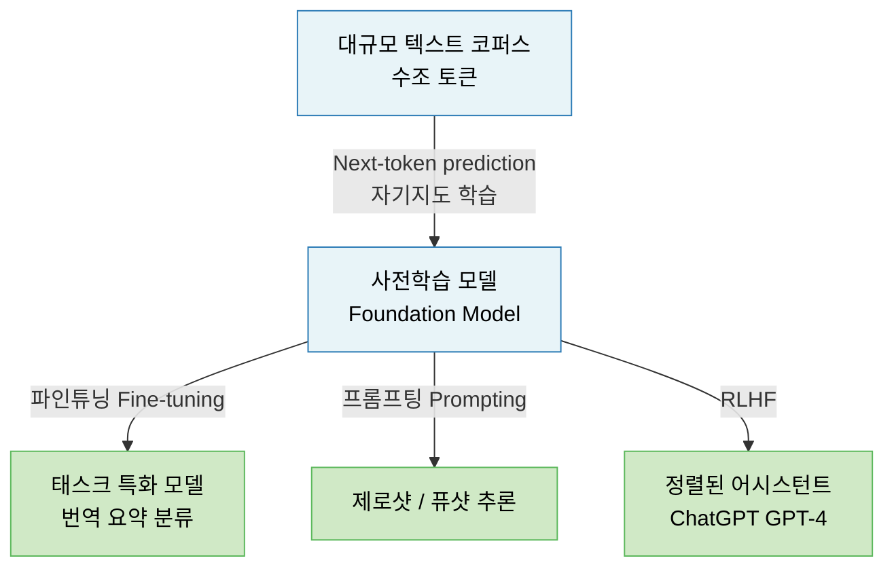
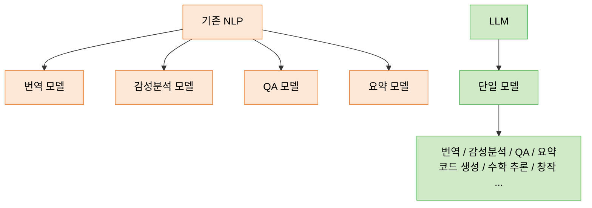
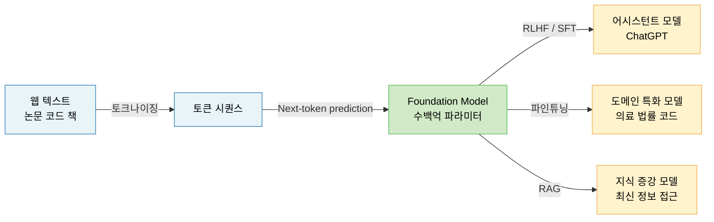

# Lecture 13. LLM의 본질

## 개요

**핵심 질문**

- Next-token prediction은 어떻게 범용 능력을 만드는가?
- 사전학습(Pretraining)이란 무엇이며, 왜 강력한가?
- 언어 모델이 단순 NLP 모델을 넘어 범용 모델이 되는 이유는 무엇인가?
- LLM을 기존 언어 모델과 같은 시각으로 보면 안 되는 이유는 무엇인가?

**학습 목표**

- Next-token prediction의 학습 구조와 자기지도 학습 원리를 설명할 수 있다.
- N-그램 → RNN → Transformer로 이어지는 언어 모델 발전사를 이해한다.
- 사전학습이 범용 표현을 만드는 원리를 설명할 수 있다.
- LLM이 단순 언어 처리를 넘어 추론·계획·코드 생성까지 가능한 이유를 이해한다.

---

## 핵심 개념

### 1. 언어 모델의 발전사

언어 모델의 핵심 과제는 항상 같다: **이전 컨텍스트가 주어졌을 때 다음 단어(토큰)의 확률을 추정하라.**

**N-그램 모델**

- $(n-1)$개의 이전 단어로 $n$번째 단어 예측
- 구현 간단, 계산 효율 높음
- 장기 의존성 포착 불가, 데이터 희소성 문제

**RNN / LSTM / GRU**

- 은닉 상태로 시퀀스 전체 문맥 누적
- LSTM: 게이트로 장기 의존성 처리
- GRU: LSTM의 경량 변형
- 순차 처리 → 병렬화 불가, 여전히 장거리 의존성 취약

**Transformer**

- 셀프 어텐션으로 모든 토큰 쌍의 관계를 동시 계산
- $O(n^2)$ 복잡도이지만 완전 병렬화 가능
- 장거리 의존성 문제 근본적 해결

---

### 2. Next-Token Prediction

**정의**

> 이전 토큰들이 주어졌을 때 다음 토큰의 확률 분포를 예측하는 과제.

$$
p(x_t | x_1, x_2, \ldots, x_{t-1})
$$

**학습 방식: 자기지도 학습 (Self-Supervised Learning)**

레이블이 필요 없다. 텍스트 자체가 감독 신호다 — 현재 토큰이 입력이자 레이블이다.

**왜 이 단순한 과제가 범용 능력을 만드는가?**

다음 토큰을 잘 예측하려면 모델은 다음을 모두 이해해야 한다:

- 문법과 구문 구조
- 사실 관계와 세계 지식
- 맥락과 화자 의도
- 논리적 추론과 인과 관계
- 코드의 실행 흐름

즉 **Next-token prediction은 세상에 대한 압축된 이해를 요구**한다. 이것이 LLM이 범용 모델이 되는 핵심 이유다.

---

### 3. 사전학습 (Pretraining)의 의미

**정의**

> 방대한 텍스트 코퍼스로 Next-token prediction을 수행하여 범용 언어 표현을 학습하는 단계.

GPT-3는 약 300B 토큰, GPT-4는 수조(Trillion) 토큰 규모의 텍스트로 학습되었다.

**사전학습이 강력한 이유**

1. **규모**: 인터넷 전체에 가까운 텍스트 — 인류의 지식이 압축됨
2. **자기지도**: 레이블 없이 무한한 데이터 활용 가능
3. **범용 표현**: 특정 태스크가 아닌 언어·지식·추론의 일반 구조 학습
4. **창발적 능력**: 충분한 규모에서 사전에 명시적으로 학습하지 않은 능력이 나타남

---

### 4. 언어 모델이 범용 모델이 되는 이유

**언어는 세계의 인터페이스다**

자연어는 인류가 지식을 저장하고 전달하는 수단이다. 수학 증명, 의학 논문, 법률 조항, 코드, 철학 논증 — 이 모든 것이 텍스트로 표현된다. 텍스트에서 패턴을 학습한 모델은 자동으로 이 모든 도메인의 구조를 내재화한다.

**창발적 능력 (Emergent Abilities)**

모델 규모가 임계점을 넘으면, 작은 모델에서는 없던 능력이 갑자기 나타난다.

| 능력 | 등장 규모 |
|---|---|
| 산술 계산 | ~13B 파라미터 |
| 다단계 추론 (Chain-of-Thought) | ~100B 파라미터 |
| 코드 생성 | ~7B 파라미터 |
| 언어 간 번역 | ~수십B 파라미터 |

이는 단순한 NLP 성능 향상이 아니라 **질적 변화**다.

---

### 5. LLM을 단순 NLP 모델로 보면 안 되는 이유

**기존 NLP 모델의 패러다임**

- 태스크마다 별도 모델 설계 (번역용, 감성분석용, QA용 등)
- 입력-출력 형식이 고정됨
- 도메인 밖 문제 처리 불가

**LLM의 패러다임 전환**

- **하나의 모델, 무한한 태스크**: 프롬프트만 바꾸면 어떤 태스크도 처리
- **In-context Learning**: 소수의 예제만 보고 즉시 새 패턴 학습 (파라미터 업데이트 없음)
- **Chain-of-Thought**: 추론 과정을 언어로 펼쳐 복잡한 문제 해결
- **Tool Use**: 검색, 코드 실행, API 호출 등 외부 도구 활용

**LLM이 "지식 압축기"이자 "추론 엔진"인 이유**

- 사전학습 중 수조 토큰의 지식이 파라미터에 압축됨
- 추론 시 이 압축된 지식을 문맥에 맞게 조합·재구성
- 본 적 없는 질문에도 학습한 패턴을 일반화하여 답변 생성

---

## 수식

**Next-token prediction 목적 함수**

$$
\mathcal{L} = -\sum_{t=1}^{T} \log p_\theta(x_t | x_1, \ldots, x_{t-1})
$$

**자기회귀 언어 모델의 텍스트 생성 확률**

$$
p_\theta(\mathbf{x}) = \prod_{t=1}^{T} p_\theta(x_t | x_{<t})
$$

**Softmax 출력 (토큰 확률 분포)**

$$
p_\theta(x_t = v | x_{<t}) = \frac{\exp(h_t^\top e_v)}{\sum_{v' \in \mathcal{V}} \exp(h_t^\top e_{v'})}
$$

- $h_t$: 시각 $t$에서의 Transformer 은닉 상태
- $e_v$: 어휘 $v$의 임베딩 벡터
- $\mathcal{V}$: 전체 어휘 사전

**Scaled Dot-Product Attention (복습)**

$$
\text{Attention}(Q, K, V) = \text{softmax}\left(\frac{QK^\top}{\sqrt{d_k}}\right) V
$$

---

## 시각화

**LLM 사전학습 및 활용 파이프라인**

---

## 직관적 이해

Next-token prediction은 겉으로는 단순하다. "다음 단어를 맞춰라." 하지만 이 과제를 수조 토큰 규모에서 잘 수행하려면, 모델은 사실상 세계 전체를 이해해야 한다. 다음 단어를 맞추려면 문법도, 역사도, 과학도, 코드 문법도 알아야 하기 때문이다.

사전학습은 이 과정을 통해 인류의 지식을 파라미터에 압축하는 단계다. 특정 태스크를 위한 것이 아니라, 언어로 표현되는 모든 것의 구조를 학습한다. 그래서 파인튜닝이나 프롬프팅만으로도 번역·요약·코딩·추론이 가능해진다.

기존 NLP 모델과의 차이는 단순히 크기가 아니다. **패러다임 자체가 다르다.** 기존 모델은 태스크마다 설계되었지만, LLM은 언어 자체를 학습한 단일 모델이 모든 태스크를 처리한다.

---

## 참고

- Vaswani, A., et al. (2017). [Attention Is All You Need](https://arxiv.org/abs/1706.03762). *NeurIPS*.
- Brown, T., et al. (2020). [Language Models are Few-Shot Learners (GPT-3)](https://arxiv.org/abs/2005.14165). *NeurIPS*.
- Wei, J., et al. (2022). [Emergent Abilities of Large Language Models](https://arxiv.org/abs/2206.07682). *TMLR*.
- Wei, J., et al. (2022). [Chain-of-Thought Prompting Elicits Reasoning in Large Language Models](https://arxiv.org/abs/2201.11903). *NeurIPS*.
- Radford, A., et al. (2019). [Language Models are Unsupervised Multitask Learners (GPT-2)](https://cdn.openai.com/better-language-models/language_models_are_unsupervised_multitask_learners.pdf). OpenAI Blog.
