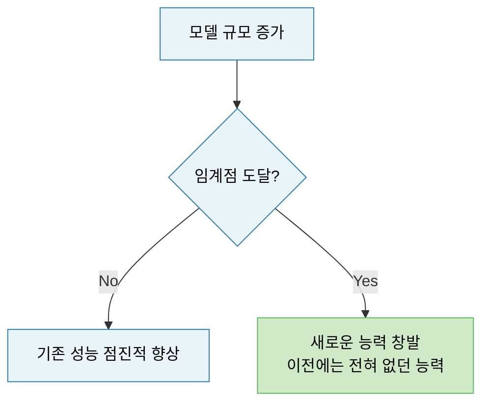
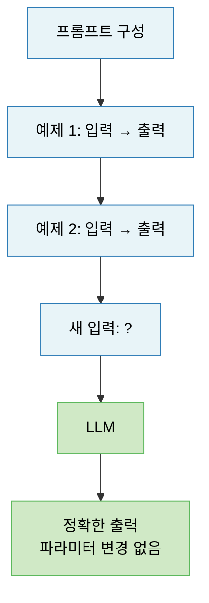
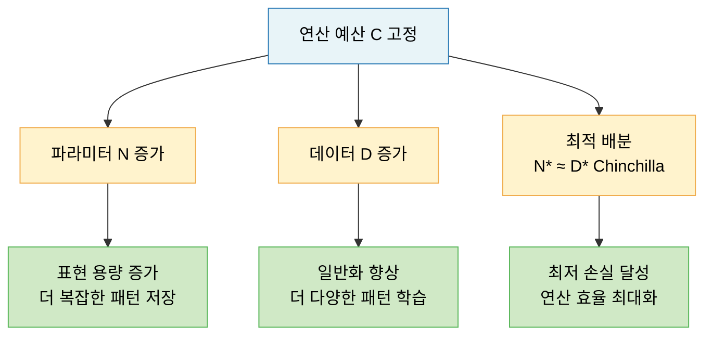
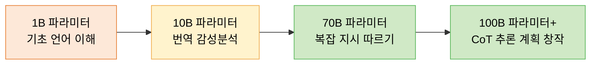

# Lecture 14. 스케일링과 능력

## 개요

**핵심 질문**

- 파라미터·데이터·연산량을 늘리면 성능은 어떻게 변하는가?
- 창발적 능력(Emergent Ability)이란 무엇이며, 왜 나타나는가?
- In-context learning은 어떻게 해석할 수 있는가?
- 단순히 크기가 커지는 것이 왜 질적인 구조 변화를 만드는가?

**학습 목표**

- 스케일링 법칙(Scaling Law)의 수식과 의미를 설명할 수 있다.
- Chinchilla 법칙을 통해 최적 학습 비율을 이해한다.
- 창발적 능력의 정의와 발생 원인을 설명할 수 있다.
- In-context learning이 파라미터 업데이트 없이 작동하는 원리를 이해한다.

---

## 핵심 개념

### 1. 스케일링 법칙 (Scaling Law)

**핵심 발견**

> 언어 모델의 손실은 모델 크기(파라미터), 데이터 크기, 연산량에 대해 **멱함수(power law) 관계**를 따른다.

Kaplan et al. (2020, OpenAI)이 처음 정립한 이 관계는 세 가지 독립 변수로 구성된다.

| 스케일링 축 | 설명 |
|---|---|
| $N$ (파라미터 수) | 모델의 표현 용량 |
| $D$ (훈련 토큰 수) | 학습 데이터 규모 |
| $C$ (연산량, FLOPs) | 훈련에 투입된 계산 비용 |

**OpenAI 스케일링 법칙 (Kaplan et al., 2020)**

각 축을 고정할 때 손실의 변화:

$$
L(N) \approx \left(\frac{N_c}{N}\right)^{\alpha_N}, \quad
L(D) \approx \left(\frac{D_c}{D}\right)^{\alpha_D}
$$

- 손실은 $N$과 $D$에 대해 멱함수로 감소
- 지수 $\alpha_N \approx 0.076$, $\alpha_D \approx 0.095$ (경험적 추정)

**핵심 관찰**

- 파라미터만 늘려도 성능 향상
- 데이터만 늘려도 성능 향상
- 연산량(= 모델 크기 × 훈련 스텝)이 고정되면 최적 배분이 존재

---

### 2. Chinchilla 스케일링 법칙

**문제 제기**

OpenAI 법칙에 따르면 모델을 크게 만드는 것이 항상 이득이다. 그런데 Hoffmann et al. (2022, DeepMind)은 이를 반박했다.

> 고정된 연산 예산 $C$에서, 기존 모델들은 **파라미터를 너무 크게, 데이터를 너무 적게** 쓰고 있었다.

**Chinchilla 법칙**

연산 예산 $C$가 고정될 때 **최적 파라미터 수 $N^*$와 최적 토큰 수 $D^*$**는:

$$
N^* \propto C^{0.5}, \quad D^* \propto C^{0.5}
$$

즉, **파라미터와 데이터 수를 같은 비율로 늘려야** 최적이다.

$$
D^* \approx 20 \times N
$$

파라미터 하나당 약 20개의 토큰이 필요하다. 70B 모델은 1.4T 토큰으로 학습해야 최적이다.

**실제 함의**

- GPT-3 (175B 파라미터, 300B 토큰) → 데이터 부족
- Chinchilla (70B 파라미터, 1.4T 토큰) → GPT-3보다 더 좋은 성능
- LLaMA 시리즈: Chinchilla 법칙 적극 반영

---

### 3. 창발적 능력 (Emergent Abilities)

**정의**

> 작은 모델에서는 전혀 나타나지 않다가, 모델 규모가 특정 임계점을 넘으면 갑자기 나타나는 능력.

단순한 성능 향상이 아니라 **0에서 유능으로의 불연속적 전이**다.

**대표적 창발 능력**

| 능력 | 임계 규모 | 설명 |
|---|---|---|
| 산술 계산 (3자리 이상) | ~13B | 작은 모델은 완전히 실패 |
| Chain-of-Thought 추론 | ~100B | 단계별 풀이를 통한 복잡한 문제 해결 |
| 지시 따르기 (Instruction Following) | ~68B | 복잡한 지시를 정확히 수행 |
| 언어 간 번역 | ~7B | 다국어 텍스트에서 자동 학습 |
| 코드 디버깅 | ~12B | 오류를 인식하고 수정 제안 |

**왜 창발이 나타나는가?**

단일 정답은 없지만, 유력한 해석들:

1. **과제 분해**: 복잡한 태스크는 여러 하위 기술의 조합. 각 기술이 임계점에 도달해야 전체 태스크 가능
2. **표현 용량**: 충분한 파라미터가 쌓여야 추상적 개념 간의 관계 인코딩 가능
3. **희소 회로 (Sparse Circuits)**: 특정 능력은 모델 내 특정 회로가 형성될 때 나타남

---

### 4. In-Context Learning (ICL)

**정의**

> 파라미터 업데이트 없이, 프롬프트에 포함된 예제만으로 새로운 태스크를 즉시 수행하는 능력.

**ICL의 유형**

- **Zero-shot**: 예제 없이 지시만으로 태스크 수행
- **One-shot**: 예제 1개 제공
- **Few-shot**: 예제 수개 제공 → 패턴 추론

**어떻게 가능한가? — 두 가지 해석**

**해석 1: 잠재 학습자 (Implicit Bayesian Learner)**

사전학습 중 모델은 수많은 패턴을 내재화했다. ICL은 그 중 관련된 패턴을 "활성화"하는 것이다.

**해석 2: 기울기 없는 메타 학습 (Gradient-Free Meta-Learning)**

어텐션 메커니즘이 암묵적으로 소수 예제에 대한 "내부 학습"을 수행한다. 각 레이어의 어텐션이 예제들의 패턴을 찾아 새 입력에 적용한다.

**ICL의 특성**

- 예제 수가 늘어날수록 성능 향상 (Few-shot > One-shot > Zero-shot)
- 예제의 순서에 민감 — 순서만 바꿔도 성능 크게 변화
- 예제의 레이블 정확도보다 **형식·패턴**이 더 중요

---

### 5. 크기가 구조적 변화를 만드는 이유

**압축과 재조합**

모델이 커질수록 더 많은 패턴을 파라미터에 저장할 수 있다. 중요한 것은 단순 저장이 아니라 **패턴 간의 관계와 재조합 능력**이다.

- 작은 모델: 패턴 A, 패턴 B를 따로 저장
- 큰 모델: "A와 B가 이런 상황에서 이렇게 조합된다"를 학습

**표현의 다층적 추상화**

규모가 커질수록 Transformer 레이어가 쌓이고, 각 레이어가 더 높은 추상화 수준을 처리할 수 있다.

**양에서 질로의 전환**

물리학에서처럼, 특정 임계점에서 양적 변화가 질적 변화를 낳는다. 물이 100°C에서 기체로 상전이하듯, LLM도 특정 규모에서 새로운 능력이 "상전이"처럼 나타난다.

---

## 수식

**OpenAI 스케일링 법칙 (파라미터 고정 시)**

$$
L(N) = \left(\frac{N_c}{N}\right)^{\alpha_N}
$$

**Chinchilla 최적 배분**

$$
N^* = G \cdot C^a, \quad D^* = G^{-1} \cdot C^b, \quad a \approx b \approx 0.5
$$

$$
D^* \approx 20 \cdot N
$$

**연산량 추정 (밀집 Transformer)**

$$
C \approx 6ND
$$

- $N$: 파라미터 수, $D$: 훈련 토큰 수
- 파라미터 하나, 토큰 하나에 대해 약 6 FLOPs 소요

**Few-shot ICL 손실**

$$
\mathcal{L}_{\text{ICL}} = -\log p_\theta(y | x, \mathcal{D}_{\text{ctx}})
$$

- $\mathcal{D}_{\text{ctx}} = \{(x_1, y_1), \ldots, (x_k, y_k)\}$: 컨텍스트 예제들
- 파라미터 $\theta$ 변경 없이 컨텍스트만으로 조건부 확률 계산

---

## 시각화

**스케일링 3축과 성능 관계**

**창발적 능력의 임계점 패턴**

---

## 직관적 이해

스케일링 법칙은 모델 개발자에게 **로드맵**을 준다. 연산 예산이 정해지면 파라미터와 데이터를 어떻게 배분해야 최적인지 수식으로 예측할 수 있다. Chinchilla는 "더 큰 모델"이 아니라 "더 균형 잡힌 모델"이 정답임을 보여줬다.

창발적 능력은 스케일링의 가장 놀라운 측면이다. 물이 100°C에서 기체로 변하듯, 모델도 임계 규모에서 갑자기 새로운 능력이 나타난다. 이것이 LLM 연구자들이 "더 크게"를 포기하지 않는 이유다.

In-context learning은 파라미터를 바꾸지 않고 프롬프트만으로 학습하는 것처럼 보인다. 정확히는, 사전학습으로 내재화된 수많은 패턴 중 관련된 것을 예제가 "활성화"하는 것이다.

---

## 참고

- Kaplan, J., et al. (2020). [Scaling Laws for Neural Language Models](https://arxiv.org/abs/2001.08361). *arXiv*.
- Hoffmann, J., et al. (2022). [Training Compute-Optimal Large Language Models (Chinchilla)](https://arxiv.org/abs/2203.15556). *NeurIPS*.
- Wei, J., et al. (2022). [Emergent Abilities of Large Language Models](https://arxiv.org/abs/2206.07682). *TMLR*.
- Brown, T., et al. (2020). [Language Models are Few-Shot Learners (GPT-3)](https://arxiv.org/abs/2005.14165). *NeurIPS*.
- Olsson, C., et al. (2022). [In-context Learning and Induction Heads](https://arxiv.org/abs/2209.11895). *Transformer Circuits Thread*.
