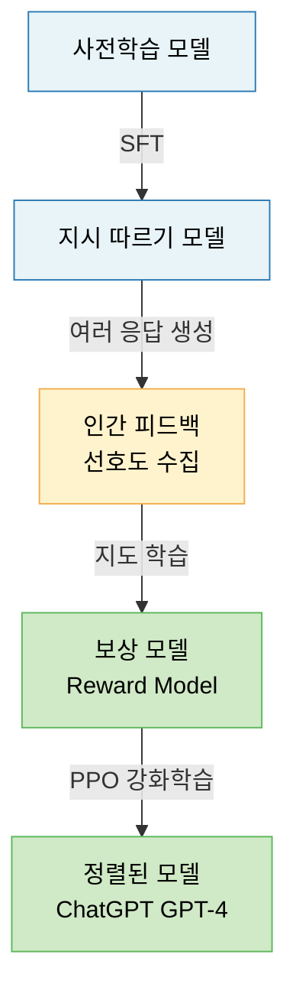
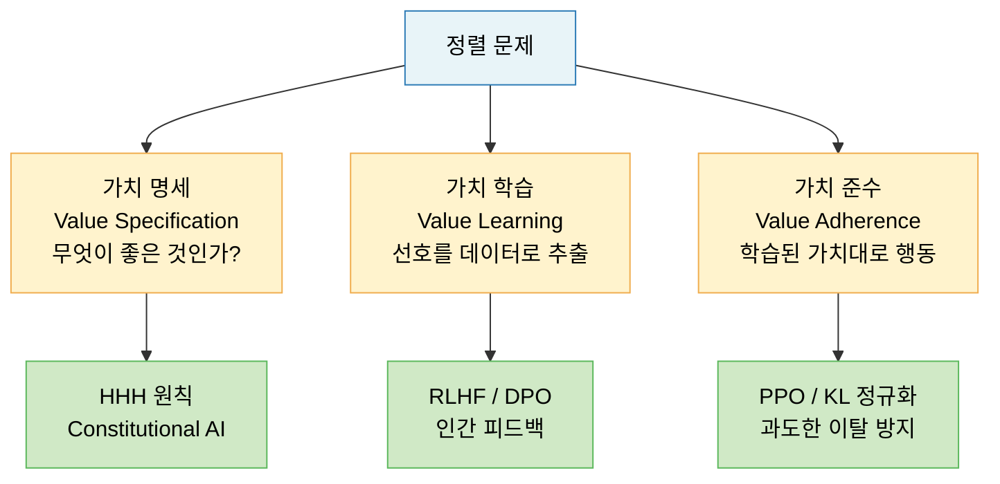
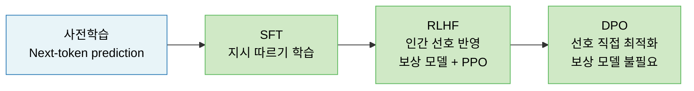

# Lecture 15. 정렬과 미세조정

## 개요

**핵심 질문**

- Instruction Tuning은 왜 필요하며 무엇을 바꾸는가?
- RLHF는 어떤 구조로 인간의 선호를 모델에 반영하는가?
- Preference Learning이란 무엇이며 어떻게 구현되는가?
- 정렬(Alignment)을 기술 문제로 보는 관점은 무엇인가?

**학습 목표**

- 사전학습 모델과 정렬된 모델의 차이를 설명할 수 있다.
- SFT → Reward Model → PPO로 이어지는 RLHF 파이프라인을 이해한다.
- DPO가 RLHF를 어떻게 단순화하는지 설명할 수 있다.
- 정렬 문제를 기술적 관점에서 정의하고 현재 한계를 파악한다.

---

## 핵심 개념

### 1. 왜 정렬이 필요한가

사전학습된 LLM은 Next-token prediction만 수행했다. 인터넷의 텍스트 전체를 학습했기 때문에 유해한 내용·거짓 정보·무관한 출력도 생성할 수 있다.

**정렬되지 않은 모델의 문제**

- 질문에 답하지 않고 질문을 이어 생성
- 유해하거나 편향된 내용 출력
- 사용자의 의도가 아닌 학습 데이터의 패턴을 따름
- 사실과 다른 내용을 자신 있게 생성 (환각, Hallucination)

**정렬의 목표: HHH**

| 원칙 | 설명 |
|---|---|
| Helpful (유용함) | 사용자의 요청을 정확히 이해하고 도움이 되는 응답 |
| Harmless (무해함) | 유해하거나 위험한 내용 생성 거부 |
| Honest (정직함) | 불확실한 것은 모른다고 하고, 거짓을 생성하지 않음 |

---

### 2. Instruction Tuning (SFT)

**목적**

> 사전학습 모델이 "다음 토큰 생성기"에서 "지시를 따르는 어시스턴트"로 전환되도록 미세조정하는 것.

**방식: Supervised Fine-Tuning (SFT)**

사람이 직접 작성한 (지시, 응답) 쌍으로 지도 학습:

$$
\mathcal{L}_{\text{SFT}} = -\sum_{t} \log p_\theta(y_t | x, y_{<t})
$$

- $x$: 지시(Instruction)
- $y$: 이상적인 응답

**효과**

- 지시를 따르는 형식 학습
- 대화 형식, 역할 수행 가능
- 하지만 어떤 응답이 더 좋은지는 아직 모름 → RLHF 필요

---

### 3. RLHF (Reinforcement Learning from Human Feedback)

**전체 파이프라인**

**Step 1: 인간 선호 데이터 수집**

같은 프롬프트에 대해 모델이 여러 응답을 생성하고, 사람이 더 나은 응답을 선택:

$$
\mathcal{D}_{\text{pref}} = \{(x, y_w, y_l)\}
$$

- $x$: 프롬프트
- $y_w$ (winner): 선호되는 응답
- $y_l$ (loser): 덜 선호되는 응답

**Step 2: 보상 모델 학습 (Reward Model)**

인간의 선호를 모방하는 보상 함수 $r_\phi$ 학습. Bradley-Terry 모델을 사용:

$$
\mathcal{L}_{\text{RM}} = -\mathbb{E}_{(x, y_w, y_l)} \left[ \log \sigma\left( r_\phi(x, y_w) - r_\phi(x, y_l) \right) \right]
$$

선호되는 응답에 더 높은 보상 점수를 부여하도록 학습.

**Step 3: PPO로 정책 최적화**

보상 모델을 신호로 사용해 강화학습(PPO)으로 언어 모델 파라미터 업데이트:

$$
\mathcal{L}_{\text{RLHF}} = \mathbb{E}_{x \sim \mathcal{D}, y \sim \pi_\theta} \left[ r_\phi(x, y) \right] - \beta \, D_{\text{KL}}\left(\pi_\theta \| \pi_{\text{ref}}\right)
$$

- 첫 번째 항: 보상 최대화 (높은 점수 응답 생성)
- KL 항: 사전학습 모델 $\pi_{\text{ref}}$에서 너무 멀어지지 않도록 정규화
- $\beta$: 두 목표 간 균형 하이퍼파라미터

---

### 4. Preference Learning — DPO

**RLHF의 한계**

- 보상 모델 훈련 → PPO 훈련의 2단계 파이프라인이 복잡
- PPO 강화학습의 불안정성
- 보상 모델이 해킹될 수 있음 (Reward Hacking)

**DPO (Direct Preference Optimization)**

Rafailov et al. (2023)은 보상 모델 없이 선호 데이터에서 직접 정책을 최적화하는 방법을 제안:

$$
\mathcal{L}_{\text{DPO}} = -\mathbb{E}_{(x, y_w, y_l)} \left[ \log \sigma \left( \beta \log \frac{\pi_\theta(y_w | x)}{\pi_{\text{ref}}(y_w | x)} - \beta \log \frac{\pi_\theta(y_l | x)}{\pi_{\text{ref}}(y_l | x)} \right) \right]
$$

- 보상 모델 없이 선호 데이터만으로 직접 최적화
- 선호 응답의 상대적 확률을 높이고, 비선호 응답의 상대적 확률을 낮춤
- RLHF와 수학적으로 동치이지만 훨씬 단순

**RLHF vs DPO 비교**

| 구분 | RLHF | DPO |
|---|---|---|
| 보상 모델 | 별도 학습 필요 | 불필요 |
| 강화학습 | PPO 사용 | 사용 안 함 |
| 구현 복잡도 | 높음 | 낮음 |
| 안정성 | 낮음 (PPO 불안정) | 높음 |
| 현재 사용 | GPT-4 등 | LLaMA-3, Gemma 등 |

---

### 5. 정렬을 기술 문제로 보는 관점

**정렬 문제의 정의**

> 인공지능 시스템이 설계자·사용자·사회의 의도와 가치에 부합하는 방식으로 행동하도록 만드는 문제.

이것을 철학·윤리 문제가 아닌 **기술적으로 해결 가능한 최적화 문제**로 보는 시각이 있다.

**Constitutional AI (Anthropic)**

사람의 피드백 대신 AI가 스스로 원칙(Constitution)에 따라 자신의 출력을 평가·개선:

1. 원칙 집합(Constitution) 정의 — 예: "유해한 내용을 생성하지 마라"
2. 모델이 자신의 응답을 원칙에 비추어 비판
3. 비판을 반영하여 응답 수정
4. 수정된 (원본, 개선) 쌍으로 보상 모델 학습

**현재 기술적 한계**

- **Reward Hacking**: 보상 모델을 속이는 응답 생성 → 실제 선호와 괴리
- **분포 외 일반화**: 훈련 시 보지 못한 상황에서의 정렬 실패
- **Sycophancy**: 모델이 사용자가 원하는 말만 하는 경향
- **Specification Gaming**: 의도가 아닌 명세(Specification)만 최적화

---

## 수식

**SFT 손실**

$$
\mathcal{L}_{\text{SFT}} = -\sum_{t=1}^{T} \log p_\theta(y_t | x, y_{<t})
$$

**보상 모델 손실 (Bradley-Terry)**

$$
\mathcal{L}_{\text{RM}} = -\mathbb{E} \left[ \log \sigma\left( r_\phi(x, y_w) - r_\phi(x, y_l) \right) \right]
$$

**RLHF 목적 함수 (PPO + KL 페널티)**

$$
\max_{\pi_\theta} \mathbb{E}_{x, y \sim \pi_\theta} \left[ r_\phi(x, y) - \beta \, D_{\text{KL}}\left(\pi_\theta(y|x) \| \pi_{\text{ref}}(y|x)\right) \right]
$$

**DPO 손실**

$$
\mathcal{L}_{\text{DPO}} = -\mathbb{E} \left[ \log \sigma \left( \beta \log \frac{\pi_\theta(y_w|x)}{\pi_{\text{ref}}(y_w|x)} - \beta \log \frac{\pi_\theta(y_l|x)}{\pi_{\text{ref}}(y_l|x)} \right) \right]
$$

**암묵적 보상 함수 (DPO 이론)**

DPO에서 최적 정책은 다음과 같은 암묵적 보상 함수를 갖는다:

$$
r^*(x, y) = \beta \log \frac{\pi^*(y|x)}{\pi_{\text{ref}}(y|x)} + \beta \log Z(x)
$$

---

## 시각화

**SFT → RLHF → DPO 발전 흐름**

---

## 직관적 이해

사전학습 모델은 인터넷 전체를 읽은 사람이다. 박식하지만 버릇이 없다. 질문에 답하는 대신 질문을 이어 쓰고, 유해한 내용도 거침없이 생성한다. Instruction Tuning은 이 사람에게 "어떻게 대화해야 하는지"를 가르치는 과정이다.

RLHF는 한 단계 더 나아간다. 단순히 형식을 가르치는 것을 넘어, 사람이 어떤 응답을 더 좋아하는지를 학습한다. 보상 모델은 "인간 평가자를 모방하는 채점자"이고, PPO는 이 채점자의 점수를 높이는 방향으로 모델을 조금씩 조정한다.

DPO는 채점자(보상 모델)를 없애고 선호 데이터에서 직접 학습한다. 수학적으로 RLHF와 동치이지만, 훨씬 안정적이고 단순하다.

---

## 참고

- Ouyang, L., et al. (2022). [Training language models to follow instructions with human feedback (InstructGPT)](https://arxiv.org/abs/2203.02155). *NeurIPS*.
- Rafailov, R., et al. (2023). [Direct Preference Optimization: Your Language Model is Secretly a Reward Model](https://arxiv.org/abs/2305.18290). *NeurIPS*.
- Bai, Y., et al. (2022). [Constitutional AI: Harmlessness from AI Feedback](https://arxiv.org/abs/2212.08073). Anthropic.
- Christiano, P., et al. (2017). [Deep Reinforcement Learning from Human Preferences](https://arxiv.org/abs/1706.03741). *NeurIPS*.
- Askell, A., et al. (2021). [A General Language Assistant as a Laboratory for Alignment](https://arxiv.org/abs/2112.00861). Anthropic.
