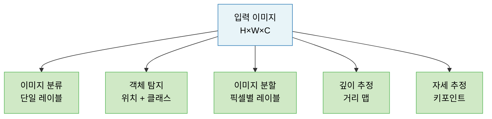
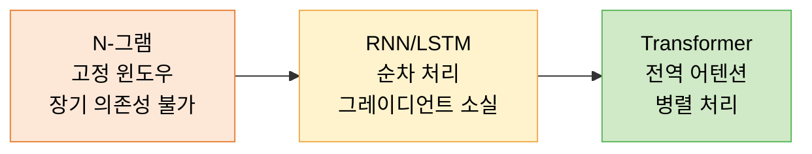
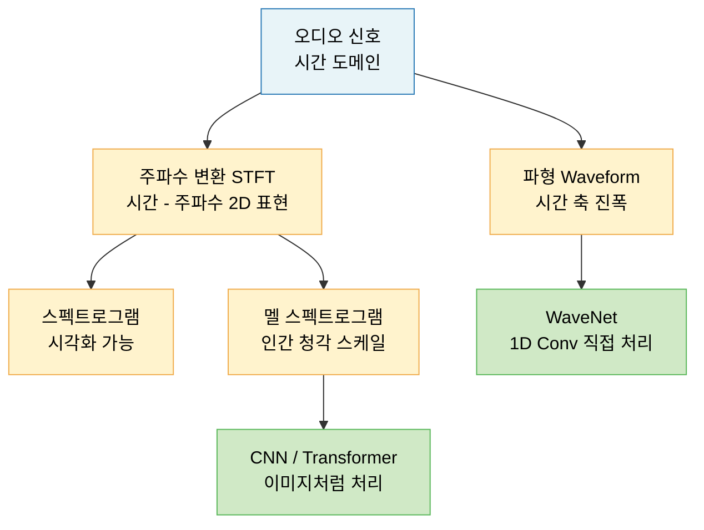
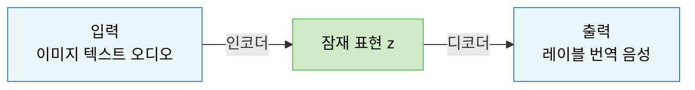
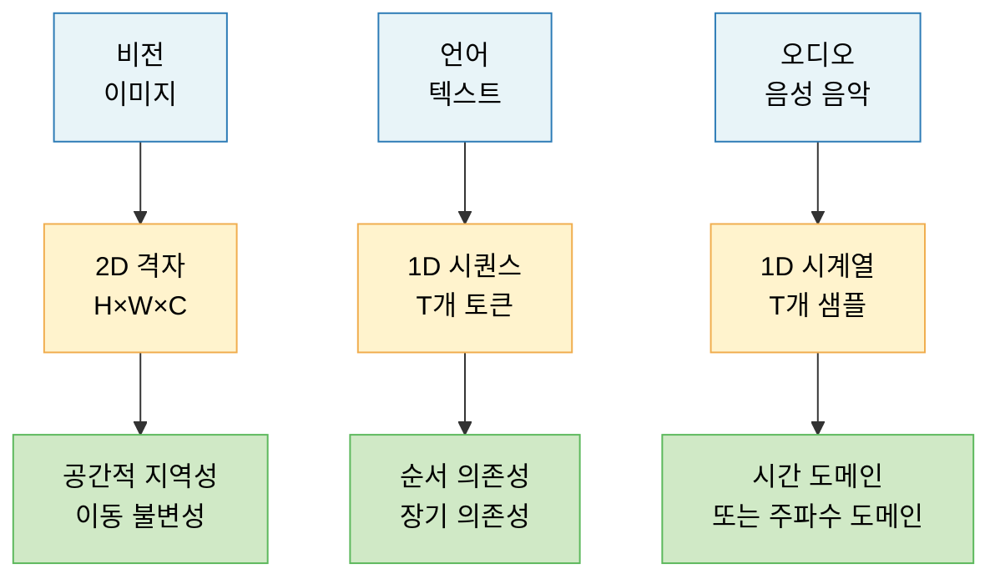

# Lecture 16. 비전/언어/오디오 문제의 구조

## 개요

**핵심 질문**

- 비전·언어·오디오 문제는 각각 어떤 구조적 특성을 갖는가?
- 세 도메인의 데이터 표현 방식은 어떻게 다른가?
- 도메인이 달라도 공통적으로 적용되는 추상 구조는 무엇인가?
- 각 도메인에서 딥러닝이 어떻게 적용되는가?

**학습 목표**

- 비전 문제를 픽셀·특성 맵·공간 구조 관점에서 설명할 수 있다.
- 언어 문제를 토큰 시퀀스·장기 의존성·문맥 관점에서 이해한다.
- 오디오 데이터를 시간 축과 주파수 축 두 관점에서 표현할 수 있다.
- 세 도메인에서 공통적으로 나타나는 추상 구조(인코더-디코더, 어텐션)를 파악한다.

---

## 핵심 개념

### 1. 시각 문제의 공통 구조

**데이터 표현**

이미지는 픽셀의 2차원 격자다. 채널(RGB)을 포함하면 3차원 텐서로 표현된다.

$$
\mathbf{I} \in \mathbb{R}^{H \times W \times C}
$$

- $H$: 높이, $W$: 너비, $C$: 채널 수 (RGB = 3)
- 동영상: $\mathbb{R}^{T \times H \times W \times C}$ (4D 텐서)

**구조적 가정**

- **지역성**: 의미 있는 패턴은 지역적으로 나타남 → 합성곱 연산
- **이동 불변성**: 물체는 이미지 어느 위치에 있어도 동일하게 인식 → 필터 공유
- **계층적 표현**: 저수준(에지·질감) → 중수준(모양) → 고수준(객체) 순으로 추상화

**주요 시각 태스크**

**CNN → ViT 전환**

- CNN: 지역 패턴·파라미터 공유의 귀납적 편향 → 적은 데이터에서 강점
- Vision Transformer (ViT): 이미지를 패치(Patch) 시퀀스로 분할 후 Transformer 적용 → 전역 관계 포착

$$
\mathbf{x}_p \in \mathbb{R}^{N \times (P^2 \cdot C)}, \quad N = \frac{HW}{P^2}
$$

$P \times P$ 크기의 패치 $N$개를 토큰으로 변환 → 언어 모델과 동일한 구조 적용 가능.

---

### 2. 언어 문제의 시퀀스적 특성

**데이터 표현**

텍스트는 이산적(discrete) 토큰의 시퀀스다.

$$
\mathbf{x} = (x_1, x_2, \ldots, x_T), \quad x_t \in \mathcal{V}
$$

- $\mathcal{V}$: 어휘 사전 (Vocabulary), 수만~수십만 크기
- 토큰화(Tokenization): 문자열 → 정수 인덱스 시퀀스

**구조적 특성**

- **순서 의존성**: 같은 단어도 위치에 따라 의미가 달라짐
- **장기 의존성**: "나는 프랑스에서 태어났다. ... 나는 __ 를 잘 한다" → 앞의 정보가 멀리서 필요
- **가변 길이**: 문장마다 길이가 다름 → 고정 크기 입력에 맞게 처리 필요

**주요 언어 태스크**

| 태스크 | 입력 → 출력 | 예시 |
|---|---|---|
| 텍스트 분류 | 시퀀스 → 레이블 | 감성 분석, 스팸 분류 |
| 시퀀스 레이블링 | 시퀀스 → 시퀀스 | 개체명 인식(NER), 품사 태깅 |
| Seq2Seq | 시퀀스 → 시퀀스 (다른 길이) | 번역, 요약 |
| 언어 모델링 | 시퀀스 → 다음 토큰 확률 | GPT, LLM |
| 질의응답 | 질문+문맥 → 답변 | BERT, RAG |

**N-그램 → RNN → Transformer 전환 요약**

---

### 3. 오디오 데이터의 시간·주파수 관점

**데이터 표현**

오디오는 시간 축을 따라 진동하는 연속 신호다.

$$
\mathbf{a} = \{a(t)\}_{t=0}^{T}, \quad a(t) \in \mathbb{R}
$$

일반적으로 초당 16,000~44,100 샘플로 디지털화된다.

**두 가지 관점**

**스펙트로그램 (Spectrogram)**

단시간 푸리에 변환(STFT)으로 시간-주파수 2D 표현을 얻는다:

$$
S(t, f) = \left| \sum_{\tau} a(\tau) w(\tau - t) e^{-j2\pi f\tau} \right|^2
$$

- 가로 축: 시간, 세로 축: 주파수
- 2D 이미지 형태 → CNN으로 처리 가능

**멜 스펙트로그램 (Mel Spectrogram)**

인간의 청각이 저주파에 민감한 특성을 반영한 비선형 주파수 스케일:

$$
m = 2595 \log_{10}\left(1 + \frac{f}{700}\right)
$$

**주요 오디오 태스크**

| 태스크 | 설명 |
|---|---|
| 음성 인식 (ASR) | 오디오 → 텍스트 |
| 화자 인식 | 누가 말하는지 식별 |
| 음악 장르 분류 | 오디오 → 레이블 |
| 음성 합성 (TTS) | 텍스트 → 오디오 |
| 소리 이벤트 탐지 | 특정 소리 발생 시점 탐지 |

---

### 4. 도메인이 달라도 공통되는 추상 구조

세 도메인은 표면적으로 달라 보이지만, 추상화하면 **동일한 수학적 구조**로 수렴한다.

**공통 구조 1: 입력 → 토큰/패치 → 시퀀스**

| 도메인 | 원시 데이터 | 토큰화 |
|---|---|---|
| 이미지 | $H \times W \times C$ 픽셀 배열 | $N$개 패치 시퀀스 (ViT) |
| 텍스트 | 문자열 | 단어/서브워드 토큰 시퀀스 |
| 오디오 | 파형 시계열 | 스펙트로그램 패치 또는 파형 세그먼트 |

모두 **고정 크기 벡터의 시퀀스**로 변환된다. Transformer는 이 공통 형식에 그대로 적용된다.

**공통 구조 2: 인코더–디코더 패러다임**

- 이미지 분할: CNN 인코더 + 업샘플링 디코더 (U-Net)
- 기계 번역: Transformer 인코더 + Transformer 디코더
- 음성 인식: CNN/Transformer 인코더 + CTC/Seq2Seq 디코더

**공통 구조 3: 어텐션 메커니즘의 범용성**

$$
\text{Attention}(Q, K, V) = \text{softmax}\left(\frac{QK^\top}{\sqrt{d_k}}\right)V
$$

- 이미지에서: 패치 간 관계 → Self-Attention (ViT)
- 텍스트에서: 토큰 간 관계 → Self-Attention (BERT, GPT)
- 오디오에서: 프레임 간 관계 → Wav2Vec 2.0, Whisper

**공통 구조 4: 멀티모달 확장**

세 도메인을 동일한 임베딩 공간으로 투영하면 **도메인을 넘나드는 모델** 구성 가능:

- CLIP: 이미지 + 텍스트 공동 임베딩 공간
- Whisper: 오디오 + 텍스트 (음성 인식)
- GPT-4V: 이미지 + 텍스트 통합 처리

---

## 수식

**이미지 텐서 표현**

$$
\mathbf{I} \in \mathbb{R}^{H \times W \times C}
$$

**ViT 패치 토큰화**

$$
\mathbf{z}_0 = [\mathbf{x}_{\text{cls}}; \, \mathbf{x}_p^1 E; \, \mathbf{x}_p^2 E; \ldots; \mathbf{x}_p^N E] + \mathbf{E}_{\text{pos}}
$$

- $E \in \mathbb{R}^{(P^2 C) \times D}$: 패치 임베딩 행렬
- $\mathbf{E}_{\text{pos}}$: 위치 인코딩

**합성곱 출력 크기**

$$
O = \frac{(N + 2P) - F}{S} + 1
$$

**STFT 스펙트로그램**

$$
S(t, f) = \left| \sum_\tau a(\tau) w(\tau - t) e^{-j2\pi f\tau} \right|^2
$$

**멜 스케일 변환**

$$
m(f) = 2595 \log_{10}\left(1 + \frac{f}{700}\right)
$$

---

## 시각화

**세 도메인의 데이터 구조 비교**

---

## 직관적 이해

이미지는 **공간에 펼쳐진 정보**다. 픽셀 하나하나보다 인접한 픽셀들의 패턴이 의미를 만든다. 그래서 CNN이 지역 패턴을 먼저 보고, 점점 더 넓은 영역의 패턴으로 계층을 쌓는다.

텍스트는 **시간 순서로 흐르는 의미**다. 단어 하나가 앞뒤 문맥에 따라 전혀 다른 의미를 가지며, 멀리 떨어진 단어끼리도 연결된다. 어텐션이 이 장거리 관계를 한 번에 포착한다.

오디오는 **시간과 주파수 두 축을 동시에 가진** 신호다. 파형 그대로 처리하거나, 스펙트로그램으로 변환해 이미지처럼 다룰 수 있다.

세 도메인이 다르게 보이지만, Transformer 앞에서는 모두 **패치/토큰의 시퀀스**가 된다. 이것이 멀티모달 AI의 기반이다.

---

## 참고

- Dosovitskiy, A., et al. (2021). [An Image is Worth 16x16 Words: Transformers for Image Recognition at Scale (ViT)](https://arxiv.org/abs/2010.11929). *ICLR*.
- He, K., et al. (2016). [Deep Residual Learning for Image Recognition](https://arxiv.org/abs/1512.03385). *CVPR*.
- Bahdanau, D., Cho, K., & Bengio, Y. (2015). [Neural Machine Translation by Jointly Learning to Align and Translate](https://arxiv.org/abs/1409.0473). *ICLR*.
- Radford, A., et al. (2023). [Robust Speech Recognition via Large-Scale Weak Supervision (Whisper)](https://arxiv.org/abs/2212.04356). *ICML*.
- Radford, A., et al. (2021). [Learning Transferable Visual Models From Natural Language Supervision (CLIP)](https://arxiv.org/abs/2103.00020). *ICML*.
- Oord, A. van den, et al. (2016). [WaveNet: A Generative Model for Raw Audio](https://arxiv.org/abs/1609.03499). *arXiv*.
