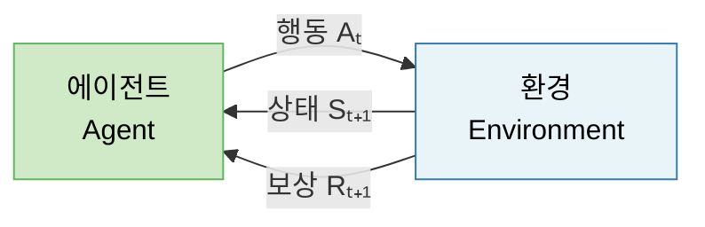
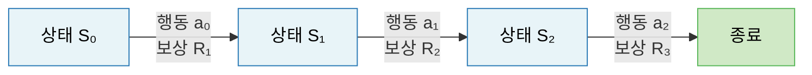
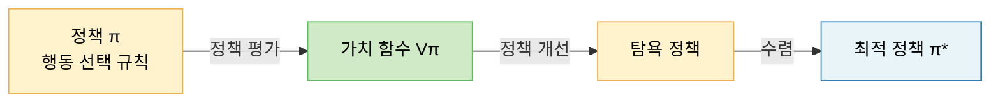

# Lecture 17. 강화학습의 기본 개념

## 개요

**핵심 질문**

- 강화학습은 지도·비지도 학습과 무엇이 근본적으로 다른가?
- 에이전트–환경 상호작용은 어떻게 수학적으로 정형화되는가?
- 정책과 가치 함수는 어떤 관계를 갖는가?
- MDP는 강화학습 문제를 어떻게 정의하는가?

**학습 목표**

- 에이전트·환경·상태·행동·보상·정책·가치의 정의를 설명할 수 있다.
- MDP(Markov Decision Process)를 수식으로 정형화할 수 있다.
- 벨만 방정식의 의미를 설명할 수 있다.
- 강화학습이 다른 학습 패러다임과 어떻게 다른지 비교할 수 있다.

---

## 핵심 개념

### 1. 강화학습이 다른 학습과 다른 점

세 학습 패러다임의 근본적 차이는 **피드백 신호의 종류**에 있다.

| 패러다임 | 피드백 | 특징 |
|---|---|---|
| 지도 학습 | 정답 레이블 (즉각·명시적) | 각 입력에 대한 정답이 주어짐 |
| 비지도 학습 | 없음 | 데이터 자체의 구조 탐색 |
| 강화학습 | 보상 신호 (지연·희소) | 행동의 결과가 시간이 지나야 알려짐 |

**강화학습만의 특성**

- **순차적 의사결정**: 단일 예측이 아닌 일련의 행동(에피소드)을 통해 학습
- **지연된 피드백**: 어떤 행동이 보상에 기여했는지 즉시 알 수 없음 → 신용 할당 문제(Credit Assignment Problem)
- **탐험-활용 트레이드오프**: 새로운 행동 탐험(Exploration) vs 알려진 좋은 행동 활용(Exploitation)
- **환경과의 상호작용**: 에이전트의 행동이 환경 상태를 바꾸고, 이것이 다시 에이전트에 영향

---

### 2. 에이전트–환경 인터페이스

**각 요소의 정의**

| 요소 | 표기 | 설명 |
|---|---|---|
| 상태 (State) | $S_t \in \mathcal{S}$ | 현재 환경의 관측 가능한 표현 |
| 행동 (Action) | $A_t \in \mathcal{A}$ | 에이전트가 선택하는 행동 |
| 보상 (Reward) | $R_{t+1} \in \mathbb{R}$ | 행동 결과로 환경이 주는 스칼라 피드백 |
| 정책 (Policy) | $\pi(a \| s)$ | 상태에서 행동을 선택하는 규칙 |
| 가치 (Value) | $V^\pi(s)$ | 정책 $\pi$를 따를 때 기대 누적 보상 |

---

### 3. 정책 (Policy)

> 에이전트가 상태 $s$에서 행동 $a$를 선택하는 함수.

**결정적 정책 (Deterministic)**

$$
a = \pi(s)
$$

**확률적 정책 (Stochastic)**

$$
\pi(a | s) = P(A_t = a | S_t = s)
$$

정책은 강화학습이 최적화하는 핵심 대상이다. 최적 정책 $\pi^*$를 찾는 것이 목표.

---

### 4. 가치 함수 (Value Function)

**상태 가치 함수**

$$
V^\pi(s) = \mathbb{E}_\pi \left[ \sum_{k=0}^{\infty} \gamma^k R_{t+k+1} \Bigg| S_t = s \right]
$$

**행동 가치 함수 (Q-function)**

$$
Q^\pi(s, a) = \mathbb{E}_\pi \left[ \sum_{k=0}^{\infty} \gamma^k R_{t+k+1} \Bigg| S_t = s, A_t = a \right]
$$

- $\gamma \in [0, 1]$: 할인 인수 — 미래 보상을 현재 기준으로 할인

**가치와 정책의 관계**

$$
V^\pi(s) = \sum_{a} \pi(a|s) \, Q^\pi(s, a)
$$

---

### 5. 마르코프 결정 과정 (MDP)

> 강화학습 문제를 수학적으로 정형화하는 프레임워크.

$$
\mathcal{M} = (\mathcal{S}, \mathcal{A}, \mathcal{P}, \mathcal{R}, \gamma)
$$

**마르코프 성질**

$$
P(S_{t+1} | S_t, A_t, S_{t-1}, \ldots) = P(S_{t+1} | S_t, A_t)
$$

"미래는 현재 상태에만 의존하며, 과거 이력과 무관하다."

---

### 6. 벨만 방정식 (Bellman Equation)

가치 함수의 재귀적 분해. 최적 정책 탐색의 이론적 기반.

**벨만 기대 방정식**

$$
V^\pi(s) = \sum_a \pi(a|s) \sum_{s'} \mathcal{P}(s'|s,a) \left[ \mathcal{R}(s,a) + \gamma V^\pi(s') \right]
$$

현재 상태의 가치 = 즉각 보상 + 다음 상태 가치의 할인 합.

**벨만 최적 방정식**

$$
V^*(s) = \max_a \sum_{s'} \mathcal{P}(s'|s,a) \left[ \mathcal{R}(s,a) + \gamma V^*(s') \right]
$$

$$
\pi^*(s) = \argmax_a Q^*(s, a)
$$

---

## 수식

**누적 할인 보상 (Return)**

$$
G_t = \sum_{k=0}^{\infty} \gamma^k R_{t+k+1}
$$

**상태 가치 함수**

$$
V^\pi(s) = \mathbb{E}_\pi[G_t | S_t = s]
$$

**벨만 최적 방정식 (Q-function)**

$$
Q^*(s, a) = \mathcal{R}(s, a) + \gamma \sum_{s'} \mathcal{P}(s'|s,a) \max_{a'} Q^*(s', a')
$$

**TD 오차**

$$
\delta_t = R_{t+1} + \gamma V(S_{t+1}) - V(S_t)
$$

---

## 시각화

**MDP의 상태 전이**

**정책–가치–최적화 순환**

---

## 직관적 이해

강화학습은 **시행착오를 통해 배우는 것**이다. 아이가 자전거를 배울 때 교과서(지도 학습)도, 자전거 데이터(비지도 학습)도 없다. 넘어지고, 균형을 잡으면서 보상 신호로부터 학습한다.

MDP는 이 과정을 수식으로 표현한다. 마르코프 성질은 "현재 상태에 모든 필요한 정보가 담겨 있다"는 가정이다. 체스에서 현재 보드 상태만 보면 충분한 것처럼.

벨만 방정식은 "현재 가치 = 즉각 보상 + 미래 가치의 할인 합"이라는 재귀적 관계다. Lecture 18에서 다룰 모든 알고리즘은 이 방정식을 어떻게 풀 것인가의 문제다.

---

## 참고

- Sutton, R. S., & Barto, A. G. (2018). [Reinforcement Learning: An Introduction](http://incompleteideas.net/book/the-book-2nd.html) (2nd ed.). MIT Press.
- Bellman, R. (1957). *Dynamic Programming*. Princeton University Press.
- Mnih, V., et al. (2015). [Human-level control through deep reinforcement learning (DQN)](https://www.nature.com/articles/nature14236). *Nature*, 518, 529–533.
