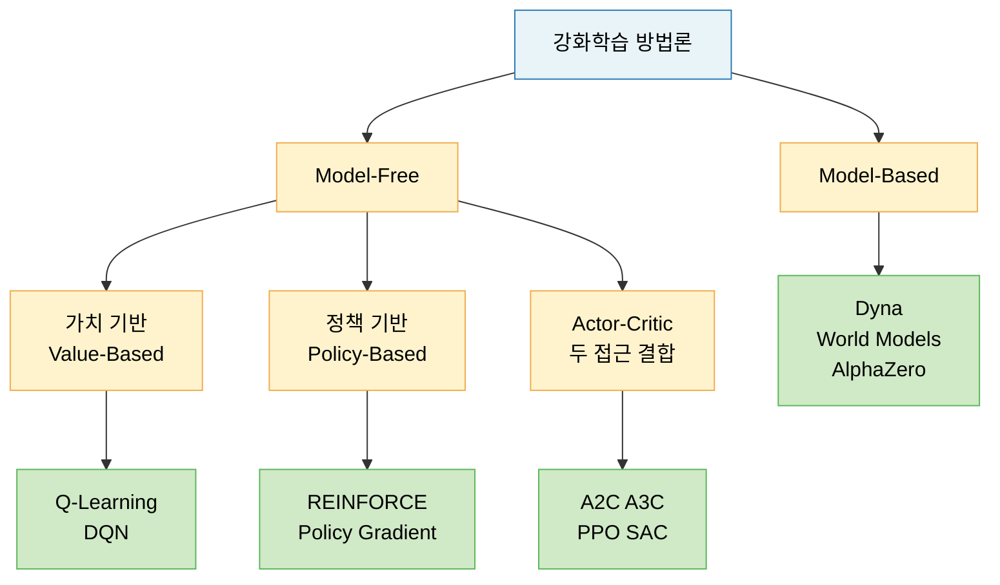
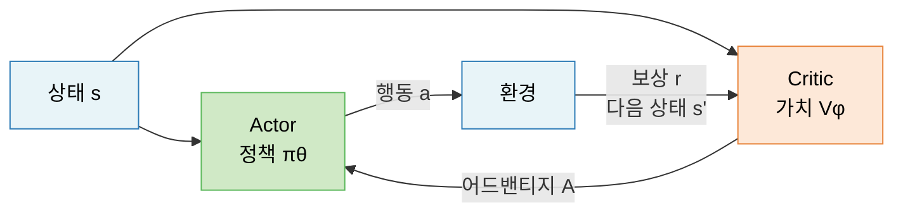
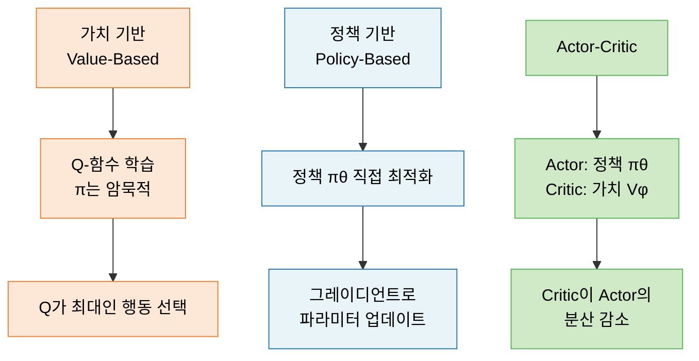

# Lecture 18. 강화학습의 주요 방법론

## 개요

**핵심 질문**

- 가치 기반 접근은 어떤 사고방식으로 정책을 찾는가?
- 정책 기반 접근은 가치 기반과 어떻게 다른가?
- Actor–Critic은 두 접근을 어떻게 결합하는가?
- 모델 기반 강화학습은 무엇을 다르게 하는가?

**학습 목표**

- 가치 기반 접근(Q-learning, DQN)의 원리를 설명할 수 있다.
- 정책 기반 접근(REINFORCE, Policy Gradient)의 목적 함수를 이해한다.
- Actor–Critic 구조와 PPO의 개선 방향을 설명할 수 있다.
- 모델 기반 강화학습의 개념과 Model-free와의 차이를 이해한다.

---

## 핵심 개념

### 1. 강화학습 방법론 분류



---

### 2. 가치 기반 접근 (Value-Based)

**사고방식**

> Q-함수(행동 가치 함수)를 학습한 뒤, 가장 Q값이 높은 행동을 선택한다. 정책은 Q-함수에서 암묵적으로 파생된다.

$$
\pi^*(s) = \argmax_a Q^*(s, a)
$$

**Q-Learning**

모델(전이 확률) 없이 벨만 최적 방정식을 TD 방식으로 반복 업데이트:

$$
Q(s, a) \leftarrow Q(s, a) + \alpha \left[ R + \gamma \max_{a'} Q(s', a') - Q(s, a) \right]
$$

- $\alpha$: 학습률
- 목표값: $R + \gamma \max_{a'} Q(s', a')$
- TD 오차: 목표값 - 현재 추정값

오프-폴리시(Off-policy): 행동하는 정책과 학습하는 정책이 달라도 됨.

**DQN (Deep Q-Network)**

Q-함수를 신경망 $Q_\theta(s, a)$로 근사하여 고차원 입력(이미지 등) 처리:

$$
\mathcal{L}(\theta) = \mathbb{E} \left[ \left( R + \gamma \max_{a'} Q_{\theta^-}(s', a') - Q_\theta(s, a) \right)^2 \right]
$$

**DQN의 핵심 안정화 기법**

- **경험 재생 (Experience Replay)**: 과거 경험 $(s, a, r, s')$을 버퍼에 저장 후 랜덤 샘플링 → 상관관계 제거
- **고정 타깃 네트워크 (Fixed Target Network)**: 타깃 계산 시 별도 네트워크 $\theta^-$ 사용 → 학습 안정화

**가치 기반 접근의 한계**

- 이산(discrete) 행동 공간에만 자연스럽게 적용
- 연속(continuous) 행동 공간에서 $\argmax$ 계산이 어려움

---

### 3. 정책 기반 접근 (Policy-Based)

**사고방식**

> Q-함수 없이, 정책 $\pi_\theta$의 파라미터 $\theta$를 직접 최적화하여 기대 누적 보상을 최대화한다.

$$
J(\theta) = \mathbb{E}_{\tau \sim \pi_\theta} [G(\tau)] = \mathbb{E}_{\pi_\theta} \left[ \sum_t \gamma^t R_{t+1} \right]
$$

**정책 그레이디언트 정리 (Policy Gradient Theorem)**

$$
\nabla_\theta J(\theta) = \mathbb{E}_{\pi_\theta} \left[ \nabla_\theta \log \pi_\theta(a|s) \cdot Q^\pi(s,a) \right]
$$

- $\nabla_\theta \log \pi_\theta(a|s)$: 행동 선택 확률의 로그 그레이디언트
- $Q^\pi(s,a)$: 해당 행동이 얼마나 좋은지 — 신용 할당 신호

**REINFORCE 알고리즘**

$Q^\pi(s,a)$를 실제 수익 $G_t$으로 추정:

$$
\nabla_\theta J(\theta) \approx \sum_t G_t \nabla_\theta \log \pi_\theta(A_t | S_t)
$$

온-폴리시(On-policy): 학습하는 정책과 행동하는 정책이 동일.

**정책 기반 접근의 장점**

- 연속 행동 공간에 자연스럽게 적용
- 확률적 정책 직접 표현 가능
- 수렴 안정성 이론 보장

**한계**: 높은 분산(Variance) → 학습 느림, 샘플 비효율

---

### 4. Actor–Critic

**사고방식**

> 정책 기반(Actor)과 가치 기반(Critic)을 결합하여 각각의 장점을 취한다.

- **Actor**: 정책 $\pi_\theta(a|s)$ 담당 — 어떤 행동을 할지 결정
- **Critic**: 가치 함수 $V_\phi(s)$ 담당 — 행동이 얼마나 좋은지 평가



**어드밴티지 함수 (Advantage Function)**

REINFORCE의 분산을 줄이기 위해 베이스라인으로 Critic 사용:

$$
A^\pi(s, a) = Q^\pi(s, a) - V^\pi(s)
$$

$$
\nabla_\theta J(\theta) \approx \mathbb{E} \left[ A^\pi(S_t, A_t) \nabla_\theta \log \pi_\theta(A_t | S_t) \right]
$$

**PPO (Proximal Policy Optimization)**

정책 업데이트가 너무 크면 학습이 불안정해진다. PPO는 업데이트 크기를 클리핑으로 제한:

$$
\mathcal{L}^{\text{CLIP}}(\theta) = \mathbb{E}_t \left[ \min\left( r_t(\theta) A_t, \; \text{clip}(r_t(\theta), 1-\epsilon, 1+\epsilon) A_t \right) \right]
$$

- $r_t(\theta) = \frac{\pi_\theta(a_t|s_t)}{\pi_{\theta_{\text{old}}}(a_t|s_t)}$: 새 정책 / 이전 정책 비율
- $\epsilon$: 클리핑 범위 (보통 0.1~0.2)
- 비율이 $[1-\epsilon, 1+\epsilon]$ 범위를 벗어나면 그레이디언트 차단

PPO는 현재 **RLHF에서 LLM 정렬**에 사용되는 핵심 알고리즘이다 (→ Lecture 15 참고).

**주요 Actor-Critic 계열 비교**

| 알고리즘 | 특징 |
|---|---|
| A2C | 동기식 다중 에이전트 액터-크리틱 |
| A3C | 비동기식 병렬 학습 |
| PPO | 클리핑으로 안정적 업데이트, 현재 표준 |
| SAC | 엔트로피 최대화 추가, 연속 행동 공간에 강점 |

---

### 5. 모델 기반 강화학습 (Model-Based RL)

**사고방식**

> 환경의 동역학 모델 $\hat{\mathcal{P}}(s'|s,a)$을 학습하여, 실제 환경과 상호작용 없이 **내부 시뮬레이션**으로 계획하고 학습한다.

```mermaid
graph TD
    A[환경과 상호작용] -->|실제 경험| B[세계 모델 학습\nP s'|s a 추정]
    B -->|내부 시뮬레이션| C[계획 Planning]
    C -->|정책 개선| D[에이전트]
    D --> A

    classDef env fill:#e8f4f8,stroke:#2c7bb6,color:#000000
    classDef model fill:#fff3cd,stroke:#f0ad4e,color:#000000
    classDef agent fill:#d0e9c6,stroke:#5cb85c,color:#000000

    class A env
    class B,C model
    class D agent
```

**Model-Free vs Model-Based 비교**

| 구분 | Model-Free | Model-Based |
|---|---|---|
| 환경 모델 학습 | 불필요 | 필요 |
| 샘플 효율성 | 낮음 | 높음 |
| 계산 비용 | 낮음 | 높음 |
| 적용 난이도 | 쉬움 | 어려움 |
| 대표 알고리즘 | DQN, PPO, SAC | AlphaZero, Dyna, World Models |

**대표 모델 기반 방법**

- **AlphaZero**: 게임 규칙(완전 모델) + 몬테카를로 트리 탐색(MCTS) → 바둑, 체스 정복
- **World Models (Ha & Schmidhuber)**: 환경을 잠재 공간에서 압축된 모델로 학습 → 모델 내에서 꿈(Dream)처럼 훈련
- **Dyna-Q**: Q-learning에 모델 시뮬레이션 병합

---

## 수식

**Q-Learning 업데이트**

$$
Q(s, a) \leftarrow Q(s, a) + \alpha \left[ R + \gamma \max_{a'} Q(s', a') - Q(s, a) \right]
$$

**DQN 손실 함수**

$$
\mathcal{L}(\theta) = \mathbb{E} \left[ \left( R + \gamma \max_{a'} Q_{\theta^-}(s', a') - Q_\theta(s, a) \right)^2 \right]
$$

**정책 그레이디언트**

$$
\nabla_\theta J(\theta) = \mathbb{E}_{\pi_\theta} \left[ \nabla_\theta \log \pi_\theta(a|s) \cdot A^\pi(s, a) \right]
$$

**어드밴티지 함수**

$$
A^\pi(s, a) = Q^\pi(s, a) - V^\pi(s) \approx R + \gamma V(s') - V(s)
$$

**PPO 클리핑 목적 함수**

$$
\mathcal{L}^{\text{CLIP}}(\theta) = \mathbb{E}_t \left[ \min\left( r_t(\theta) A_t, \; \text{clip}(r_t(\theta), 1-\epsilon, 1+\epsilon) A_t \right) \right]
$$

---

## 시각화

**가치 기반 vs 정책 기반 vs Actor-Critic**



---

## 직관적 이해

가치 기반 접근은 **부동산 투자자**처럼 생각한다. "이 동네(상태)의 땅값(Q값)은 얼마인가?"를 먼저 파악한 뒤, 가장 비싼 땅을 선택한다. 최적 행동은 Q값 비교에서 자동으로 나온다.

정책 기반 접근은 **직관적인 선수**처럼 생각한다. 땅값을 계산하지 않고, 경험을 통해 "어떤 상황에서 어떻게 행동하면 좋은 결과가 나온다"는 감(정책)을 직접 키운다. 연속적인 행동 공간에서 강하다.

Actor-Critic은 **선수와 코치**의 조합이다. 선수(Actor)가 행동하고, 코치(Critic)가 "그 행동이 평균보다 얼마나 좋았는가(어드밴티지)"를 피드백한다. PPO는 여기에 "한 번에 너무 많이 바꾸지 마라"는 안전장치를 추가한다.

모델 기반 강화학습은 **시뮬레이션 훈련**이다. 실제 경기(환경)에 나가기 전, 머릿속에서 상황을 시뮬레이션하며 훈련하기 때문에 실제 경험 없이도 빠르게 학습한다.

---

## 참고

- Mnih, V., et al. (2015). [Human-level control through deep reinforcement learning (DQN)](https://www.nature.com/articles/nature14236). *Nature*, 518, 529–533.
- Schulman, J., et al. (2017). [Proximal Policy Optimization Algorithms (PPO)](https://arxiv.org/abs/1707.06347). *arXiv*.
- Silver, D., et al. (2017). [Mastering Chess and Shogi by Self-Play with a General Reinforcement Learning Algorithm (AlphaZero)](https://arxiv.org/abs/1712.01815). *arXiv*.
- Ha, D., & Schmidhuber, J. (2018). [World Models](https://arxiv.org/abs/1803.10122). *NeurIPS*.
- Haarnoja, T., et al. (2018). [Soft Actor-Critic (SAC)](https://arxiv.org/abs/1801.01290). *ICML*.
- Sutton, R. S., & Barto, A. G. (2018). [Reinforcement Learning: An Introduction](http://incompleteideas.net/book/the-book-2nd.html) (2nd ed.). MIT Press.
