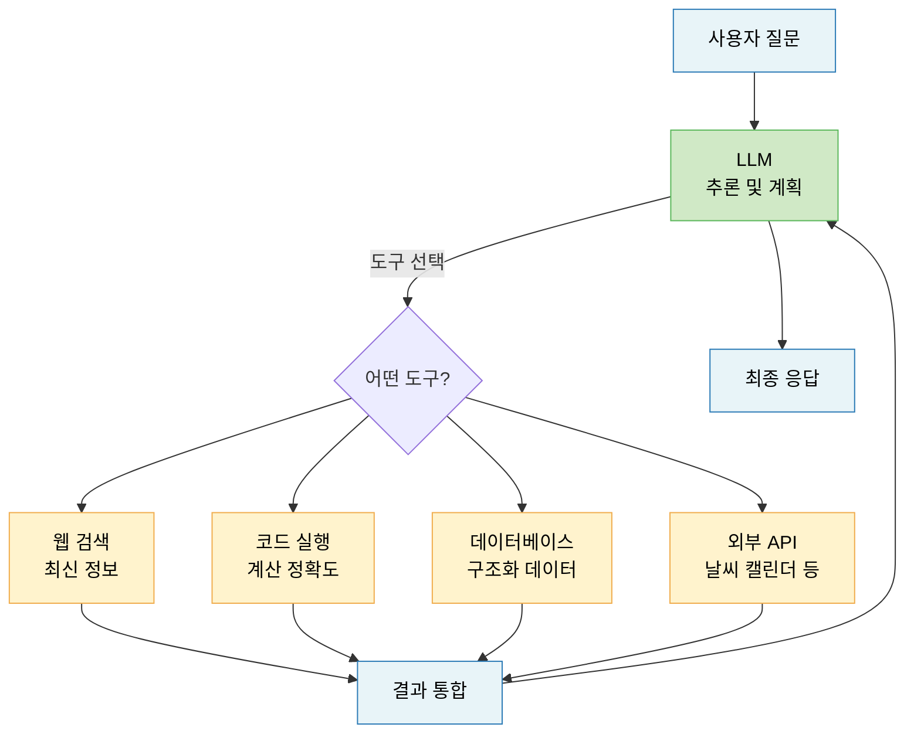
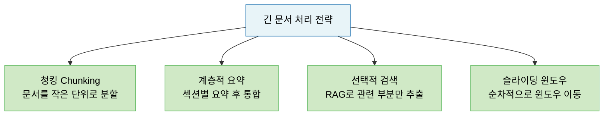
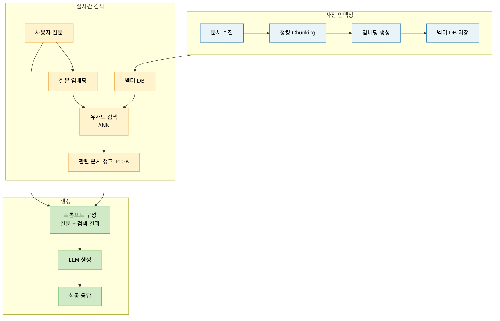
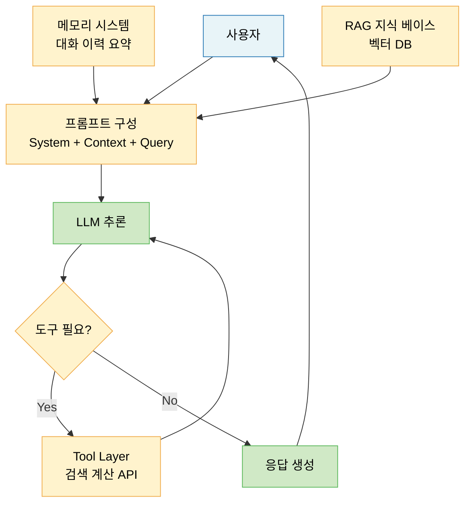

# Lecture 19. LLM 기반 시스템 설계

## 개요

**핵심 질문**

- 프롬프팅은 LLM 시스템에서 어떤 역할을 하는가?
- 도구(Tool)를 추가하면 LLM의 한계를 어떻게 극복할 수 있는가?
- 긴 문맥과 메모리는 어떻게 설계해야 하는가?
- RAG는 무엇이며, 파라메트릭 지식과 검색 지식은 어떻게 다른가?

**학습 목표**

- 프롬프트 엔지니어링의 주요 기법(Zero-shot, Few-shot, CoT)을 설명할 수 있다.
- Tool Augmentation의 구조와 필요성을 이해한다.
- Long-context 처리의 한계와 메모리 설계 전략을 설명할 수 있다.
- RAG 파이프라인의 구조와 파라메트릭 지식과의 차이를 이해한다.

---

## 핵심 개념

### 1. 사전학습 LLM의 한계

LLM은 강력하지만 단독으로 사용할 때 몇 가지 구조적 한계가 있다.

| 한계 | 설명 |
|---|---|
| 지식 컷오프 | 학습 데이터 이후의 정보를 모름 |
| 환각 (Hallucination) | 그럴듯하지만 틀린 정보를 자신 있게 생성 |
| 컨텍스트 길이 제한 | 한 번에 처리할 수 있는 토큰 수에 상한이 있음 |
| 계산 불가 | 정확한 수치 계산, 코드 실행, 외부 API 호출 불가 |
| 장기 기억 없음 | 대화가 끝나면 이전 정보를 잊음 |

이 한계들을 극복하기 위해 LLM을 **시스템의 중심 컴포넌트**로 설계하는 방식이 등장했다.

---

### 2. 프롬프팅 (Prompting)

**역할**

> 파라미터를 바꾸지 않고 입력(프롬프트)의 설계만으로 LLM의 행동을 제어하는 기술.

프롬프트는 LLM 시스템의 **소프트웨어 인터페이스**다. 코드가 하드웨어를 제어하듯, 프롬프트는 LLM의 행동을 제어한다.

**주요 기법**

**Zero-shot Prompting**

예제 없이 지시만으로 태스크 수행:
```
다음 문장의 감성을 분류하라: "오늘 날씨가 정말 좋다."
```

**Few-shot Prompting**

소수의 예제를 포함하여 패턴을 제시:
```
긍정: "오늘 정말 행복하다." → positive
부정: "너무 힘들다." → negative
분류: "날씨가 맑아서 기분이 좋다." → ?
```

**Chain-of-Thought (CoT) Prompting**

추론 과정을 단계별로 펼치도록 유도:
```
문제를 단계별로 풀어보자.
1단계: ...
2단계: ...
최종 답: ...
```

**시스템 프롬프트 (System Prompt)**

모델의 역할, 제약, 응답 형식을 사전에 정의:
```
당신은 의료 정보 어시스턴트입니다.
항상 전문 의사 상담을 권고하고, 진단을 내리지 마십시오.
```

**프롬프트 엔지니어링의 원칙**

- 역할 부여(Role Assignment): 모델에게 구체적 역할 지정
- 명시적 형식 지정: 출력 형식(JSON, 마크다운 등)을 명확히
- 예제 포함: 원하는 입출력 패턴 시연
- 단계별 추론 유도: "step by step으로 생각하라"

---

### 3. Tool Augmentation

**필요성**

LLM은 텍스트 생성에는 탁월하지만 정확한 계산·실시간 정보 접근·외부 시스템 제어는 불가능하다. 도구(Tool)를 외부에 연결함으로써 이 한계를 극복한다.



**Function Calling**

LLM이 어떤 함수를 어떤 인자로 호출할지 결정하고, 그 결과를 다시 컨텍스트에 포함하는 방식:

1. 사용자 질문 입력
2. LLM이 필요한 도구와 인자를 JSON 형식으로 출력
3. 외부 시스템에서 함수 실행
4. 결과를 다시 LLM에 입력
5. 최종 응답 생성

**ReAct 패턴 (Reason + Act)**

추론(Thought) → 행동(Action) → 관찰(Observation)을 반복하는 구조:

```
Thought: 오늘 서울 날씨를 알아야 한다.
Action: weather_api("서울", "2024-05-15")
Observation: 맑음, 23°C
Thought: 날씨 정보를 얻었으므로 답변할 수 있다.
Answer: 오늘 서울은 맑고 23°C입니다.
```

---

### 4. Long-Context 처리

**컨텍스트 윈도우의 한계**

LLM은 한 번에 처리할 수 있는 토큰 수에 상한이 있다. 이 범위를 넘어서는 정보는 **직접 참조 불가**.

- GPT-4: ~128K 토큰
- Claude 3.5: ~200K 토큰
- 1K 토큰 ≈ 약 750 영단어 ≈ 약 500 한국어 글자

**Long-Context 처리 전략**



**Lost in the Middle 문제**

컨텍스트가 길어질수록 LLM은 **중간 부분의 정보를 잘 활용하지 못하는 경향**이 있다. 중요한 정보는 컨텍스트의 처음이나 끝에 배치하는 것이 효과적이다.

---

### 5. 메모리 설계 (Memory Design)

LLM 자체는 상태가 없다(Stateless). 대화 간 정보를 유지하려면 외부 메모리 시스템이 필요하다.

**메모리 유형**

| 유형 | 설명 | 예시 |
|---|---|---|
| 인-컨텍스트 메모리 | 현재 컨텍스트 윈도우 내 대화 이력 | 직전 대화 내용 |
| 외부 메모리 | 벡터 DB 등 외부 저장소 | 사용자 프로필, 과거 대화 |
| 파라메트릭 메모리 | LLM 파라미터에 내재된 지식 | 사전학습으로 학습된 지식 |
| 캐시 메모리 | KV-cache 등 계산 재사용 | 반복 요청 최적화 |

**메모리 설계 전략**

- **요약 메모리**: 긴 대화를 주기적으로 요약하여 저장
- **엔티티 메모리**: 언급된 인물·장소·개념을 구조화하여 저장
- **벡터 메모리**: 과거 대화를 임베딩하여 유사도 검색

---

### 6. RAG (Retrieval-Augmented Generation)

**정의**

> LLM이 응답을 생성하기 전에, 외부 지식 베이스에서 관련 정보를 검색(Retrieve)하여 컨텍스트에 추가한 뒤 생성(Generate)하는 방식.

**RAG 파이프라인**



**RAG의 필요성**

- LLM의 지식 컷오프 문제 해결
- 도메인 특화 문서 활용 (사내 문서, 법령, 논문 등)
- 생성 근거(Source)를 제공 → 환각 감소
- 파인튜닝 없이 지식 업데이트 가능

---

### 7. 파라메트릭 지식 vs 검색 지식

**파라메트릭 지식 (Parametric Knowledge)**

> 사전학습을 통해 LLM의 **파라미터에 압축·내재화된 지식**.

- 접근 방식: 모델 추론만으로 즉시 활용 가능
- 장점: 빠름, 추가 시스템 불필요
- 단점: 컷오프 이후 정보 없음, 특수 도메인 지식 부족, 환각 가능성

**검색 지식 (Retrieved Knowledge)**

> RAG 등을 통해 **외부 소스에서 실시간으로 가져오는 지식**.

- 접근 방식: 검색 → 컨텍스트 주입 → 생성
- 장점: 최신 정보, 출처 명시, 도메인 특화 가능
- 단점: 검색 지연 시간, 검색 품질에 의존, 시스템 복잡도 증가

**두 지식의 상호작용**

| 특성 | 파라메트릭 지식 | 검색 지식 |
|---|---|---|
| 저장 위치 | 모델 파라미터 | 외부 벡터 DB |
| 업데이트 방식 | 재학습 / 파인튜닝 | 문서 추가만으로 즉시 가능 |
| 정확도 | 환각 위험 있음 | 출처 기반, 검증 가능 |
| 응답 속도 | 빠름 | 검색 오버헤드 있음 |
| 적합한 경우 | 일반 상식, 추론 | 최신 정보, 전문 도메인 |

---

## 수식

**임베딩 유사도 (코사인 유사도)**

$$
\text{sim}(\mathbf{q}, \mathbf{d}) = \frac{\mathbf{q}^\top \mathbf{d}}{\|\mathbf{q}\| \|\mathbf{d}\|}
$$

- $\mathbf{q}$: 질문 임베딩 벡터
- $\mathbf{d}$: 문서 청크 임베딩 벡터

**Top-K 검색**

$$
\mathcal{D}_{\text{retrieved}} = \text{Top-K}_{d \in \mathcal{D}} \, \text{sim}(\mathbf{q}, \mathbf{d})
$$

**RAG 생성 조건부 확률**

$$
p(y | x, \mathcal{D}_{\text{retrieved}}) = p_\theta(y | x, d_1, d_2, \ldots, d_k)
$$

- $x$: 사용자 질문
- $d_1 \ldots d_k$: 검색된 문서 청크
- $y$: 생성된 응답

---

## 시각화

**LLM 시스템의 전체 구조**



---

## 직관적 이해

LLM 단독은 **박식하지만 고립된 전문가**다. 훨씬 많이 알지만 인터넷도, 계산기도, 최신 자료도 없다.

프롬프트는 이 전문가에게 **어떻게 질문하고 어떤 역할을 맡길지** 결정하는 방법이다. 같은 전문가라도 질문 방식에 따라 전혀 다른 답이 나온다.

Tool Augmentation은 전문가에게 **계산기, 검색 엔진, 외부 API**를 쥐어주는 것이다. 전문가가 직접 못 하는 일을 도구로 위임한다.

RAG는 전문가에게 **관련 자료를 찾아서 보여주고** 답하게 하는 것이다. 파라메트릭 지식은 전문가가 이미 외운 것이고, 검색 지식은 그때그때 도서관에서 찾아오는 것이다. 외운 것은 빠르지만 오래되거나 틀릴 수 있고, 찾아온 것은 정확하지만 시간이 걸린다.

---

## 참고

- Lewis, P., et al. (2020). [Retrieval-Augmented Generation for Knowledge-Intensive NLP Tasks](https://arxiv.org/abs/2005.11401). *NeurIPS*.
- Yao, S., et al. (2023). [ReAct: Synergizing Reasoning and Acting in Language Models](https://arxiv.org/abs/2210.03629). *ICLR*.
- Liu, N. F., et al. (2023). [Lost in the Middle: How Language Models Use Long Contexts](https://arxiv.org/abs/2307.03172). *arXiv*.
- Schick, T., et al. (2023). [Toolformer: Language Models Can Teach Themselves to Use Tools](https://arxiv.org/abs/2302.04761). *NeurIPS*.
- Wei, J., et al. (2022). [Chain-of-Thought Prompting Elicits Reasoning in Large Language Models](https://arxiv.org/abs/2201.11903). *NeurIPS*.
