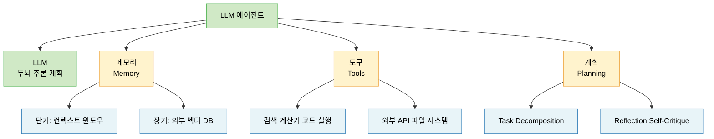
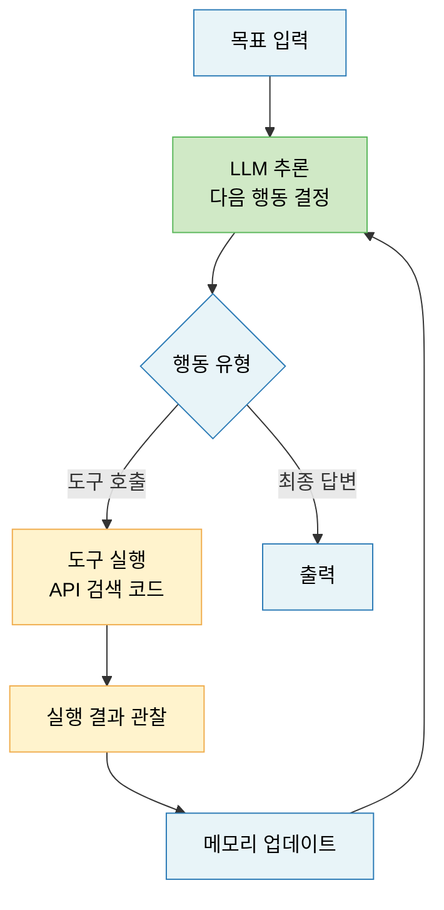
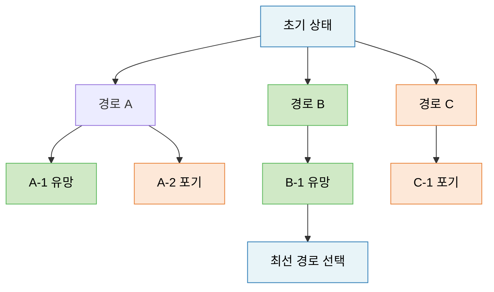
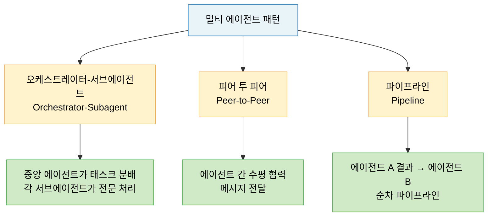
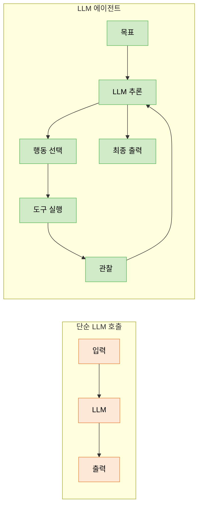

# Lecture 20. 에이전트형 인공지능

## 개요

**핵심 질문**

- 에이전트란 무엇이며, 단순 LLM 호출과 무엇이 다른가?
- 행동과 계획은 어떤 관계를 갖는가?
- LLM 기반 에이전트는 어떻게 구조화되는가?
- 멀티 에이전트 시스템은 왜 필요하고 어떻게 작동하는가?
- 에이전트를 평가하기 어려운 이유는 무엇인가?

**학습 목표**

- 에이전트의 정의와 구성 요소를 설명할 수 있다.
- Task Decomposition의 원리와 주요 기법(CoT, ReAct, ToT)을 이해한다.
- LLM 기반 에이전트의 전체 루프 구조를 설명할 수 있다.
- 멀티 에이전트 시스템의 장점과 설계 방식을 이해한다.
- 에이전트 평가의 어려움을 구체적으로 설명할 수 있다.

---

## 핵심 개념

### 1. 에이전트의 정의

**전통적 정의 (Russell & Norvig)**

> 에이전트(Agent)란 환경을 **지각(Perception)** 하고 그에 따라 **행동(Action)** 하는 모든 것.

$$
\text{Agent}: \text{Perception} \rightarrow \text{Action}
$$

**LLM 기반 에이전트**

> LLM을 **추론·계획의 핵심 엔진**으로 사용하여, 도구를 활용하고 환경과 상호작용하며 목표를 달성하는 시스템.

단순 LLM 호출과의 차이:

| 구분 | 단순 LLM 호출 | LLM 에이전트 |
|---|---|---|
| 상호작용 | 1회 (단발성) | 다회 (반복 루프) |
| 행동 | 텍스트 생성만 | 도구 실행·환경 변경 |
| 계획 | 없음 | 목표 분해·순서 결정 |
| 상태 | 없음 | 외부 메모리로 유지 |
| 피드백 | 없음 | 실행 결과 반영 |

---

### 2. LLM 기반 에이전트 구조

Weng (2023)이 정리한 에이전트 구성 요소는 크게 네 가지다.



**에이전트 실행 루프 (Agent Loop)**



---

### 3. 행동과 계획의 관계

**행동 (Action)**

에이전트가 환경에 가하는 단일 조작:
- 도구 호출 (함수 실행, API 요청)
- 파일 읽기/쓰기
- 브라우저 조작
- 다른 에이전트에 태스크 위임

**계획 (Planning)**

목표를 달성하기 위해 **행동의 순서를 사전에 결정**하는 과정.

계획 없는 에이전트는 각 스텝을 즉흥적으로 결정한다. 계획이 있는 에이전트는 목표를 분해하고 단계를 미리 설정한다.

**계획의 계층 구조**

$$
\text{Goal} \rightarrow \text{Subgoals} \rightarrow \text{Actions} \rightarrow \text{Observations}
$$

---

### 4. Task Decomposition

**정의**

> 복잡한 목표를 LLM이 처리 가능한 작은 하위 태스크로 분해하는 과정.

복잡한 문제를 한 번에 풀면 오류가 누적되고 추론이 어렵다. 분해하면 각 단계가 단순해지고 중간 결과를 검증할 수 있다.

**주요 기법**

**Chain-of-Thought (CoT)**

추론 과정을 선형으로 단계별 펼침:
```
문제 → 단계 1 → 단계 2 → ... → 최종 답
```

**ReAct (Reason + Act)**

추론(Thought)과 행동(Action)을 번갈아 수행하며 관찰(Observation)로 수정:
```
Thought → Action → Observation → Thought → Action → ...
```

**Tree of Thoughts (ToT)**

여러 가지 추론 경로를 트리 구조로 탐색하고 최선의 경로를 선택:



**LLM+P (LLM + Classical Planning)**

LLM이 자연어 목표를 PDDL(Planning Domain Definition Language) 같은 형식 언어로 변환하고, 고전적 플래너가 최적 계획 생성.

---

### 5. Tool-Using Agent

**도구 사용의 구조**

에이전트가 사용할 수 있는 도구를 스키마(Schema)로 정의하고, LLM이 상황에 맞는 도구를 선택하여 호출:

```json
{
  "name": "web_search",
  "description": "최신 웹 정보를 검색합니다",
  "parameters": {
    "query": "검색할 키워드"
  }
}
```

**도구 유형**

| 유형 | 예시 |
|---|---|
| 정보 검색 | 웹 검색, 벡터 DB 검색, 문서 읽기 |
| 계산·실행 | 코드 실행기, 계산기, SQL 실행 |
| 외부 서비스 | 이메일, 캘린더, 파일 시스템 |
| 에이전트 호출 | 다른 전문화 에이전트에게 위임 |

**Toolformer (Schick et al., 2023)**

LLM이 어떤 도구를, 언제, 어떻게 사용할지를 **스스로 학습**하는 방식. 도구 호출 API를 텍스트 내에 삽입하는 형태로 훈련.

---

### 6. Multi-Agent 시스템

**왜 여러 에이전트가 필요한가**

단일 에이전트의 한계:
- 컨텍스트 길이 초과 → 매우 긴 태스크 처리 불가
- 단일 LLM의 편향 → 자기 오류를 스스로 발견하기 어려움
- 병렬화 불가 → 독립 서브태스크도 순차 처리

멀티 에이전트로 해결:
- 역할 분리 → 각 에이전트가 전문화된 태스크 담당
- 병렬 실행 → 독립 서브태스크 동시 처리
- 상호 검증 → 다른 에이전트가 오류를 지적

**주요 멀티 에이전트 패턴**



**Reflexion (Shinn et al., 2023)**

에이전트가 실패 후 **언어적 자기반성(Verbal Reflection)** 을 통해 전략을 수정하는 방식. 외부 보상 없이도 반복적 자기 개선 가능.

**대표 멀티 에이전트 프레임워크 (확인된 것만)**

- **AutoGen (Microsoft, 2023)**: 다수의 LLM 에이전트 간 대화로 협업 태스크 해결
- **MetaGPT (Hong et al., 2023)**: 소프트웨어 개발 팀의 역할 분담을 에이전트로 구현

---

### 7. 에이전트 평가가 어려운 이유

단순 LLM 평가(정확도, BLEU 등)와 달리, 에이전트 평가는 구조적으로 어렵다.

**이유 1: 중간 과정의 복잡성**

최종 결과뿐 아니라 **계획의 적절성, 도구 선택의 효율성, 오류 복구 능력** 등 중간 과정 전체를 평가해야 한다.

**이유 2: 비결정론적 실행**

같은 목표라도 매번 다른 경로로 성공할 수 있고, 다른 경로로 실패할 수 있다. 단순 정답/오답으로 구분이 어렵다.

**이유 3: 환경 의존성**

에이전트 성능은 어떤 도구를 제공받았는지, 환경의 상태가 무엇인지에 크게 의존한다. 동일한 에이전트도 환경에 따라 성능이 크게 달라진다.

**이유 4: 장기 태스크의 희소 피드백**

수십 단계를 거쳐야 결과가 나오는 태스크에서는 중간 단계가 옳은지 판단하기 어렵다.

**이유 5: 벤치마크 한계**

정적 벤치마크는 빠르게 포화(Saturation)되며, 실제 배포 환경을 제대로 반영하지 못한다.

**현재 평가 방식**

| 방식 | 설명 | 한계 |
|---|---|---|
| 최종 결과 평가 | 태스크 성공 여부 | 과정 무시 |
| 단계별 평가 | 각 행동의 적절성 | 레이블링 비용 높음 |
| 인간 평가 | 사람이 직접 판단 | 비용·규모 제한 |
| LLM-as-Judge | LLM이 에이전트 출력 평가 | LLM 편향 문제 |

---

## 수식

**에이전트 목표 함수 (기대 누적 보상)**

$$
J(\pi) = \mathbb{E}_{\tau \sim \pi} \left[ \sum_{t=0}^{T} r(s_t, a_t) \right]
$$

- $\pi$: 에이전트의 정책 (LLM + 도구 + 계획)
- $r(s_t, a_t)$: 각 스텝에서의 보상

**ReAct 스텝 형식화**

$$
a_t = \text{LLM}(\text{goal}, h_{<t}), \quad o_t = \text{Env}(a_t), \quad h_t = h_{t-1} \cup \{(a_t, o_t)\}
$$

- $h_t$: 시각 $t$까지의 이력 (History)
- $o_t$: 행동 $a_t$의 관찰 결과

---

## 시각화

**에이전트 vs 단순 LLM 호출 비교**



---

## 직관적 이해

단순 LLM 호출은 **질문에 즉답하는 전문가**다. 한 번 묻고 한 번 답한다.

에이전트는 **프로젝트를 수행하는 직원**이다. 목표를 받으면 계획을 세우고, 필요한 도구를 쓰고, 실패하면 방향을 바꾸며, 완료될 때까지 반복한다.

Task Decomposition은 **큰 프로젝트를 작은 태스크로 쪼개는 것**이다. "회사 전략을 세워라"보다 "경쟁사 분석 → 시장 조사 → 재무 분석 → 전략 초안 작성"으로 분해하면 각 단계가 실행 가능해진다.

멀티 에이전트는 **팀 프로젝트**다. 한 사람이 모든 것을 하는 대신, 기획자·개발자·검토자 역할을 나눠 병렬로 진행하고 서로 오류를 교정한다.

에이전트 평가가 어려운 이유는 **결과뿐 아니라 과정도 중요**하고, 같은 목표라도 수백 가지 경로가 가능하기 때문이다. 정답이 하나인 시험과 달리, 에이전트의 성능은 상황과 환경에 따라 달라진다.

---

## 참고

- Weng, L. (2023). [LLM Powered Autonomous Agents](https://lilianweng.github.io/posts/2023-06-23-agent/). Lilian Weng's Blog.
- Yao, S., et al. (2023). [ReAct: Synergizing Reasoning and Acting in Language Models](https://arxiv.org/abs/2210.03629). *ICLR*.
- Yao, S., et al. (2023). [Tree of Thoughts: Deliberate Problem Solving with Large Language Models](https://arxiv.org/abs/2305.10601). *NeurIPS*.
- Shinn, N., et al. (2023). [Reflexion: Language Agents with Verbal Reinforcement Learning](https://arxiv.org/abs/2303.11366). *NeurIPS*.
- Wu, Q., et al. (2023). [AutoGen: Enabling Next-Gen LLM Applications via Multi-Agent Conversation](https://arxiv.org/abs/2308.08155). *arXiv*.
- Schick, T., et al. (2023). [Toolformer: Language Models Can Teach Themselves to Use Tools](https://arxiv.org/abs/2302.04761). *NeurIPS*.
